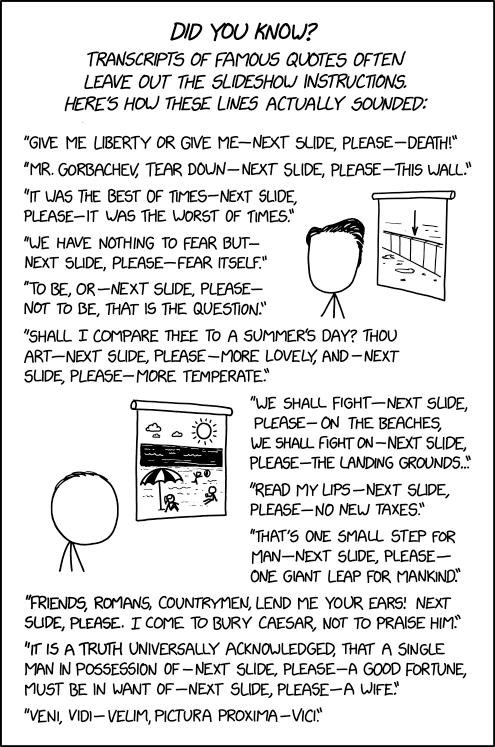

:title: <EXAMPLE_TITLE>
:data-transition-duration: 1500
:css: keri.css

<EXAMPLE_DESCRIPTION>

----

<EXAMPLE_TITLE_SLIDE>
======================

----

Objectives
==========

* <OBJECTIVE_1>
* <OBJECTIVE_2>
* <OBJECTIVE_3>

----

<EXAMPLE_BULLETS>
=================

* <BULLET_1>
* <BULLET_2>
* <BULLET_3>

----

<EXAMPLE_SUB_BULLETS>
=====================

<LIST_OF_THINGS>:
  + <BULLET_1>
  + <BULLET_2>
  + <BULLET_3>

----

<EXAMPLE_TITLE>
===============

<EXAMPLE_NOTE>

<EXAMPLE_SUBTITLE_1>
--------------------

* <BULLET_1_1>
* <BULLET_1_2>

<EXAMPLE_SUBTITLE_2>
--------------------

* <BULLET_2_1>
* <BULLET_2_2>

----

<EXAMPLE_CODE>
==============

This is an example of code

.. code:: c

    int main(void)
    {
    	printf("Hello World");
    }

----

<EXAMPLE_SECTION_HEADER>
========================

----

:class: split-table

<EXAMPLE_TABLE>
===============

+---------+---------+---------+
| <COL_1> | <COL_2> | <COL_3> |
+---------+---------+---------+
| <VAL_1> | <VAL_2> | <VAL_3> |
+---------+---------+---------+
| <VAL_4> | <VAL_5> | <VAL_6> |
+---------+---------+---------+

----

:class: split-table shrink-table

<EXAMPLE_TABLE_SHRINK>
======================

+---------+---------+---------+
| <COL_1> | <COL_2> | <COL_3> |
+---------+---------+---------+
| <VAL_1> | <VAL_2> | <VAL_3> |
+---------+---------+---------+
| <VAL_4> | <VAL_5> | <VAL_6> |
+---------+---------+---------+

----

<EXAMPLE_IMAGE_1>
=================

<SMALL_IMAGE>

----

:class: flex-image

<EXAMPLE_IMAGE_2>
=================

<SMALL_IMAGE_EXAPANDED>

----

<EXAMPLE_IMAGE_3>
=================

<MANUALLY SIZE THE IMAGE OR SPECIFY HEIGHT AND WIDTH>

<HERE, I'VE MANUALLY CALCULATED 75% OF THE RAW IMAGE SIZE>

----

:class: shrink-image

<EXAMPLE_IMAGE_4>
=================

<SHRINK LARGE IMAGES>

----

:class: shrink-image block-image center-image

<EXAMPLE_IMAGE_5>
=================

<COMBINE IMAGE CLASSES: SHRUNK, BLOCKED, AND CENTERED>

----

<EXAMPLE_PRESENTER_NOTES>
=========================

* <STUDENTS_SEE_THIS>

.. note::

	<PRESENTER_NOTE>
