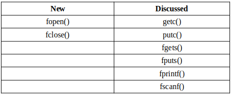
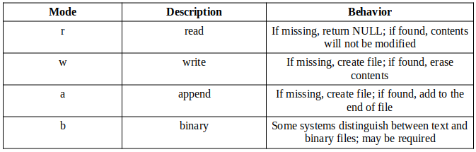

:title: C Programming - Input/Output Part 2: Files
:data-transition-duration: 1500
:css: c-prog.css

CCD Basic JQR v1.0
6.8 Demonstrate the ability to perform file management operations in C

----

6.8 Demonstrate the ability to perform file management operations in C
=======================================================================

----

Objectives
========================================

* [Demonstrate] Read Data from a File
* [Demonstrate] Write Data to a File
* [Demonstrate] Modify Data in a File
* [Demonstrate] Close an Open File
* [Demonstrate] Print File Information to the Console
* [Demonstrate] Create a New File
* [Demonstrate] Append Data to an Existing File
* [Demonstrate] Delete a File
* [Demonstrate] Determine the Size of a File (in a UNIX-based operating system)
* [Demonstrate] Determine Location within a File
* [Demonstrate] Insert Data into an Existing File
* [Demonstrate] Open an Existing File

----

Overview
========================================

* Read Data from a File
* Write Data to a File
* Modify Data in a File
* Close an Open File
* Print File Information to the Console
* Create a New File
* Append Data to an Existing File
* Delete a File
* Determine the Size of a File (in a UNIX-based operating system)
* Determine Location within a File
* Insert Data into an Existing File
* Open an Existing File
* Directory Traversal

----

File Data Type
========================================

* A file is a named section of storage on a system
* Files are stored on the systems main storage device (i.e. SSD, HDD, etc...)
* File declaration:

.. code:: c

  file * <file pointer variable>;         //example syntax
  file * myFile_ptr;                      //real syntax

----

File - Related Functions and Modes
========================================

* New functions vs previously discussed functions:

* File Modes:

----

Read Data from a File
========================================

* C language contains pre-define functions that allow reading rata from a file
* From the <stdio.h> header file
* they include the following:

  + fgetc() - Used to read a single character from the file.
  + fgets() - Used to read strings from files.
  + fscanf() - Used to read formatted input from a file.
  + fread() - Used to read the block of raw bytes from files(for binary files).

* Steps to read a file:
  + Open the file using fopen() function and store the reference of the file in a FILE pointer.
  + Read contents of the file using any of the functions listed above.
  + Close the file using the fclose() function.

* Note: We will see an implementation of this later

----

Write Data to a File
========================================

* To write data to a file, use the following steps

  + create a file pointer to handle the file
  + use the fopen() function with the "w" mode
  + check if ...
  + take input from user using fputs() function
  + Close the file using the fclose() function

* Note: We will see an implementation of this later

----

Modify Data in a file
========================================

* Silimar to writing data to a file
* Varies depending on what you want to modify in the file

  + Add/append data to a file
  + Change specific data/words to file
  + Replace data with other content to file
* For simplicity and the sake of this class, we'll look at how to append to a file

----

Close an Open File
========================================

* When handling files, it's important to close the file once you're done using it

  + This allows memory allocated for the program to be released 
  + This can prevent data loss (program/system unexpectedly crashes)
  + Modifications made to file may not display until file is closed
* Use the fclose() function to close file

----

Print File Information to the Console
========================================

* In order to print contents of a file to the console, you'll need to:

  + get file name
  + open file
  + read data from file
  + print data read to console
  + close file

Note: <labs_and_exercises/input_output_2>

----

Create a New File
========================================

* Was covered in a previous slide
* example:

.. code:: c

  file * fp;         
  fp = fopen("foo.txt", "w");                      

----

Append Data to an Existing File
========================================

* use the fopen() function with the "a" mode

* example:

.. code:: c

  file * fp;         
  fp = fopen("foo.txt", "a");  

----

Determine the Size of a File (in a UNIX-based operating system)
================================================================================

* In unix-based OS, you can use the fseek() and ftell() functions to know size of a file
* fseek() moves the file pointer to the end and ftell() finds the file pointers position in bytes
* Syntax of fseek():

.. code:: C

  int fseek(FILE *stream, long int offset, int pos)

* The "stream" parameter is the file object (aka the file you want to know the size of)
* The "offset" parameter used to specify the offset in terms of the number of bytes or characters where the position indicator needs to be placed to define the new file position.
* The "pos" parameter the point where the file offset needs to be added (meaning it defines the position where the file pointer must be moved)

* Syntax of ftell():

.. code:: C

  long int ftell(FILE *fstream)

* The "fstream" parameter is the file object (aka the file you want to know the size of)

----

Determine the Size of a File - Sample Code
================================================================================

.. code:: C

  // C program to find the size of a file
  #include <stdio.h>

  int main(){
      char file_name[] = { "foo.txt" };

      // opening the file in read mode
      FILE* fp = fopen(file_name, "r");
    
      // checking if the file exist or not
      if (fp == NULL) {
          printf("File Not Found!\n");
          return -1;
      }
    
      fseek(fp, 0, SEEK_END);
    
      // calculating the size of the file
      long int res = ftell(fp);
    
      // closing the file
      fclose(fp);

      if (res != -1)
          printf("Size of the file %s is %ld bytes \n", file_name, res);
      return 0;
  }

* The "0" value is 0 bytes from the begining of the file
* The "seek_end" value in fseek denotes the end of the file

Note: <labs_and_exercises/input_output_2/file_size.c>

----

Determine location within a file
========================================

* Finding a file in your system
* 

----

Directory Traversal
========================================

* Sometimes you may forget which specific location you put a file on your computer

  + Knowing how to traverse subdirectories within directories are important in this instance
* Directory traversal - locates a file using recursion
* In C, the header file <dirent.h> is used
* Common functions used in file traversal:

  + readdir()
  + opendir()
  + closedir()

----

Helpful Resources and Links
========================================

* Filler
* Filler
