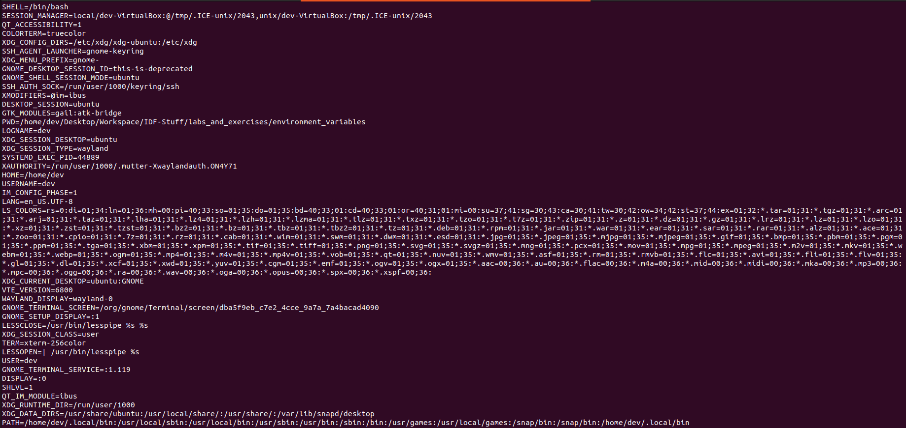

:title: C Programming - Environment Variables
:data-transition-duration: 1500
:css: c-prog.css

CCD Basic JQR v1.0
6.7 Demonstrate the ability to properly use the standard main() entry arguments
6.20 Demonstrate skill in accessing environment variables

----

6.20 Demonstrate skill in accessing environment variables
=============================================================

----

Objectives
========================================

* [Demonstrate] Use C library function getenv() to access environment variables
* [Demonstrate] Use char `*envp[]` to access environment variables inside main function (scope limited)

----

Overview
========================================

* Defining Environment Variables
* Environment access
* Standard Environment Variables
* Demonstration
* Resources
* Labs

----

Defining Environment Variables
========================================

What is an environment variable?
---------------------------------
* Variable that is set outside of a program
* The snippet of code ran below would print out your system's various environment variables.

example code:

.. code:: c

    #include <stdio.h>

    int main(int argc, char *argv[], char *envp[])
    {
	    int index;
        for (index = 0; envp[index] != NULL; index++)
        {
            printf("\n%s", envp[index]);
        }
        return 0;
    }
    :height: 550px
    :width: 1200px

----

:class: center-image

Output of code:
---------------------------------

----

Environment Access
========================================

* Two ways to access environment variables

  + argv and argc arguments in main() function
  + the same environment variables that are set using assignments and 'export' command in the shell
  + **note: program executed from the shell inherit all of the environment variables from the shell**

* Value of an environment variable can be accessed with getenv() function
* For Windows OS: can also access environment variables via getenv()

----

Environment Access Via getenv() Function
========================================

* Access Environment via getenv() function
* getenv() function is declared in the header file 'stdlib.h'
* Function: char *getenv(const char *name)*

  + returns a string that is the value of the environment variable 'name'
  + **note: in some non-Unix systems not using the GNU C Library (Windows),this string may be overwritten by subsequent calls to getenv.**
  + **note: if environment variable 'name' is not defined, the value is a null pointer**

getenv() function in code:

.. code:: c

  #include <stdio.h>
  #include <stdlib.h>

  int main () {
    printf("PATH : %s\n", getenv("PATH"));
    printf("HOME : %s\n", getenv("HOME"));
    printf("ROOT : %s\n", getenv("ROOT"));

    return(0);
  }

----

Environment Access Via secure_getenv() Function
=====================================================

* Similar to *getenv*, but returns null pointer if environment is not trusted
* This occurs when program file has SUID/SGID bits set.

  + Programs with SUID/SGID (executing as user who owns the file) can be used for nefarious reasons if exploited/abused

----

Environment Access via char * envp[] Argument
=====================================================

* envp[] is an alternative method of access environment variables
* Is not specified by POSIX standards but is supported
* Declared as a third argument in main() function

----

Demonstration
========================================
