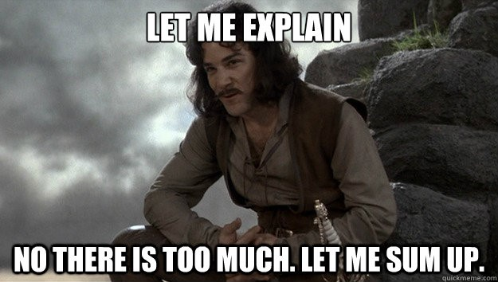

:title: C Programming - Intro and C Fundamentals
:data-transition-duration: 1500
:css: c-prog.css

Introduction to Instructors/Students, instruction environment, reference material, and C Fundamentals 

----

C-Block Introduction
========================================
* 6.1
* 6.14

----

Around the Room
========================================

* Name
* Programming Experience
* Where do you call home?

----

Working Agreement
========================================

* Start & End times
* Instruction vs Exercise balance
* Breaks
* Deliverables
* ???

.. note::

	Deliverables - Student repos/demonstrated understanding, instructor material
	Ask what students need from instruction team to be successful

----

C-Block Overview
========================================

Week 1:
  + stdout/in, variables, functions, operators, pointers
Week 2: 
  + memory management, compiler, data structures
Week 3:
  + environment variables, file I/O, multithreading

----

Important links
========================================

Course Material:
  + https://gitlab.90cos.cdl.af.mil/90cos/idf/instructors/c-programming
JQR
  + https://training.90cos.cdl.af.mil/jqr/CCD%20Basic%20JQR%20v1.0
Practice Environment
  + https://gitlab.90cos.cdl.af.mil/90cos/cyt/basic-ccd-practice-problems/basic-dev-prac-env
Practice Project
  + https://gitlab.90cos.cdl.af.mil/90cos/ccv/cyber-capability-developer-ccd/ccd-performance-test-bank-jqr/test-p
  
----

:class: center-image

C Introduction
========================================

.. note::

	We have more to cover then you have time to absorb
	Work on foundational understanding and how to search/digest information
	Be willing to challenge your own knowledge gaps, ask questions, be that guy

----

Objectives
========================================

* Establish workflow
* Learn basic C terminology
* Learn how to look up what you don't know	

.. note::

	Establish some form of workflow for the class and for approaching basic-ccd-practice-problems
	C Lexicon
	How/where to search

----

Overview
=========================

* Pseudo Code/Flow Charts
* Language Features
* Documentation
* Environment Setup

.. note::

	<PRESENTER_NOTE>

----

Pseudo Code & Flow charts
========================================

https://www.programiz.com/article/flowchart-programming

.. note::

	Have they seen something like this before? 
	Do they understand how to do something like this to represent code

----

C Terminology
========================================

* Keywords
* Punctuators
* Identifier
* Scope
* Declaration/Definition
* Expression
* Statements
* Functions

.. note::

	keywords: main, namespaces
	https://learn.microsoft.com/en-us/cpp/c-language/lexical-grammar?view=msvc-170

----

Keywords
=========================

Words with *special meaning* to a C compiler. 

There are a lot, and can be compiler/system specific

.. note::

	https://gcc.gnu.org/onlinedocs/gcc-4.8.5/gcc/Keyword-Index.html
	https://learn.microsoft.com/en-us/cpp/c-language/c-keywords?view=msvc-170

----

Punctuators
========================================

Characters with *special meaning* to a C compiler.

	\[ ] ( ) { } . -> ++ -- & \* + - ~ ! / % 
	<< >> < > <= >= == != ^ \| && \|\| ? : ; ...
	= \*= /= %= += -= <<= >>= &= ^= \|= , # \\

.. note::

	<PRESENTER_NOTE>

----

Identifier 
========================================

Names you provide for your functions, variables, labels, and/or types.
Must use unique identifiers!
Can't overlap with other identifiers or keywords.

.. note::

	exercises/wk1/intro.c

---

Scope
========================================

The part of a program in which an identifier may be used

.. note::

	exercises/wk1/intro.c

----

Declaration/Definition
========================================

A declaration specifies the interpretation and attributes of an identifier. 
A *declaration* that causes storage to be reserved is called a *Definition*.

.. note::

	exercises/wk1/intro.c

----

Expression 
========================================

Sequence of operators and operands that compute a value, designate an object or function, and/or generate side effects.

.. note::
	Expressions enclosed in () become operands
	exercises/wk1/intro.c

----

Statements 
========================================

A section of code that carries out a task.

.. note::

	exercises/wk1/intro.c

----

Functions 
========================================

A sequence of statements packaged together perform a task.

.. note::

	exercises/wk1/intro.c

----

Documentation 
========================================

* Man pages: Software documentation found on unix-like operating systems
* https://learn.microsoft.com/en-us/docs/: Microsoft documentation

.. note::

	man -k
	Microsoft documentation is going targeted to c++, may need to know difference

----

Environment Setup
========================================

* CCD Performance Practice Environment

.. note::
	
	Don't know what you're doing use practice environment
	Unix - Use environment, WSL, linux vm, linux host
	Windows - Use Visual Studio on windows vm/host

----

Summary
========================================

* Working Agreement for the Block
* Overview of the next 3 weeks
* Started working on our C lexicon
* Learned where to find resources
* Setup a development environment