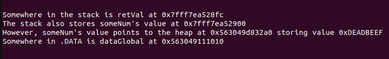
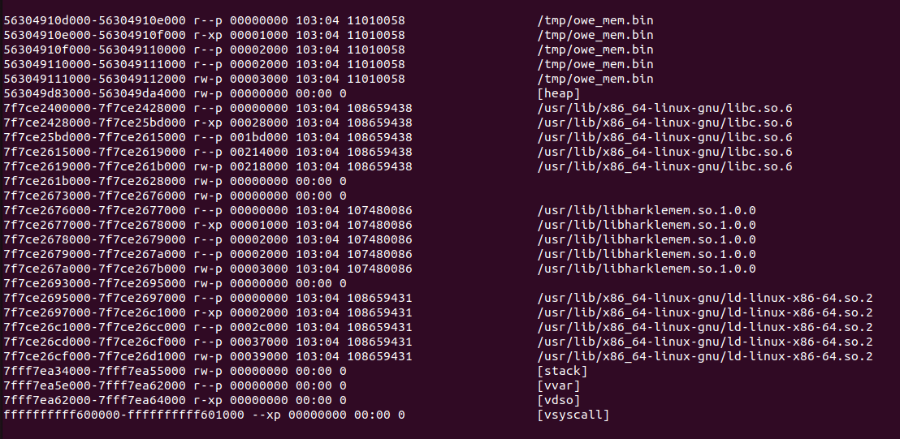
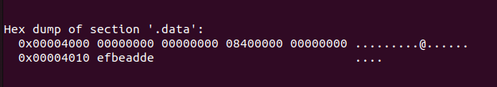
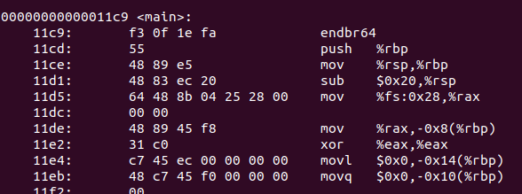
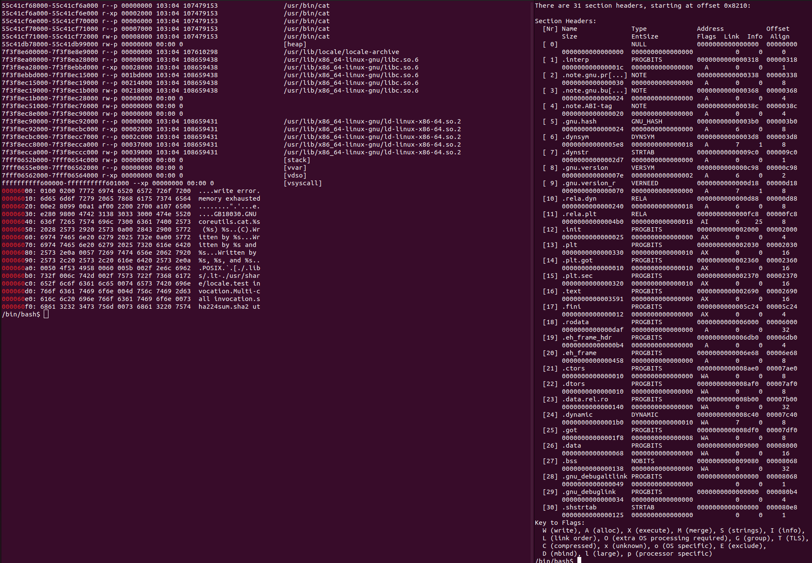

:title: C Programming - Memory Concepts
:data-transition-duration: 1500
:css: keri.css

CCD Basic JQR v1.0
6.2 Describe C programming concepts in regard to memory

----

6.2 Describe C programming concepts in regard to memory
=======================================================

----

Objectives
========================================

* [Describe] Dynamically allocated memory
* [Describe] Statically allocated memory
* In the context of automatic vs dynamic allocation, explain how those concepts are related to the implementation of a stack and heap in a C program
* [Describe the] Memory map of a Linux process
* [Describe] Automatically allocated memory

.. note::

	Verbs were added to better communicate the actual objective expectation

	The order of JQS line item objectives was preserved but the presentation order will be different

----

Overview
========================================

* Memory Concepts
* Memory Map of a Linux Process
* Resources

----

Memory Concepts
========================================

* Binary Sections
* Memory Regions
* Storage Classes
* What goes where?
* Pros/Cons
* Demonstration

.. note::

	SPOILER ALERT: This section will fill in a table as the section progresses

----

:class: split-table

Memory Concepts - Binary Sections
========================================

+---------+------------------------------+---------------------------+
| SECTION | CONTENTS                     | EXAMPLES                  |
+---------+------------------------------+---------------------------+
| .text   | executable code              | \x90\x90\x90\x90          |
+---------+------------------------------+---------------------------+
| .rodata | read-only initialized data   | "string literals"         |
+---------+------------------------------+---------------------------+
| .data   | initialized static variables | int myGlobal = 42;        |
+---------+------------------------------+---------------------------+

.. note::

	"initialized static variables", i.e. global variables and local static variables which have a defined value and can be modified

	.bss holds "uninitialized static data", both variables and constants, i.e. global variables and local static variables that are initialized to zero or do not have explicit initialization in source code.

	Static is an important word here.  SPOILER ALERT: Non-static function-scope variables do *not* got into .data or .bss.  They go on the stack.

	SPOILER ALERT: There are more sections than these but these sections are: 1. important to this lession, 2. standard(ish) between PE and ELF, 3. the details of an ELF file are a two week course unto themselves

	In PE files, .rodata is .rdata

	FUN FACT: \x90\x90\x90\x90 represents the opcodes for what is known as a "nop sled"

	This chart is "section header" ordered

----

Memory Concepts - Memory Regions
========================================

* .data
* heap
* stack

.. note::

	<PRESENTER_NOTE>

----

Memory Concepts - Storage Classes
========================================

* automatic
* dynamic
* static

.. note::

	<PRESENTER_NOTE>

----

:class: split-table

Memory Concepts
========================================

Put it all together...

+---------------+---------------+---------------------------+-------------------------------------+-------------------------------------+
| REGION        | STORAGE CLASS | HOW?                      | PROS                                | CONS                                |
+---------------+---------------+---------------------------+-------------------------------------+-------------------------------------+
| .data         | static        | global & static variables | TD: DDN... get from 39 IOS training | TD: DDN... get from 39 IOS training |
+---------------+---------------+---------------------------+-------------------------------------+-------------------------------------+
| heap          | dynamic       | ask the OS nicely         | TD: DDN... get from 39 IOS training | TD: DDN... get from 39 IOS training |
+---------------+---------------+---------------------------+-------------------------------------+-------------------------------------+
| stack         | automatic     | local variables*          | TD: DDN... get from 39 IOS training | TD: DDN... get from 39 IOS training |
+---------------+---------------+---------------------------+-------------------------------------+-------------------------------------+

\* Some calling conventions pass parameters on the stack.  Also, lower level languages have direct access to the stack.

.. note::

	<PRESENTER_NOTE>

----

Memory Concepts - Demonstration
========================================

Consider this source code...

.. code:: c

	#include <harklemem.h>  // give_me_memory(), take_my_memory()
	#include <stdio.h>      // printf(), getchar()

	int dataGlobal = 0xDEADBEEF;  // Global variable stored in .DATA

	int main(void)
	{
		// LOCAL VARIABLES
		int retVal = 0;       // Stored on the stack
		int *someNum = NULL;  // Also on the stack

		// DO SOMETHING
		someNum = give_me_memory(sizeof(int));  // Returns a pointer to the heap

		if (NULL == someNum)
		{
			retVal = 1;  // PRO TIP: Always Be Checking pointers
		}
		else
		{
			*someNum = dataGlobal;
			printf("Somewhere in the stack is retVal at %p\n", &retVal);
			printf("The stack also stores someNum's value at %p\n", &someNum);
			printf("However, someNum's value points to the heap at %p storing value 0x%X\n",
			       someNum, *someNum);
			printf("Somewhere in .DATA is dataGlobal at %p\n", &dataGlobal);
			take_my_memory((void**)&someNum, sizeof(int));  // Zeroizes and frees the heap memory
			getchar();  // Pause exeucution so I can inspect /proc/PID/maps
		}

		// DONE
		return retVal;
	}

.. note::

	Discuss the region and storage class for the following variables: dataGlobal, retVal, someNum.

	BONUS POINTS to whomever remembers the section where string literals are stored.

	"A, always. B, be. C, checking.  Always be checking pointers, ALWAYS be checking pointers."

----

:class: flex-image center-image

Memory Concepts - Demonstration
========================================

During execution...

.. code:: bash

	gcc -o owe_mem.bin owe_mem.c -lharklemem
	./owe_mem.bin

.. code:: bash

	cat /proc/`pidof owe_mem.bin`/maps

<address start>-<address end>    <mode>    <offset>    <major id:minor id>    <inode id>    <file path>

.. note::

	<PRESENTER_NOTE>

----

:class: flex-image center-image

Memory Concepts - Demonstration
========================================

Let's find the variables in the ELF binary

.. code:: bash

	readelf -x .data owe_mem.bin  # Hex-dump the .data section of owe_mem.bin

.. code:: bash

	objdump -d main owe_mem.bin  # Disassemble owe_mem.bin's main()

This isn't Assembly Programming!  What does this mean?

.. code:: nasm

	push %rbp              ; 1. Save the base pointer on the stack
	mov %rsp,%rbp          ; 2. Replace the base pointer with the stack pointer
	sub $0x20,%rsp         ; 3. Makes room on the stack for the local variables
	; <snip>
	movl $0x0,-0x14(%rbp)  ; 4. int retVal = 0
	movq $0x0,-0x10(%rbp)  ; 5. int *someNum = NULL

.. note::

	We found 0xDEADBEEF in the .data section of the ELF file.  An observant student would notice that it reads "efbeadde" instead
	of deadbeef.  Why is that?  SHORT ANSWER: readelf -h owe_mem.bin | head -n 4 tells us this is little endian.

	1. Pretty common practice for humans and compilers.  Save the base pointer by pushing it onto the stack to we can pop it later.

	2. Pretty common practice for humans and compilers.  Save the "default"(?) stack pointer so we can make room for local variables
	on the stack.  We can make more room as we go without having to keep track of how much room we made.  When we're done, the stack
	pointer is restored from the rbp register and the original base pointer is popped from the stack into rbp.  In this case,
	all of this is done by the x86_64 leave instruction.  A human would likely either do it all manually or call enter/leave.  Instead,
	the compiler decided to mix it up.  <shrug>

	3. Make room on the stack for 0x20 bytes worth of data.

	4. int retVal (4 bytes) is stored at 0x14 bytes above the (current) base pointer.
	movl moves 4 bytes worth of 0x0 into its address on the stack.

	5. int \*someNum (8 bytes) is stored at 0x10 bytes above the (current) base pointer.
	movq moves 8 bytes (a QUADWORD) worth of 0x0 into its address on the stack.

	SIDE NOTE: An observant student might notice that 0x20 bytes were "cleared" on the stack but the locals only use up 12 bytes.
	Well, compilers do odd things sometimes.  Sometimes, it's at the behest of the ABI.  If you investigate *all* of main()'s
	disassembly, you would see that something is being done with the bytes below someNum.  However, it doesn't appear the bytes
	above retVal are being used.  Perhaps this is to align the stack?  Regardless, a human would likely have programmed this
	differently.

----

:class: flex-image center-image

Memory Concepts - Demonstration
========================================

.. code:: bash

	cat /proc/self/maps               # Upper Left
	xxd `which cat` | grep "^000060"  # Left
	readelf -S `which cat`            # Right

.. note::

	THINGS TO POINT OUT TO THE STUDENTS:

	Compare the offset of the mapping to the offset of the section headers

	Compare the offset of the section headers to the xxd of the binary

	The readelf output shows us the offset of the .DATA section is 0x8000.  The proc maps shows us a rw section of memory at offset 0x8000.  We've seen previous examples (owe_mem.bin) showing that was the .DATA mapping.

	The readelf output shows us the offset of the .RODATA section is 0x6000.  The proc maps has a read-only section mapped at offset 0x6000.  The xxd output, starting at the binary's offset of 0x6000, shows us some obvious string literals.

	The readelf output shows us the offset of the .TEXT section is 0x2690.  According to proc maps, that places it within the only memory segment allowed to "execute".

----

<SECTION_2_3>
========================================

* <STUDENTS_SEE_THIS>

.. note::

	<PRESENTER_NOTE>

----

<SECTION_3>
========================================

----

<SECTION_3_1>
========================================

* <STUDENTS_SEE_THIS>

.. note::

	<PRESENTER_NOTE>

----

<SECTION_3_2>
========================================

* <STUDENTS_SEE_THIS>

.. note::

	<PRESENTER_NOTE>

----

RESOURCES
========================================

* Binary Sections
    * ELF: https://lwn.net/Articles/531148/
    * PE: https://0xrick.github.io/win-internals/pe5/

.. note::

	<PRESENTER_NOTE>

----

Summary
========================================

* <SECTION_1>
* <SECTION_2>
* <SECTION_3>

----

Objectives
========================================

* <OBJECTIVE_1>
* <OBJECTIVE_2>
* <OBJECTIVE_3>
