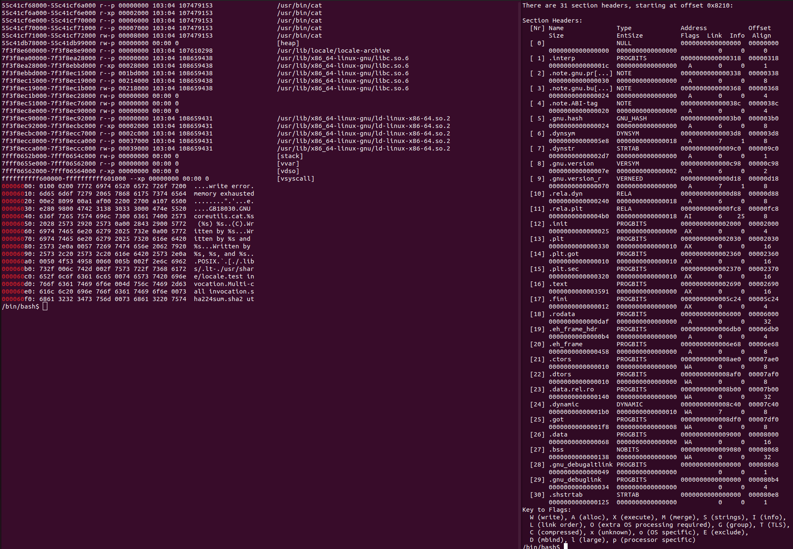

:title: C Programming - Memory Concepts
:data-transition-duration: 1500
:css: keri.css

CCD Basic JQR v1.0
6.2 Describe C programming concepts in regard to memory

----

6.2 Describe C programming concepts in regard to memory
=======================================================

----

Objectives
========================================

* [Describe] Dynamically allocated memory
* [Describe] Statically allocated memory
* In the context of automatic vs dynamic allocation, explain how those concepts are related to the implementation of a stack and heap in a C program
* [Describe the] Memory map of a Linux process
* [Describe] Automatically allocated memory

.. note::

	Verbs were added to better communicate the actual objective expectation

	The order of JQS line item objectives was preserved but the presentation order will be different

----

Overview
========================================

* Memory Concepts
* Memory Map of a Linux Process
* Demonstration
* Resources

----

Memory Concepts
========================================

* Binary Sections
* Memory Regions
* Pros/Cons
* Which region should I use?
* Storage Classes

.. note::

	SPOILER ALERT: This section will be summarized by a table that "puts it all together"

----

:class: split-table

Memory Concepts - Binary Sections
========================================

+---------+------------------------------+---------------------------+
| SECTION | CONTENTS                     | EXAMPLES                  |
+---------+------------------------------+---------------------------+
| .text   | executable code              | \x90\x90\x90\x90          |
+---------+------------------------------+---------------------------+
| .rodata | read-only initialized data   | "string literals"         |
+---------+------------------------------+---------------------------+
| .data   | initialized static variables | int myGlobal = 42;        |
+---------+------------------------------+---------------------------+

.. note::

	"initialized static variables", i.e. global variables and local static variables which have a defined value and can be modified

	.bss holds "uninitialized static data", both variables and constants, i.e. global variables and local static variables that are initialized to zero or do not have explicit initialization in source code.

	Static is an important word here.  SPOILER ALERT: Non-static function-scope variables do *not* got into .data or .bss.  They go on the stack.

	SPOILER ALERT: There are more sections than these but these sections are: 1. important to this lession, 2. standard(ish) between PE and ELF, 3. the details of an ELF file are a two week course unto themselves

	In PE files, .rodata is .rdata

	FUN FACT: \x90\x90\x90\x90 represents the opcodes for what is known as a "nop sled"

	This chart is "section header" ordered

----

Memory Concepts - Memory Regions
========================================

* .data
	* stores initialized global && static variables
	* stored in the binary
	* loaded into a "writeable" memory segment
* heap
	* stores whatever you want
	* managed by the programmer
	* ask the OS nicely to borrow some
	* reclaimed when freed
* stack
	* stores local variables
	* managed by the OS
	* behavior dependent on OS
	* reclaimed when process exits

.. note::

	heap "ask nicely for some" is the crux of 6-21

	stack "behavior dependent on OS" (see: ABI from 6-15)

----

:class: split-table

Memory Concepts - Pros/Cons
========================================

Each memory region has advantages and disadvantages

+---------------+-------------------------------------+----------------------------------------------------+
| REGION        | PROS                                | CONS                                               |
+---------------+-------------------------------------+----------------------------------------------------+
| .data         | global/static variables useful      | global variables are dangerous                     |
+---------------+-------------------------------------+----------------------------------------------------+
| heap          | Accessible globally; can be resized | Slower; requires bookkeeping; requests fail; leaky |
+---------------+-------------------------------------+----------------------------------------------------+
| stack         | Fast; auto-managed                  | Limited; fixed size; stored in contiguous memory   |
+---------------+-------------------------------------+----------------------------------------------------+

.. note::

	.data

	If anyone asks why global and/or static variables are useful...

	global variables

	PROS: good for program/library-wide constants; easy inter-process communication (IPC)

	CONS: more difficult to debug; concurrency is an issue

	static variables

	PROS: preserve their value across function calls

	heap

	Passing around pointers to heap memory is appropriate but mismanagement of heap memory can lead to BUGs.
	Also, preferred for storing data of variable size or large amounts of data.

	stack

	As a C programmer, you need not concern yourself with the stack.  Your default memory region for storing data
	should be "local variables", which are stored here.  No management required.  However, the fact that its
	stored in continguous memory makes it vulnerable to buffer overflow attacks.

----

Memory Concepts - Which Should I Use?
========================================

When should I use the _____ memory region?

* .data
    * Don't!
    * constants
    * inter-process communication (IPC)
* heap
    * large data
    * data size unknown at compile-time
    * preserve data across function calls
    * data that needs to be resized at run-time
* stack
    * default
    * small data
    * short-lived data

.. note::

	.data

	The default stance should be "don't use global or static variables".  If you *need* one, you'll know it.

	heap

	Variable sized data or large data.

	stack

	Default to locally scoped variables.

----

Memory Concepts - Storage Classes
========================================

* automatic - managed by the OS at runtime
* dynamic - allocated, managed, and freed by programmers at runtime
* static - allocated at compile time

.. note::

	C programmers need not worry themselves about "automatic" memory.  Assembly programmers on the other hand...

	Dynamic memory is the bread-and-butter of C Programming.

	static memory exists in memory for the lifetime of the program

	see: https://fractallambda.com/2014/10/30/Dynamic-Static-and-Automatic-memory.html

----

:class: split-table

Memory Concepts
========================================

Put it all together...

+---------------+---------------+----------------------------+-------------------------------------+----------------------------------------------------+
| REGION        | STORAGE CLASS | HOW?                       | PROS                                | CONS                                               |
+---------------+---------------+----------------------------+-------------------------------------+----------------------------------------------------+
| .data         | static        | global && static variables | global/static variables useful      | globals are dangerous                              |
+---------------+---------------+----------------------------+-------------------------------------+----------------------------------------------------+
| heap          | dynamic       | ask the OS nicely          | Accessible globally; can be resized | Slower; requires bookkeeping; requests fail; leaky |
+---------------+---------------+----------------------------+-------------------------------------+----------------------------------------------------+
| stack         | automatic     | local variables*           | Fast; auto-managed                  | Limited; fixed size; stored in contiguous memory   |
+---------------+---------------+----------------------------+-------------------------------------+----------------------------------------------------+

\* Some calling conventions pass parameters on the stack.  Also, lower level languages have direct access to the stack.

.. note::

	Time to explicitly associate the storage classes with the memory regions.

	Now's the time to discuss "In the context of automatic vs dynamic allocation, explain how those concepts are related to the implementation of a stack and heap in a C program"

----

:class: center-image

Memory Map of a Linux Process
========================================

.. image:: images/06-02_003_01-memory_layout-cropped.png

.. note::

	This orientation (high addresses --> low addresses) is commonly used to describe the memory layout.  It may not be good for this lesson though because readelf, objdump, proc maps, and xxd all display output from low address --> high address.  Be sure to highlight the difference in orientation for the students.

	However, this layout may be favorable for assembly programmers.  It's likely easier to think about the stack from this orientation.

	It's not important for C programmers, but mention the fact that the "stack grows down" and the "heap grows up" (as they say).

	Image lifted from: https://courses.engr.illinois.edu/cs225/fa2022/resources/stack-heap/

----

Demonstration
========================================

Consider this source code...

.. code:: c

	#include <harklemem.h>  // give_me_memory(), take_my_memory()
	#include <stdio.h>      // printf(), getchar()

	int dataGlobal = 0xDEADBEEF;  // Global variable stored in .DATA

	int main(void)
	{
		// LOCAL VARIABLES
		int retVal = 0;       // Stored on the stack
		int *someNum = NULL;  // Also on the stack

		// DO SOMETHING
		someNum = give_me_memory(sizeof(int));  // Returns a pointer to the heap

		if (NULL == someNum)
		{
			retVal = 1;  // PRO TIP: Always Be Checking pointers
		}
		else
		{
			*someNum = dataGlobal;
			printf("Somewhere in the stack is retVal at %p\n", &retVal);
			printf("The stack also stores someNum's value at %p\n", &someNum);
			printf("However, someNum's value points to the heap at %p storing value 0x%X\n",
			       someNum, *someNum);
			printf("Somewhere in .DATA is dataGlobal at %p\n", &dataGlobal);
			take_my_memory((void**)&someNum, sizeof(int));  // Zeroizes and frees the heap memory
			getchar();  // Pause exeucution so I can inspect /proc/PID/maps
		}

		// DONE
		return retVal;
	}

.. note::

	Knowledge-based discussion of a topic is fine, but visual presentation can aid in understanding.

	Discuss the region and storage class for the following variables: dataGlobal, retVal, someNum.

	BONUS POINTS to whomever remembers the section where string literals are stored.

	"A, always. B, be. C, checking.  Always be checking pointers, ALWAYS be checking pointers."

----

:class: flex-image center-image

Demonstration
========================================

During execution...

.. code:: bash

	gcc -o owe_mem.bin owe_mem.c -lharklemem
	./owe_mem.bin

.. image:: images/06-02_001_01-execution-cropped.png

.. code:: bash

	cat /proc/`pidof owe_mem.bin`/maps

<address start>-<address end>    <mode>    <offset>    <major id:minor id>    <inode id>    <file path>

.. image:: images/06-02_001_02-proc_maps-cropped.png

.. note::

	For more on /proc/<PID>/maps see: https://www.baeldung.com/linux/proc-id-maps

	address start – address end is the start and end address of that mapping. Note that the whole output is sorted based on those addresses, from low to high.

    mode (permissions) specifies which actions are available on this mapping and if it’s private or shared.

    offset is the start offset in bytes within the file that is mapped. This only makes sense for file mappings. For instance, stack or heap mappings are examples of mappings that aren’t files, and in those cases, the offset is 0.

    major:minor ids represent the device that the mapped file lives in the form of a major and minor id. For non-file mappings, this column shows 00:00.

    inode id of the mapped file (again, that’s only valid for file mappings). Inodes are data structures that contain the core filesystem-related metadata. When it comes to non-file mappings, this field is set to 0.

    The file path of the file for that mapping. In the event that this is not a file mapping, that field is empty.

----

:class: flex-image center-image

Demonstration
========================================

Let's find the variables in the ELF binary

.. code:: bash

	readelf -x .data owe_mem.bin  # Hex-dump the .data section of owe_mem.bin

.. image:: images/06-02_001_03-data_section-cropped.png

.. code:: bash

	objdump -d main owe_mem.bin  # Disassemble owe_mem.bin's main()

.. image:: images/06-02_001_04-text_section-cropped.png

This isn't C code!  What is this the meaning of this?

.. code:: nasm

	push %rbp              ; 1. Save the base pointer on the stack
	mov %rsp,%rbp          ; 2. Replace the base pointer with the stack pointer
	sub $0x20,%rsp         ; 3. Makes room on the stack for the local variables
	; <snip>
	movl $0x0,-0x14(%rbp)  ; 4. int retVal = 0
	movq $0x0,-0x10(%rbp)  ; 5. int *someNum = NULL

.. note::

	We found 0xDEADBEEF in the .data section of the ELF file.  An observant student would notice that it reads "efbeadde" instead
	of deadbeef.  Why is that?  SHORT ANSWER: readelf -h owe_mem.bin | head -n 4 tells us this is little endian.

	1. Pretty common practice for humans and compilers.  Save the base pointer by pushing it onto the stack to we can pop it later.

	2. Pretty common practice for humans and compilers.  Save the "default"(?) stack pointer so we can make room for local variables
	on the stack.  We can make more room as we go without having to keep track of how much room we made.  When we're done, the stack
	pointer is restored from the rbp register and the original base pointer is popped from the stack into rbp.  In this case,
	all of this is done by the x86_64 leave instruction.  A human would likely either do it all manually or call enter/leave.  Instead,
	the compiler decided to mix it up.  <shrug>

	3. Make room on the stack for 0x20 bytes worth of data.

	4. int retVal (4 bytes) is stored at 0x14 bytes above the (current) base pointer.
	movl moves 4 bytes worth of 0x0 into its address on the stack.

	5. int \*someNum (8 bytes) is stored at 0x10 bytes above the (current) base pointer.
	movq moves 8 bytes (a QUADWORD) worth of 0x0 into its address on the stack.

	SIDE NOTE: An observant student might notice that 0x20 bytes were "cleared" on the stack but the locals only use up 12 bytes.
	Well, compilers do odd things sometimes.  Sometimes, it's at the behest of the ABI.  If you investigate *all* of main()'s
	disassembly, you would see that something is being done with the bytes below someNum.  However, it doesn't appear the bytes
	above retVal are being used.  Perhaps this is to align the stack?  Regardless, a human would likely have programmed this
	differently.

----

:class: flex-image center-image

Demonstration
========================================

.. code:: bash

	cat /proc/self/maps               # Upper Left
	xxd `which cat` | grep "^000060"  # Left
	readelf -S `which cat`            # Right

.. note::

	THINGS TO POINT OUT TO THE STUDENTS:

	Compare the offset of the mapping to the offset of the section headers

	Compare the offset of the section headers to the xxd of the binary

	The readelf output shows us the offset of the .DATA section is 0x8000.  The proc maps shows us a rw section of memory at offset 0x8000.  We've seen previous examples (owe_mem.bin) showing that was the .DATA mapping.

	The readelf output shows us the offset of the .RODATA section is 0x6000.  The proc maps has a read-only section mapped at offset 0x6000.  The xxd output, starting at the binary's offset of 0x6000, shows us some obvious string literals.

	The readelf output shows us the offset of the .TEXT section is 0x2690.  According to proc maps, that places it within the only memory segment allowed to "execute".

	For more on /proc/<PID>/maps see: https://www.baeldung.com/linux/proc-id-maps

----

RESOURCES
========================================

* Binary Sections
    * ELF: https://lwn.net/Articles/531148/
    * PE: https://0xrick.github.io/win-internals/pe5/
* Understanding /proc/<PID>/maps: https://www.baeldung.com/linux/proc-id-maps
* Understanding the Memory Layout of Linux Executables: https://gist.github.com/CMCDragonkai/10ab53654b2aa6ce55c11cfc5b2432a4
* Stack vs Heap: https://courses.engr.illinois.edu/cs225/fa2022/resources/stack-heap/
* Dynamic, automatic, and static memory: https://fractallambda.com/2014/10/30/Dynamic-Static-and-Automatic-memory.html
* 39 IOS Training: https://39ios-idf.90cos.cdl.af.mil/4_c_module/12_memory_management/index.html

.. note::

	Good resources for additional learning opportunities

----

Summary
========================================

* Memory Concepts
	* Binary Sections
	* Memory Regions
	* Pros/Cons
	* Which region should I use?
	* Storage Classes
* Memory Map of a Linux Process
* Demonstration
* Resources

.. note::

	Be sure to discuss, "In the context of automatic vs dynamic allocation, explain how those concepts are related to the implementation of a stack and heap in a C program" if you haven't already...

	Take this opportunity to recap with questions like:

	Q: "Which binary section holds executable code?"  A: ".text"

	Q: "Which memory region stores local variables?"  A: "stack"

	Q: "Which storage class is managed by programmers?"  A: "dynamic"

	Q: "Which binary section holds string literals?"  A: ".rodata"

	Q: "What is an advantage of storing advantage on the stack?"  A: speed

	Q: "When should you consider storing data on the heap instead of the stack?"  A: Large amounts of data, size unknown at compile-time

	Here's a question at a higher knowledge level they should be able to answer:

	Q: "Which binary section is also a memory region?"  A: ".data"	

----

Objectives
========================================

* [Describe] Dynamically allocated memory
* [Describe] Statically allocated memory
* In the context of automatic vs dynamic allocation, explain how those concepts are related to the implementation of a stack and heap in a C program
* [Describe the] Memory map of a Linux process
* [Describe] Automatically allocated memory
