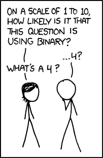
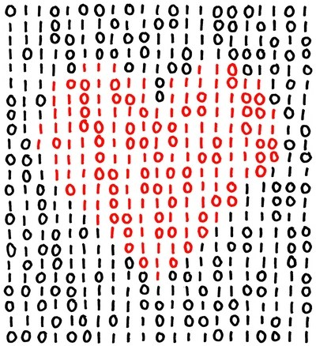

:title: C Programming - Expressions - Bitwise
:data-transition-duration: 1500
:css: c-prog.css

Bitwise operations in C

----

C Expressions and Operators
========================================
* 6.6
* 6.18

----

Objectives
========================================

* Use bitwise operators to create relevant expressions

----

Overview
========================================

* Binary 101
* Signed vs. Unsigned Types
* Bitwise Operators
* Common Uses
* Common Expressions
* Resources
* Student Labs

----

:class: shrink-image center-image

Binary 101
========================================

.. note::

	SOURCE: https://xkcd.com/953

----

Binary 101
========================================

* <STUDENTS_SEE_THIS>

.. note::

	<PRESENTER_NOTE>

----

Signed vs. Unsigned Types
========================================

----

Signed vs. Unsigned
========================================

* <STUDENTS_SEE_THIS>

.. note::

	<PRESENTER_NOTE>

----

Bitwise Operators
========================================

----

:class: split-table shrink-table

Bitwise Operators
========================================

+-------------+--------+
| Operator    | Symbol |
+-------------+--------+
| AND         | &      |
+-------------+--------+
| OR          | \|     |
+-------------+--------+
| XOR         | ^      |
+-------------+--------+
| NOT         | ~      |
+-------------+--------+
| Left Shift  | <<     |
+-------------+--------+
| Right Shift | >>     |
+-------------+--------+

.. note::

	XOR is pronounced "Ecks-Ohr"
	Foot-stomp the fact these are not to be confused with logical operators
	(Make the students describe the different between logical/bitwise AND, OR, and NOT)

----

Bitwise AND
========================================

+-------+-------+-------+
| bit a | bit b | a & b |
+-------+-------+-------+
| 0     | 0     | 0     |
+-------+-------+-------+
| 0     | 1     | 0     |
+-------+-------+-------+
| 1     | 0     | 0     |
+-------+-------+-------+
| 1     | 1     | 1     |
+-------+-------+-------+

.. note::

	Both bits must be "true" for the result to be "true"

----

Bitwise AND
========================================

.. code:: text

	  01001101 01100001 01110010 01101011
	& 01001000 01100001 01110010 01101011
	  -----------------------------------
	  01001000 01100001 01110010 01101011

.. note::

	Walk the students through this bit by bit
	Mark & Hark == Hark

----

Bitwise OR
========================================

+-------+-------+-------+
| bit a | bit b | a | b |
+-------+-------+-------+
| 0     | 0     | 0     |
+-------+-------+-------+
| 0     | 1     | 1     |
+-------+-------+-------+
| 1     | 0     | 1     |
+-------+-------+-------+
| 1     | 1     | 1     |
+-------+-------+-------+

.. note::

	Either bit can be "true" for the result to be "true"

----

Bitwise OR
========================================

.. code:: text

	  01001101 01100001 01110010 01101011
	| 01001000 01100001 01110010 01101011
	  -----------------------------------
	  01001101 01100001 01110010 01101011

.. note::

	Walk the students through this bit by bit
	Mark | Hark == Mark

----

Bitwise XOR
========================================

* AKA Exclusive Or

+-------+-------+-------+
| bit a | bit b | a ^ b |
+-------+-------+-------+
| 0     | 0     | 0     |
+-------+-------+-------+
| 0     | 1     | 1     |
+-------+-------+-------+
| 1     | 0     | 1     |
+-------+-------+-------+
| 1     | 1     | 0     |
+-------+-------+-------+

.. note::

	Only one bit can be "true" for the result to be "true"

----

Bitwise XOR
========================================

.. code:: text

	  01001101 01100001 01110010 01101011
	^ 01001000 01100001 01110010 01101011
	  -----------------------------------
	  00000101 00000000 00000000 00000000

.. note::

	Walk the students through this bit by bit
	Mark | Hark == "\x05\x00\x00\x00"

----

Bitwise NOT
========================================

* AKA The 1's Compliment

+-------+-------+
| bit a | ~a    |
+-------+-------+
| 0     | 1     |
+-------+-------+
| 1     | 0     |
+-------+-------+

.. note::

	This is a unary operator (needing just one operand)
	It has the effect of "flipping" the bit

----

Bitwise NOT
========================================

.. code:: text

	~ 01001101 01100001 01110010 01101011
	  -----------------------------------
	  10110010 10011110 10001101 10010100

.. note::

	Walk the students through this bit by bit
	~Mark == ����

----

Bitwise Left Shift
========================================

* <STUDENTS_SEE_THIS>

.. note::

	<PRESENTER_NOTE>

----

Bitwise Right Shift
========================================

* <STUDENTS_SEE_THIS>

.. note::

	<PRESENTER_NOTE>

----

<SECTION_3_3>
========================================

* <STUDENTS_SEE_THIS>

.. note::

	<PRESENTER_NOTE>

----

Resources
========================================

* Bitwise Calculator: https://bitwisecmd.com/
* Bitwise Calculator & Visualizer: https://unsuitable001.github.io/BitViz
* The C Programming Language 2.9
* https://www.programiz.com/c-programming/bitwise-operators

----

Student Labs
========================================

* <STUDENTS_SEE_THIS>

.. note::

	<PRESENTER_NOTE>

----

Summary
========================================

* <SECTION_1>
* <SECTION_2>
* <SECTION_3>

----

Objectives
========================================

* <OBJECTIVE_1>
* <OBJECTIVE_2>
* <OBJECTIVE_3>

----

:class: shrink-image center-image

00000000
========================================

.. note::

	SOURCE: https://xkcd.com/99
