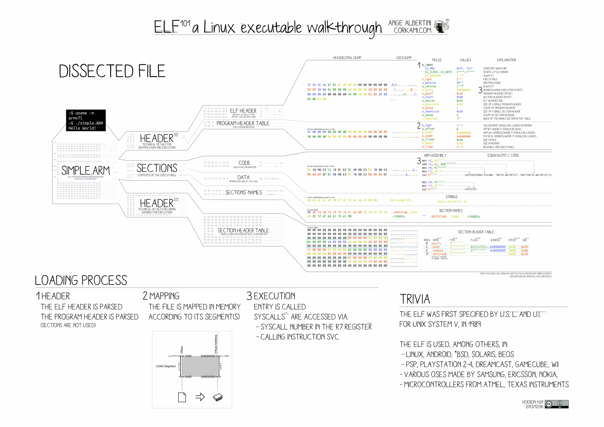

:title: C Programming - Definitions
:data-transition-duration: 1500
:css: keri.css

CCD Basic JQR v1.0
6.15 Describe terms associated with compiling, linking, debugging, and executables

----

6.15 Describe terms associated with compiling, linking, debugging, and executables
==================================================================================

----

Objectives
========================================

* [Describe terms associated with] Portable Executable (PE)
* [Describe terms associated with] Executable and Linkable Format (ELF)
* [Describe the] Difference between PE and ELF
* [Describe the] Difference between a library (shared object / DLL) and a regular executable program
* [Describe the] Calling convention/Application Binary Interface (ABI)

.. note::

	This JQS item seems to be missing an explicit objective covering the *actual* terms associated with compiling, linking, and debugging.

	Harkjective: Describe terms associated with compiling, linking, and debugging C programs.

----

Overview
========================================

* Disclaimer
* C Compilation Stages
* PE vs ELF
* Libraries vs Executables
* Calling Convention/ABI
* Checklist

----

DISCLAIMER
========================================

Memorizing terms, for the sake of memoriziation, is useless.

Meaningful memorization comes with experience.

.. note::

	"We will discuss these terms now but experience them later.  With that experience, comes memorization."

	The students may not be able to describe all of these terms by the end of 6.15.
	However, they should be able to describe all of these terms well before the end of the C Programming
	block of instruction.

	The post-Definitions plan is to regularly refer back to the "Checklist" until everyone can describe everything.
	Following that, the students should be able to pass short multiple-choice quizzes.

----

C COMPILATION STAGES
========================================

1. Preprocessing
2. Compiling
3. Asssembling
4. Linking

.. note::

	NOTE: Different sources enumerate the compilation process in different ways. Descriptions of the process here are considered non-exhaustive as some compilers may not follow this model.

	That being said, `man gcc` tells the same story we are:
	"When you invoke GCC, it normally does preprocessing, compilation, assembly and linking.  The 'overall options' allow you to stop this process at an intermediate stage."

----

C COMPILATION STAGES
========================================

\1. Preprocessing: A glorified find-and-replace

* Removes comments
* Expands macros/constants*
* Includes files*
* Unwraps manual line continuation

\* Does so through the use of preprocessor "directives" like define and include.

.. note::

	Many times, demonstration helps further understanding and memory.
	If the students ask for it, manually preprocess a source file with:

	gcc -E -o foo.i foo.c && less foo.i  # Preprocesses foo.c into foo.i

	-OR-

	printf INT_MAX | gcc -include limits.h -E - | tail -n 1  # Preprocesses a Linux header and prints the value

----

C COMPILATION STAGES
========================================

\2. Compiling: I heard you like low-level languages

* Takes preprocessed source code as input
* Generates processor-specific assembly language instructions

.. note::

	Many times, demonstration helps further understanding and memory.
	If the students ask for it, manually compile a source file with:

	gcc -S -o foo.s foo.c && less foo.s  # gcc -S stops after compilation

----

C COMPILATION STAGES
========================================

\3. Asssembling: 01001000 01100001 01110010 01101011 00100001

* Takes assembly language instructions as input
* Generates machine code (AKA object code)

.. note::

	Many times, demonstration helps further understanding and memory.
	If the students ask for it, manually assemble a source file with:

	gcc -c -o foo.o foo.c && file foo.o; readelf -h foo.o  # gcc -c stops after assembly

	-OR-

	objdump -S foo.o  # objdump can illuminate object code

	This phase may not result in an executable but it *technically* results in an ELF (or PE?) file.

----

C COMPILATION STAGES
========================================

\4. Linking: Everything I needed to know about C compilation, I learned in kindergarten

* Glues object code together into an executable
* Links our object code to libraries
    * Static - Copies all used functions into the executable
    * Dynamic - The name of the library is placed into the executable

.. note::

	Dynamic linking will resolve symbol names at execution time.

	TO DO: DON'T DO NOW... manual linking command (using ld)

----

:class: flex-image center-image

C COMPILATION STAGES
========================================

Let's put it all together...

.. image:: images/06-15_001_01-Compilation_Stages-cropped.png

.. note::

	The actual overview is:

	* Preprocessing
	* Compiling
	* Asssembling
	* Linking

	This graphic serves the purpose though.

----

PE vs ELF
========================================

----

PE
========================================

Portable Executable (PE)

.. note::

	<PRESENTER_NOTE>

----

ELF
========================================

Executable and Linkable Format (ELF)

* Common binary file format for Unix and Unix-like systems
* Used for:
	* executables
	* object code
	* shared libraries
	* core dumps
* Magic Number: 0x7f 0x45 0x4c 0x46

.. note::

	Many times, demonstration helps further understanding and memory.
	If the students ask for it, show them some ELF details:
	
	readelf -h foo | head -n 2  # ELF Magic Number

	-OR-

	xxd foo | head -n 1  # ELF Magic Number

	-OR-

	readelf -a foo | less  # Everything you wanted to know about an ELF file

----

:class: flex-image block-image center-image

ELF
========================================

.. note::

	Don't get too hung up on this graphic.  The students need to *describe* an ELF, not parse it from memory.

	Taken from: https://upload.wikimedia.org/wikipedia/commons/e/e4/ELF_Executable_and_Linkable_Format_diagram_by_Ange_Albertini.png
	which was in turn taken from: https://github.com/corkami/pics/blob/28cb0226093ed57b348723bc473cea0162dad366/binary/elf101/elf101-64.svg

----

<SECTION_2>
========================================

----

<SECTION_2_1>
=========================

* <STUDENTS_SEE_THIS>

.. note::

	<PRESENTER_NOTE>

----

<SECTION_2_2>
========================================

* <STUDENTS_SEE_THIS>

.. note::

	<PRESENTER_NOTE>

----

<SECTION_2_3>
========================================

* <STUDENTS_SEE_THIS>

.. note::

	<PRESENTER_NOTE>

----

<SECTION_3>
========================================

----

<SECTION_3_1>
=========================

* <STUDENTS_SEE_THIS>

.. note::

	<PRESENTER_NOTE>

----

<SECTION_3_2>
========================================

* <STUDENTS_SEE_THIS>

.. note::

	<PRESENTER_NOTE>

----

<SECTION_3_3>
========================================

* <STUDENTS_SEE_THIS>

.. note::

	<PRESENTER_NOTE>

----

CHECKLIST
========================================

[ ] Assembling Stage
[ ] Compiling Stage
[ ] Linking Stage
[ ] Preprocessing Stage

.. note::

	<PUT ANSWERS HERE>

----

RESOURCES
=========================

* GNU Compiler Collection (GCC) Online Manuals: https://gcc.gnu.org/onlinedocs/
* GCC Man Page: https://man7.org/linux/man-pages/man1/gcc.1.html
* 39 IOS IDF Course Material: https://39ios-idf.90cos.cdl.af.mil/4_c_module/08_c_compiler/index.html
* ELF
    * Man page: https://man7.org/linux/man-pages/man5/elf.5.html
    * Details: https://www.cs.cmu.edu/afs/cs/academic/class/15213-f00/docs/elf.pdf

.. note::

	Or just Google something.  It seems like every other safe-for-work webpage describes
	the C Programming compilation stages: https://lmgtfy.app/?q=c+programming+compilation+stages

----

Summary
========================================

* <SECTION_1>
* <SECTION_2>
* <SECTION_3>

----

Objectives
========================================

* <OBJECTIVE_1>
* <OBJECTIVE_2>
* <OBJECTIVE_3>
