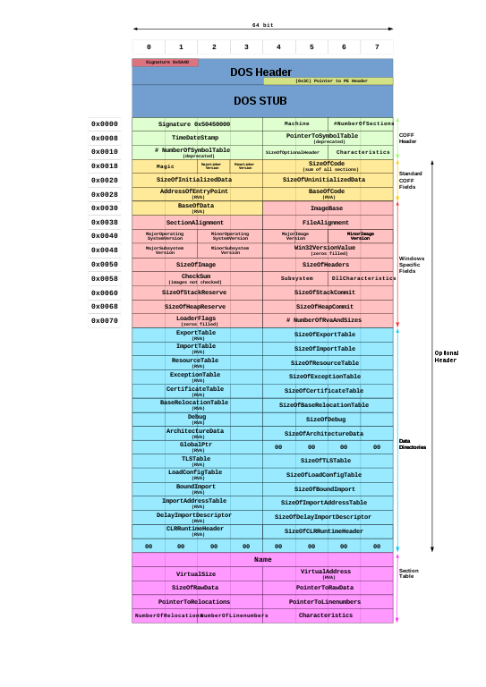
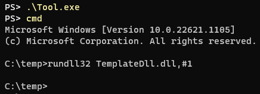
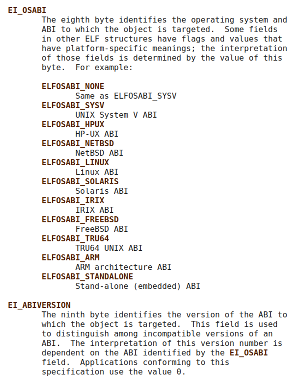
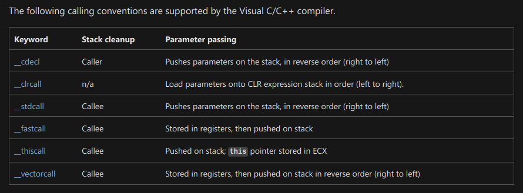

:title: C Programming - Definitions
:data-transition-duration: 1500
:css: keri.css

CCD Basic JQR v1.0
6.15 Describe terms associated with compiling, linking, debugging, and executables

----

6.15 Describe terms associated with compiling, linking, debugging, and executables
==================================================================================

----

Objectives
========================================

* [Describe terms associated with] Portable Executable (PE)
* [Describe terms associated with] Executable and Linkable Format (ELF)
* [Describe the] Difference between PE and ELF
* [Describe the] Difference between a library (shared object / DLL) and a regular executable program
* [Describe the] Calling convention/Application Binary Interface (ABI)

.. note::

	This JQS item seems to be missing an explicit objective covering the *actual* terms associated with compiling, linking, and debugging.

	Harkjective: Describe terms associated with compiling, linking, and debugging C programs.

----

Overview
========================================

* Disclaimer
* C Compilation Stages
* PE vs ELF
* Libraries vs Executables
* ABI
* Checklist

----

DISCLAIMER
========================================

Memorizing terms, for the sake of memorization, is useless.

Meaningful memorization comes with experience.

.. note::

	"We will discuss these terms now but experience them later.  With that experience, comes memorization."

	The students may not be able to describe all of these terms by the end of 6.15.
	However, they should be able to describe all of these terms well before the end of the C Programming
	block of instruction.

	The post-Definitions plan is to regularly refer back to the "Checklist" until everyone can describe everything.
	Following that, the students should be able to pass short multiple-choice quizzes.

----

C COMPILATION STAGES
========================================

1. Preprocessing
2. Compiling
3. Asssembling
4. Linking

.. note::

	NOTE: Different sources enumerate the compilation process in different ways. Descriptions of the process here are considered non-exhaustive as some compilers may not follow this model.

	That being said, `man gcc` tells the same story we are:
	"When you invoke GCC, it normally does preprocessing, compilation, assembly and linking.  The 'overall options' allow you to stop this process at an intermediate stage."

----

C COMPILATION STAGES
========================================

\1. Preprocessing: A glorified find-and-replace

* Removes comments
* Expands macros/constants*
* Includes files*
* Unwraps manual line continuation

\* Does so through the use of preprocessor "directives" like define and include.

.. note::

	Many times, demonstration helps further understanding and memory.
	If the students ask for it, manually preprocess a source file with:

	gcc -E -o foo.i foo.c && less foo.i  # Preprocesses foo.c into foo.i

	-OR-

	printf INT_MAX | gcc -include limits.h -E - | tail -n 1  # Preprocesses a Linux header and prints the value

----

C COMPILATION STAGES
========================================

\2. Compiling: I heard you like low-level languages

* Takes preprocessed source code as input
* Generates processor-specific assembly language instructions

.. note::

	Many times, demonstration helps further understanding and memory.
	If the students ask for it, manually compile a source file with:

	gcc -S -o foo.s foo.c && less foo.s  # gcc -S stops after compilation

----

C COMPILATION STAGES
========================================

\3. Asssembling: 01001000 01100001 01110010 01101011 00100001

* Takes assembly language instructions as input
* Generates machine code (AKA object code)

.. note::

	Many times, demonstration helps further understanding and memory.
	If the students ask for it, manually assemble a source file with:

	gcc -c -o foo.o foo.c && file foo.o; readelf -h foo.o  # gcc -c stops after assembly

	-OR-

	objdump -S foo.o  # objdump can illuminate object code

	This phase may not result in an executable but it *technically* results in an ELF (or PE?) file.

----

C COMPILATION STAGES
========================================

\4. Linking: Everything I needed to know about C compilation, I learned in kindergarten

* Glues object code together into an executable
* Links our object code to libraries
    * Static - Copies all used functions into the executable
    * Dynamic - The name of the library is placed into the executable

.. note::

	Dynamic linking will resolve symbol names at execution time.

	TO DO: DON'T DO NOW... manual linking command (using ld)

----

:class: flex-image center-image

C COMPILATION STAGES
========================================

Let's put it all together...

.. image:: images/06-15_001_01-Compilation_Stages-cropped.png

.. note::

	The actual overview is:

	* Preprocessing
	* Compiling
	* Asssembling
	* Linking

	This graphic serves the purpose though.

----

PE vs ELF
========================================

----

PE
========================================

Portable Executable (PE)

* Common binary file format for Windows operating systems
* Used for:
	* executables
	* object code
	* dynamic link libraries (DLL)
* Magic Number: 0x4D 0x5A (MZ)

.. note::

	TRIVIA: The PE magic number "MZ" (4D 5A) represents the initials of the designer of the file format, Mark Zbikowski.

----

:class: flex-image block-image center-image shrink-image

PE
========================================

.. note::

	Don't get too hung up on this graphic.  The students need to *describe* a PE, not parse it from memory.

	Taken from: https://en.wikipedia.org/wiki/File:Portable_Executable_32_bit_Structure_in_SVG_fixed.svg

----

ELF
========================================

Executable and Linkable Format (ELF)

* Common binary file format for Unix and Unix-like systems
* Used for:
	* executables
	* object code
	* shared libraries
	* core dumps
* Magic Number: 0x7f 0x45 0x4c 0x46 (.ELF)

.. note::

	Many times, demonstration helps further understanding and memory.
	If the students ask for it, show them some ELF details:
	
	readelf -h foo | head -n 2  # ELF Magic Number

	-OR-

	xxd foo | head -n 1  # ELF Magic Number

	-OR-

	readelf -a foo | less  # Everything you wanted to know about an ELF file

----

:class: flex-image block-image center-image

ELF
========================================

.. image:: images/06-15_002_01-ELF_Executable_and_Linkable_Format_diagram_by_Ange_Albertini.png

.. note::

	Don't get too hung up on this graphic.  The students need to *describe* an ELF, not parse it from memory.

	Taken from: https://upload.wikimedia.org/wikipedia/commons/e/e4/ELF_Executable_and_Linkable_Format_diagram_by_Ange_Albertini.png
	which was in turn taken from: https://github.com/corkami/pics/blob/28cb0226093ed57b348723bc473cea0162dad366/binary/elf101/elf101-64.svg

----

PE vs ELF
========================================

.. note::

	Here's the chance to bring it all together.  One of the objectives is to
	[Describe the] Difference between PE and ELF... So lead the class in describing differences between PE and ELF.
	While you're at it, feel free to name some similarities.

----

LIBRARIES vs EXECUTABLES
========================================

----

LIBRARIES
=========================

What is a software library?

* A suite of pre-written code to assist with software development
* Developers use libraries to add or automate functionality without writing code

"If I have seen a little further it is by standing on the shoulders of giants."
- Sir Isaac Newton

.. note::

	From: https://en.wikipedia.org/wiki/Standing_on_the_shoulders_of_giants

	The phrase "standing on the shoulders of giants" is a metaphor which means "using the understanding gained by major thinkers who have gone before in order to make intellectual progress".

	It is apropos to use this metaphor when describing libraries.  Using pre-written code to add or automate functionality allows developers to see "a little further" "in order to make intellectual progress".

----

LIBRARIES
=========================

Ways to access software libraries:

* Static
    * Object code included by a linker
    * Required modules "copied" into the executable
    * First accessed at compile-time and used at run-time

* Dynamic
    * Object code loaded into memory by the host
    * Accessible by multiple programs
    * First accessed at load-time or run-time*

\* Sometimes dynamic libraries are referenced, without copying code, at compile-time

.. note::

	Arguably, a static library could also be source code included by a compiler.

	This isn't meant to be a discussion about the pros/cons of static and dynamic linking
	but it can't hurt student comprehension to discuss it now.

	Static Pros: library dependencies guaranteed, executable is complete and stand-alone

	Static Cons: larger executable size

	Dynamic Pros: smaller executable size, can be used by other programs, easier to update a libary, code only loaded if necessary, memory use more efficient (since all programs access same in-memory library)

	Dynamic Cons: missing libraries, version conflicts

----

LIBRARIES
=========================

Library implementations:

* Linux
    * Static Library: .a
    * Shared Library: .so

* Windows
    * Shared Library: .dll

.. note::

	This is a gross oversimplification, but don't forget the objective calls to "describe" the difference between libraries and executables, *not* describe details about types of libraries.

	This information is included because it was referenced in the training objective verbiage.

	Linux shared library "practices" can be found here: https://tldp.org/HOWTO/Program-Library-HOWTO/shared-libraries.html

	Windows DLL "practices" can be found here: https://learn.microsoft.com/en-us/windows/win32/dlls/dynamic-link-libraries

----

EXECUTABLES
========================================

* Tells a system how to "perform indicated tasks according to encoded instructions"
* One or more object files are linked together
* Additional run-time code is added:
    * entry point
    * start-up
    * shutdown
* Synonyms for an executable:
    * program
    * binary
* Stored in a format that conforms to the system's ABI

.. note::

	NOTE: There are edge-case exceptions to these statements (e.g., embedded systems, explicit linker scripts) but this represents standard application.

	Good follow-up discussion:

	Q: "What are these enocded instructions?"  A: "Traditionally, machine code."

	Q: "How can we create machine code?"  A: "Develop source code in a higher level language and compile it to machine code" -or- "Hand write machine code"

	Q: "What are two examples of os-specific formats executables are stored in?"  A: "ELF" -and- "PE"

----

:class: shrink-image block-image center-image

LIBRARIES vs EXECUTABLES
========================================

Spot the executable...

\...Linux edition:

.. image:: images/06-15_004_01-Spot_the_executable-Linux-cropped.png

\...Windows edition:

.. note::

	NOTE: Don't let the students get hung up on the fact that the E in PE stands for executable.  It is merely a poor choice of words (e.g., "compiling" meaning a four-step process, in which the third step is also named "compilation") when differentiating between libraries and executables.  Don't forget that "binary" is a synonym for "executable".

	ANSWERS

	LINUX

		echo is an executable ELF

		hello_world.sh is an Bourne-Again shell script

		/bin/bash is the executable ELF, hello_world.sh is merely interpreted.

		cat is an executable ELF

	WINDOWS

		Tool.exe is an executable PE file

		cmd.exe is an executable PE file

		rundll32.exe is an executable PE file

		TemplateDll.dll is a PE file, but it is not executable.  You could consider rundll32.exe to be "interpreting" TemplateDll.dll's ordinal 1.  To be hair-splittingly specific, TemplateDll.dll is a PE-formatted shared library.

----

LIBRARIES vs EXECUTABLES
========================================

.. note::

	Take this opportunity to recap the similarities and differences between libraries and executables.

	Q: "What are some similiarities between libraries and executables?"

	A:
	    "Stored in an os-specific format (e.g., ELF, PE)"

	    "Contain encoded instructions"

	Q: "What are some differences between libraries and executables?"

	A:
	    "Executables tell a system how to perform tasks.  Libraries frequently enable executables to perform those tasks."

----

Application Binary Interface (ABI)
========================================

* What?
* Why?
* Who?
* Calling convention?

.. note::

	If you managed to hand-wave the defintion of ABI while answering questions in the "LIBRARIES vs EXECUTABLES" section, now is the time to reference them.

----

Application Binary Interface (ABI)
========================================

What is an ABI and how does it differ from an Application Programming Interface (API)?

API

* How humans access a library

ABI

* How machines access a library

.. note::

	From: https://stackoverflow.com/a/2456882
	"When you write source code, you access the library through an API. Once the code is compiled, your application accesses the binary data in the library through the ABI."

	If "seeing" would help the students better understand an API...

	man stdio  # The standard input/output library function list (along with some defined macros)

	man 3 puts  # Shows the API for "output of characters and strings" functions

----

Application Binary Interface (ABI)
========================================

Why is an ABI important?

* Processor instruction set
* Calling convention:
    * How parameters passed from caller to callee: order, location
    * How values are returned from callee to caller
    * Who cleans up the stack post-return
    * Are function names mangled
* Defines volatile registers
* Behavior and structure of the stack
* How data is arranged in memory
* How to make system calls
* Binary format

.. note::

	Different calling conventions pass parameters using registers, the stack, or a combination of the two.

	The Windows ABI specifies x86 name mangling for some calling conventions:

	    cdecl: leading underscore "_" (e.g., _myfunc)

	    stdcall: leading underscore "_" and decorated with trailing "@X" where X is the number of bytes to allocate (e.g., _myfunc@8)

	    fastcall: leading underscore and @ "_@" and stdcall-style trailing decorator (e.g., _@myfunc@8)

	System call ABI specifications may include direct system calls, system call stubs, and/or system call numbers.

----

:class: flex-image block-image center-image shrink-image

Application Binary Interface (ABI)
========================================

ELF defines the ABI and version in bytes 8-9

From: https://man7.org/linux/man-pages/man5/elf.5.html

.. note::

	Sometimes it helps to show them as well as tell them:

	readelf -h helloworld.bin  # Show the header of an ELF file

	ABI and ABI version are defined in the ELF header.

	You could always view the ELF file raw and count the bytes:

	xxd helloworld.bin | head -n 1  # Count to byte 8 to see the EI_OSABI value

----

:class: flex-image block-image center-image

Application Binary Interface (ABI)
========================================

Microsoft supports a number of calling conventions

Microsoft also has calling conventions that target specific platforms: x64, ARM.

See: https://learn.microsoft.com/en-us/cpp/cpp/argument-passing-and-naming-conventions?view=msvc-170

.. note::

	Microsoft doesn't have documentation or verbiage that explicitly refers to this being an ABI...
	But it defines calling conventions, how to pass arguments, etc.  Sounds like an ABI to me.

----

Application Binary Interface (ABI)
========================================

Who needs to know about ABIs?

* Compilers
* Assembly authors
* Reverse engineers

.. note::

	Honestly, I'm not sure why ABIs and calling conventions are an objective in this block.
	The concept is important, to be sure.  But the students aren't writing assembly and they're
	not doing any reverse engineering.  Maybe move this to reverse engineering?  <shrug>  I just work here.

----

Application Binary Interface (ABI)
========================================

What does this code do?
What data is it operating on?

.. code:: nasm

	;;;;;;;;;;;;;;;;;;;;;;;;;;;;;;;;;;;;;;;;;;;;;;;;;;;;;
	; ABI??
	; Calling convention?
	; Parameters?
	; Return value?
	;;;;;;;;;;;;;;;;;;;;;;;;;;;;;;;;;;;;;;;;;;;;;;;;;;;;;
	bits 64

	global func3a

	func3a:
		push rbp
		mov rbp, rsp
	;;;;;;;;;;;;;;;;;;;;;;;;;;;;;;;;
	;
	; What does this code do?
	;
	;;;;;;;;;;;;;;;;;;;;;;;;;;;;;;;;
		push rdi
		mov rcx, rdx
		rep movsb
		pop rax
	;;;;;;;;;;;;;;;;;;;;;;;;;;;;;;;;
	;
	; What is the return value?
	;
	;;;;;;;;;;;;;;;;;;;;;;;;;;;;;;;;
		pop rbp
		ret

.. note::

	This is an example of "who?" needs to know ABIs.

	Hard to tell what this code is doing without knowing the location and order of parameters or the return method.  That information is defined by the calling convention which is, in turn, defined by the ABI.

----

Application Binary Interface (ABI)
========================================

Knowing the location and order of parameters is important

.. code:: nasm

	;;;;;;;;;;;;;;;;;;;;;;;;;;;;;;;;;;;;;;;;;;;;;;;;;;;;;
	; System V ABI calling convention:
	; The first six integer or pointer arguments are
	; passed in registers RDI, RSI, RDX, RCX, R8, R9
	; RAX holds the return value
	;;;;;;;;;;;;;;;;;;;;;;;;;;;;;;;;;;;;;;;;;;;;;;;;;;;;;
	bits 64

	global func3a

	func3a:
		push rbp
		mov rbp, rsp
	;;;;;;;;;;;;;;;;;;;;;;;;;;;;;;;;
	;
	; What does this code do?
	;
	;;;;;;;;;;;;;;;;;;;;;;;;;;;;;;;;
		push rdi
		mov rcx, rdx
		rep movsb
		pop rax
	;;;;;;;;;;;;;;;;;;;;;;;;;;;;;;;;
	;
	; What is the return value?
	;
	;;;;;;;;;;;;;;;;;;;;;;;;;;;;;;;;
		pop rbp
		ret

.. note::

	This is the continuation example of "who?" needs to know ABIs.

	Knowing the calling convention is essential to determining the behavior of assembly.

	Walk the students through what is happening, how many arguments func3a is expecting, what func3a is doing with those arguments, and what the return value is... all in the context of the stated ABI.

	SPOILER ALERT: This example replicates the behavior of memcpy()

	// memcpy(dest, src, numBytes)

	extern "C" void* func3a(void*, void*, size_t);

----

Application Binary Interface (ABI)
========================================

* What?
* Why?
* Who?
* Calling convention?

.. note::

	Time to recap.

	Make the students answer these questions for you.

----

CHECKLIST
========================================

[ ] Application Binary Interface (ABI)

[ ] Application Programming Interface (API)

[ ] Assembling Stage

[ ] Calling Convention

[ ] Compiling Stage

[ ] Dynamic Link Library (DLL)

[ ] Executable

[ ] Executable and Linkable Format (ELF)

[ ] Library

[ ] Linking Stage

[ ] Macro

[ ] Portable Executable (PE)

[ ] Preprocessing Stage

[ ] Preprocessor Directive

[ ] Shared Object

.. note::

	1. ABI - Establishes the processor instruction set, calling convention, behavior/structure of the stack, system call usage, and binary format for a given system.

	1. API - How a human interacts with a software library.

	1. Assembling Stage - C Compilation Stage 3; Inputs assembly source code and outputs object code.

	1. Calling Convention - A set of rules that detail how a function can be expected to behave, as defined by an ABI.  This defintion includes, but is not limited to, the following: how parameters passed from caller to callee, how values are returned from callee to caller, who cleans up the stack post-return, how function names are mangled.

	1. Compiling Stage - C Compilation Stage 2; Inputs pre-processed C source code and outputs assembly source code.

	1. Dynamic Link Library (DLL) - Common Windows shared library format; .dll.

	1. Executable - One or more object files linked together, with additional run-time machine code instructions, in a format which conforms to a system's ABI to tell that system how to perform indicated tasks according to encoded instructions.

	1. ELF - Common Unix & Unix-like system binary file format: executables, object code, shared libraries, core dumps.

	1. Library - A suite of pre-written code developers use to add or automate functionality without writing code.

	1. Linking Stage - C Compilation Stage 4; Inputs object code and outputs an ABI-compliant binary file

	1. Macro - 

	1. PE - Common Windows binary file format: executables, object code, and DLLs.

	1. Preprocessing Stage - C Compilation Stage 1; Inputs a human's C source code, removes comments, expands macros, includes files and outputs pre-processed C source code.

	1. Preprocessor Directive - 

	1. Shared Object - Common Unix & Unix-like system shared library format; .so.

----

RESOURCES
========================================

* GNU Compiler Collection (GCC) Online Manuals: https://gcc.gnu.org/onlinedocs/
* GCC Man Page: https://man7.org/linux/man-pages/man1/gcc.1.html
* 39 IOS IDF Course Material: https://39ios-idf.90cos.cdl.af.mil/4_c_module/08_c_compiler/index.html
* PE
    * Microsoft: https://learn.microsoft.com/en-us/windows/win32/debug/pe-format
    * Malware researcher’s handbook (demystifying PE file): https://resources.infosecinstitute.com/topic/2-malware-researchers-handbook-demystifying-pe-file/
* ELF
    * Man page: https://man7.org/linux/man-pages/man5/elf.5.html
    * Details: https://www.cs.cmu.edu/afs/cs/academic/class/15213-f00/docs/elf.pdf

.. note::

	It seems like every other safe-for-work webpage describes the C Programming compilation stages: https://lmgtfy.app/?q=c+programming+compilation+stages

----

Summary
========================================

* Disclaimer
* C Compilation Stages
* PE vs ELF
* Libraries vs Executables
* ABI
* Checklist

----

Objectives
========================================

* [Describe terms associated with] Portable Executable (PE)
* [Describe terms associated with] Executable and Linkable Format (ELF)
* [Describe the] Difference between PE and ELF
* [Describe the] Difference between a library (shared object / DLL) and a regular executable program
* [Describe the] Calling convention/Application Binary Interface (ABI)

.. note::

	This JQS item seems to be missing an explicit objective covering the *actual* terms associated with compiling, linking, and debugging.

	Harkjective: Describe terms associated with compiling, linking, and debugging C programs.
