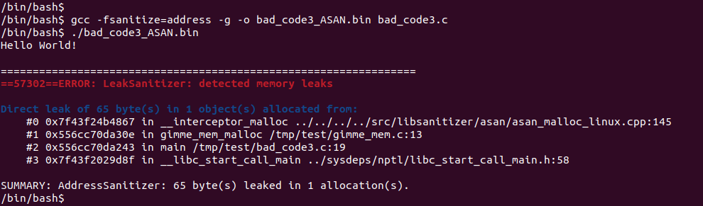
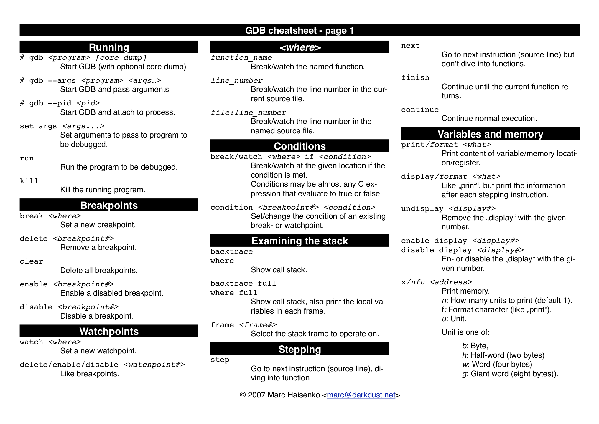
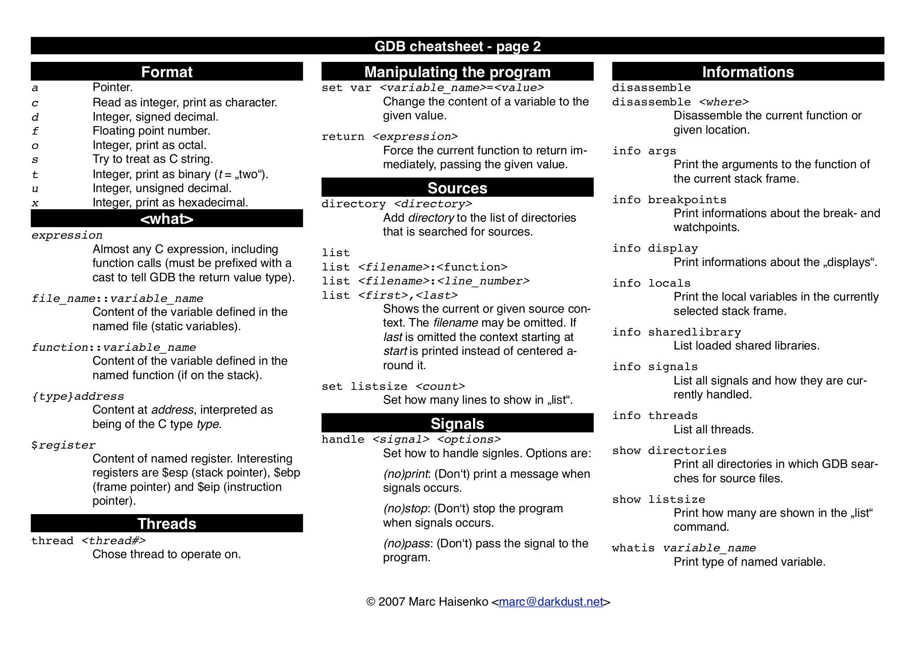

:title: C Programming - Compilation
:data-transition-duration: 1500
:css: keri.css

CCD Basic JQR v1.0
6.16 Demonstrate skill in compiling, linking, and debugging

----

6.16 Demonstrate skill in compiling, linking, and debugging
===========================================================

----

Objectives
========================================

* Execute a program in a debugger to perform general debugging actions
* Create a program using the compilation and linking process
* Compile position-independent code using a cross-compiler

----

Overview
========================================

* C Compilation Stages
* Debugging
* Position Independent Code (PIC)
* Cross-Compilation
* Resources
* Student Labs

----

C COMPILATION STAGES
========================================

* I remember that!
* But why do we care?
* How can I do it?

----

:class: flex-image center-image

C COMPILATION STAGES
========================================

.. image:: images/06-15_001_01-Compilation_Stages-cropped.png

.. note::

	"I remember that!" (But do they, though?)

	Recap facts and terms from 6-15.
	Discuss the purpose of each phase.
	Name the input and the output.

----

C COMPILATION STAGES
========================================

Why do we care?

* Preprocessing
    * Troubleshooting directives
    * Conditional compilation
    * Expanding system macros
* Compiling
    * Make the compiler write assembly for you
* Assembling
    * Easy to swap out object code
    * Link a binary to different object code builds
    * Save build time by only assembling modified libraries
* Linking
	* Easily swap out static libraries
	* Save build time by linking modified libraries into binaries

.. note::

	AKA "Why do I care how the saugsage is made?"

	Preprocessing:

		- The only real way to troubleshoot misbehaving preprocessor directives is to preprocess them and see what's happening

		- What is the value of INT_MAX on your current system?  printf INT_MAX | gcc -include limits.h -E - | tail -n 1  # Preprocesses a Linux header and prints the value

	Compiling:

		- I've used compilers to help write shell code for me

	Assembling:

		- Swap out a library implementation to diversify your code or change implementation.

		- Sometimes a library needs to be troubleshot.  Assemble that library into a DEBUG-version of object code (insted of the entire project).

		- Build time for complex projects can take minutes.  Cut that time by only assembling the libraries that have changed.

	Linking:

		- So you have DEBUG object code for a library.  Link the other unchanged object code against this new DEBUG-build and save time.

		- Build time for complex projects can take minutes.  Cut that time by linking libraries instead of compiling the entire project each time one statement changes.

----

C COMPILATION STAGES
========================================

\1. Preprocessing

Linux

.. code:: bash

	# Preprocesses foo.c into foo.i
	gcc -E -o foo.i foo.c
	# Preprocesses a Linux header and print the value of a macro
	printf INT_MAX | gcc -include limits.h -E - | tail -n 1

Windows*

.. code:: batch

	# Preprocesses foo.c into foo.i
	cl /P foo.c

\* Must be done from the Visual Studio "Developer Command Prompt"

.. note::

	"How can I do it?"

	Microsoft Visual Studio compiler options can be found here: https://learn.microsoft.com/en-us/cpp/build/reference/compiling-a-c-cpp-program?view=msvc-170

----

C COMPILATION STAGES
========================================

\2. Compiling

Linux

.. code:: bash

	# gcc -S stops after compilation
	gcc -S -o foo.s foo.c

Windows*

.. code:: batch

	# Compiles foo.c into foo.obj
	cl /c foo.c

\* Must be done from the Visual Studio "Developer Command Prompt"

.. note::

	Microsoft Visual Studio compiler options can be found here: https://learn.microsoft.com/en-us/cpp/build/reference/compiling-a-c-cpp-program?view=msvc-170

----

C COMPILATION STAGES
========================================

\3. Assembling

Linux

.. code:: bash

	# gcc -c stops after assembly
	gcc -c -o foo.o foo.c

Windows

.. code:: batch

	# Assembles foo.c into foo.asm, among other things...
	cl /Fa foo.c

\* Must be done from the Visual Studio "Developer Command Prompt"

.. note::

	Microsoft Visual Studio compiler options can be found here: https://learn.microsoft.com/en-us/cpp/build/reference/compiling-a-c-cpp-program?view=msvc-170

----

C COMPILATION STAGES
========================================

\4. Linking

Linux

.. code:: bash

	# Just keep doing what you've been doing
	gcc -o hello_world.bin hello_world.c
	# -or-
	# TO DO: DON'T DO NOW... gcc linking command example
	# TO DO: DON'T DO NOW... ld command example

Windows*

.. code:: batch

	# Links object code into a binary
	link foo.obj bar.obj /out:foo.exe

\* Must be done from the Visual Studio "Developer Command Prompt"

.. note::

	Microsoft Visual Studio linker details can be found here: https://learn.microsoft.com/en-us/cpp/build/reference/linking?view=msvc-170

----

DEBUGGING
========================================

Crashing C code with a SEG FAULT is like stubbing your toe in the dark...
It's going to happen if you're not careful.

So you've written bad code.  What do you do now?

1. Debugging Statements
1. (Memory) Debugger
1. (Interactive) Debugger

.. note::

	There aren't good categories to separate, say, GDB and Valgrind.
	We are using Interactive (GDB) and Memory (Valgrind) to help separate the two categories.

	NOTE: These are written in order of precedence (which happens to also be ease-of-use).
	It's a lot easier to find simple errors, like order-of-operations, with debugging statements than it is to go "full ham" in an interactive debugger.
	If you can't find the error with debugging statements and Address Sanitizer (ASAN) is quiet, then it might be time for an interactive debugger. 

----

DEBUGGING
========================================

\1. Debugging statements are a good first step in troubleshooting

Basic Debugging Statement

.. code:: c

	my_func(char *my_string)
	{
		puts("Entered my_func()");  // DEBUGGING
	    char temp_char = 0x0;  // Iterate the string
	    printf("Why am I crashing with %p?!", my_string);  // DEBUGGING
	    temp_char = my_string[0];  // BOOM GOES THE NULL POINTER
	}

Preprocessor Conditional Compilation Magic

.. code:: c

	#ifdef HARKLE_DEBUG
	#define HARKLE_ERROR(header, funcName, msg) do { fprintf(stderr, "<<<ERROR>>> - %s - %s() - %s!\n", \
	                                                         #header, #funcName, #msg); } while (0);
	#define HARKLE_ERRNO(header, funcName, errorNum) if (errorNum) { fprintf(stderr, "<<<ERROR>>> - %s - \
	                                                                         %s() returned errno:\t%s\n", \
	                                                                         #header, #funcName, \
	                                                                         strerror(errorNum)); }
	#define HARKLE_WARNG(header, funcName, msg) do { fprintf(stderr, "¿¿¿WARNING??? - %s - %s() - %s!\n", \
	                                                         #header, #funcName, #msg); } while (0);
	#else
	#define HARKLE_ERROR(header, funcName, msg) ;;;
	#define HARKLE_ERRNO(header, funcName, msg) ;;;
	#define HARKLE_WARNG(header, funcName, msg) ;;;
	#endif  // HARKLE_DEBUG

.. note::

	These two examples represent a range of DEBUGGING statements: basic to advanced(?)

----

:class: split-table

DEBUGGING
========================================

\2. Testing C code with a Memory Debugger is a "best practice"

The C programming language will gladly hand you a loaded weapon to shoot yourself in the foot with.
Memory Debuggers are there to stop you.

C Programming Memory Debuggers

+--------------------------+-------------------------------------------------------------------------------------------+-------------------+
|          NAME            |                                      PROS                                                 |      CONS         |
+--------------------------+-------------------------------------------------------------------------------------------+-------------------+
| Address Sanitizer (ASAN) | FOSS; 75% effective; Instrumented; Detailed output; Easy to use                           |                   |
+--------------------------+-------------------------------------------------------------------------------------------+-------------------+
| Memwatch                 | FOSS; 56% effective; Instrumented; Readable output; Good w/ multi-process & multi-threads |                   |
+--------------------------+-------------------------------------------------------------------------------------------+-------------------+
| Valgrind                 | FOSS; 69% effective                                                                       | Verbose output    |
+--------------------------+-------------------------------------------------------------------------------------------+-------------------+

NOTE: Some memory debuggers find BUGS others don't so consider using more than one.

Effectiveness research documented at: https://github.com/hark130/Mind_Monitor

.. note::

	ASAN: https://github.com/google/sanitizers/wiki/AddressSanitizer
	Memwatch: https://memwatch.sourceforge.net/
	Valgrind: https://valgrind.org/

	Mind Monitor is a project to compare the effectiveness, ease of use, and readability of six memory debuggers.
	See the final ranking here: https://github.com/hark130/Mind_Monitor#final-ranking

----

:class: flex-image center-image

DEBUGGING
========================================

ASAN Example: Someone forgot to call free().

Without ASAN

.. image:: images/06-16_001_01-ASAN_without-cropped.png

With ASAN

View the bad_code3.c source here: https://github.com/hark130/Mind_Monitor/blob/development/src/bad_code3.c

.. note::

	Highlight for the students that ASAN is accessed using -fsanitize=address -g

	NOTE: An observant student will spot a reference to "gimme_mem_malloc /tmp/test/gimme_mem.c:13" which is not seen in the gcc command.
	It was intentionally cropped out to help focus the attention on the benefits of ASAN.  The full gcc commands were:

	gcc -o bad_code3.bin bad_code3.c gimme_mem.c mimo_wrappers.c

	-and-

	gcc -fsanitize=address -g -o bad_code3_ASAN.bin bad_code3.c gimme_mem.c mimo_wrappers.c

----

:class: split-table

DEBUGGING
=========================

\3. Interactive debuggers allow you to debug code, inspect variables, examine registers, etc during program execution.

C Programming Interactive Debuggers

+---------+----------+----------------------+-------------------+
|  NAME   | PLATFORM |        PROS          |      CONS         |
+---------+----------+----------------------+-------------------+
| GDB     | Most     | FOSS; Customizable   | CLI only          |
+---------+----------+----------------------+-------------------+
| Ghidra  | Most     | FOSS; Easily updated | Uses GDB & WinDbg |
+---------+----------+----------------------+-------------------+
| IDA     | Most     | Free(ish); Standard  | COTS; Expensive   |
+---------+----------+----------------------+-------------------+
| WinDbg  | Windows  | Free                 | COTS              |
+---------+----------+----------------------+-------------------+

.. note::

	NOTE: "Most" == Linux, Windows, and Mac.

	GDB - GNU Debugger: https://www.sourceware.org/gdb/
	Ghidra: https://ghidra-sre.org/
	IDA - Interactive Disassembler: https://hex-rays.com/
	WinDbg - Windows Debugger: https://learn.microsoft.com/en-us/windows-hardware/drivers/debugger/debugger-download-tools

	FOSS: Free Open Source Software

----

:class: flex-image center-image

DEBUGGING
========================================

.. note::

	Cheat sheet (essentials): https://darkdust.net/files/GDB%20Cheat%20Sheet.pdf

----

:class: flex-image center-image

DEBUGGING
========================================

.. note::

	Cheat sheet (essentials): https://darkdust.net/files/GDB%20Cheat%20Sheet.pdf

----

DEBUGGING
========================================

What is some basic step-by-step GDB usage?

1. gcc -o hello_world.bin hello_world.c -g
2. gdb hello_world.bin
3. break main
4. run
5. next*
6. kill
7. quit

\* Ad infinitum

Tips:

* Use "print" to see values stored in variables.
* Got lost in the source?  Start over with "run".
* Use "step" to enter function calls (but avoid library functions).
* Use "list" to show you source code.
* Use "help <command>" for help with a command.
* The "info" command is very useful:
    * Use "info args" to see the function arguments
    * Use "info locals" to see the current values of local variables.
* GDB accepts truncated commands (e.g., "i b" is equivalent to "info breakpoints")

.. note::

	gcc -o hello_world.bin hello_world.c -g - Don't forget to produce debugging information with -g

	gdb hello_world.bin - Starts GDB with hello_world.bin

	break main - Sets a breakpoint at the main() function

	run - Run the program until it exits, crashes, or hits a breakpoint

	next - Execute the next statement

	kill - Stop the process

	quit - Exit GDB

----

DEBUGGING
========================================

Now harangue your instructor to do it!

* Debugging statements using errno
* ASAN FTW!
* GDB walk-through

.. note::

	Let the students guide you.  Maybe they want to see everything.  Maybe they only want to see GDB.
	Start small.  Expand.  Finish big.  Show them examples of all the commands on the previous slide, at least.

----

PIC
========================================

* What?
* Why?
* How?

.. note::

	What is PIC, why would code need to be position independent, and how do I make PIC?

----

PIC
========================================

What is PIC?

* Code that can execute from memory regardless of its address
* This code uses relative addresses instead of absolute addresses
* Absolute address: The actual memory location (e.g., 0x55cbf8f882a0)
* Relative address: A memory location measured by its distance from another address (e.g., rbp-0x8)

.. note::

	Another way to define relative address using common synonyms for these terms:

	Relative address: A memory location measured by its offset from a base address

	Relative addressing is commonly used in Assembly programming to access the stack but PIC uses the "beginning" of a procedure call/stub/function/etc as the "base address"

----

PIC
========================================

Why would I ever do that?

* Shared objects
* Shellcode

.. note::

	Reference the "shared object" defintion from 6-15

	Shellcode is defined by Wikipedia as "a small piece of code used as the payload in the exploitation of a software vulnerability".  Maybe shellcode doesn't *always* have to be PIC, but more often than not it must be.

	In case anyone asks, https://community.broadcom.com/symantecenterprise/viewdocument/dynamic-linking-in-linux-and-window-1?CommunityKey=1ecf5f55-9545-44d6-b0f4-4e4a7f5f5e68&tab=librarydocuments says:

	"Win32 DLLs are not position independent."  DLLs have a "preferred base address".

----

PIC
========================================

Sounds great, but how do I do it?

* Let the compiler handle it
* Write position independent assembly

.. note::

	Since this is C Programming and not "How to write position independent assembly code", we're going to skip the second one.

----

PIC
========================================

GCC, take the wheel...

* -fpic - generates PIC (if supported)*
* -fPIC - avoids any architecture-specific size limits

NOTES:
    * Try -fpic first.
    * Position-independent code requires special support, and therefore works only on certain architectures.

\* If you get an error message from the linker indicating that -fpic does not work, recompile with -fPIC instead.

.. code:: bash

	gcc -fpic -o my_first.so my_first_so.c -shared -Wl,-soname,libmyfirst.so.1

.. note::

	Why would -fpic not work?  The full quote from the gcc man page:

	If the GOT size for the linked executable exceeds a machine-specific maximum size, you get an error message from the linker indicating that -fpic does not work; in that case, recompile with -fPIC instead.  (These maximums are 8k on the SPARC, 28k on AArch64 and 32k on the m68k and RS/6000.  The x86 has no such limit.)

	It was truncated for the slide because an explanation of the Global Offset Table (GOT) is required to understand the full answer and that's outside the scope of these objectives.

----

PIC
========================================

Let's make a shared object!

1. Write a library (source code with a header file)
2. Compile a shared object
3. Copy the header to the "include" directory
4. Copy the shared object to the "shared library" directory
5. Create the necessary symbolic links

.. code:: bash

	gcc -fpic -o dist/libharklemem.so.3.1.8 src/harklemem.c -shared -Wl,-soname,libharklemem.so.3 -I include
	cp include/harklemem.h /usr/include/
	cp dist/libharklemem.so.3.1.8 /lib
	ln -f -s /lib/libharklemem.so.3.1.8 /lib/libharklemem.so.3
	ln -f -s /lib/libharklemem.so.3 /lib/libharklemem.so

Now you're linking with portals!

.. code:: bash

	gcc -o portals.bin portals.c -lharklemem

.. note::

	The header file should, at a minimum, have function prototypes that your "users" can include, much like every libc header you've ever "#include".
	Copy the header file to the system's include directory

	Standard naming convention for Linux shared objects is lib<soname>.so.<MAJOR_VERSION>.<MINOR_VERSION>.<MICRO_VERSION>
	In the example here, "harklemem" is the <soname>, the major version is 3, the minor version is 1, and the micro version is 8 (IAW semantic versioning).
	-fpic generates position independent code
	-shared produces a shared object which can then be linked with other objects to form an executable.
	-Wl passes options to the linker
	-soname,libharklemem.so.3 (an ld argument, see: man ld) sets the internal DT_SONAME field to the specified name, which will help the dynamic linker
	-I specifies an include directory

	Traditionally, Linux shared objects are "installed" by creating a series of symbolic links as a form of indirection for the dynamic linker:
	1. Copying the shared object to a library directory (in this case, /lib)
	2. Creating a "major version" symbolic link to the new shared object
	3. Then, creating a "general" symbolic link to the "major version" symbolic link

	The final -lharklemem is a gcc option to link with the specified library.  In this case, we're linking with harklemem.  In this example, portals.c has a #include <harklemem.h>.

----

PIC
========================================

* What is PIC?
* Why would anyone ever generate PIC?
* How does one generate PIC?
* What are the steps to create and install a shared object?

.. note::

	Time to summarize this section.  Here are the answers:

	1. Code that executes using relative addressing so that it works regardless of where its loaded in memory.
	2. Shared objects and shellcode
	3. Let the compiler do it!
	4. Write a library, compile a shared object, copy the header to the "include" directory, copy the shared object to the "shared library" directory, and create the necessary symbolic links

----

Cross-Compilation
========================================

* What?
* Why?
* How?

.. note::

	What is Cross-Compilation, why would code need to be cross-compiled, and how do I cross-compile code?

----

Cross-Compilation
========================================

Cross-compiwhat?

* Native Compiler: A compiler that compiles for the host operating system
* Cross Compiler: A compiler that compiles for an environment other than the one running the compiler
* Cross-compile for different non-native environments:
    * kernel: Linux 6.0.12, Linux 6.1.12, Solaris 5.11
    * library ABIs: libc, glibc, uClibc, various Windows CRT
    * endianness: arm vs armeb
    * word size: running 32-bit x86 mode on a x86-64 processor

See: http://www.landley.net/writing/embedded/cross.html

.. note::

	In short, cross-compilation is when you compile code for a different system.

	C RunTime (CRT): Different versions of Windows OSs use different versions of the Windows CRT (AKA the C standard library to compile against)

	Regarding endianness... Apparently some architectures have configurable endianness.  Who would have thought?!

----

Cross-Compilation
========================================

But why tho?

* Speed: Many non-standard native environments are slow
* Capability: Target platforms aren't always well resourced
* Availability: The hardware may not be capable or running a build environment
* Flexibility: No need polluting a target environment with software only needed for compilation
* Convenience: Scale your build environments

See: http://www.landley.net/writing/embedded/cross.html

.. note::

	EXAMPLES:

	Speed: Most special-purpose embedded hardware is designed for low cost and low power consumption, not high performance.

	Capability: The target platform usually doesn't have gigabytes of memory and hundreds of gigabytes of disk space the way a desktop does

	Availability: Ever try to install Ubuntu 22.04 on a Siemens ACUSON ultrasound system?

	Flexibility: Cross compiling focuses on building the target packages to be deployed, not spending time getting build-only prerequisites working on the target system.

	Convenience: Sometimes, you only have one test environment.  If you can cross-compile in your development environment, the limited test environment is less of an issue.

----

Cross-Compilation
========================================

Ok, fine.  How do I do it?

Again, make the compiler do it!

* GCC
* CMake
* GNU Make

.. note::

	What is Cross-Compilation, why would code need to be cross-compiled, and how do I cross-compile code?

----

RESOURCES
========================================

* GNU Debugger (GDB)
    * Cheat sheet (essentials): https://darkdust.net/files/GDB%20Cheat%20Sheet.pdf
    * Cheat sheet (long): https://gist.github.com/rkubik/b96c23bd8ed58333de37f2b8cd052c30
    * METALLIC SHADOWS (MESH): https://gitlab.com/JasonCoke/metallic_shadows/-/blob/master/gdb_tutor/gdb-tutor.txt
* GNU Compiler Collection (GCC) Online Manuals: https://gcc.gnu.org/onlinedocs/
* GCC Man Page: https://man7.org/linux/man-pages/man1/gcc.1.html
* 39 IOS IDF Course Material: https://39ios-idf.90cos.cdl.af.mil/4_c_module/08_c_compiler/index.html
* Semantic Versioning: https://semver.org/

.. note::

	It seems like every other safe-for-work webpage describes the C Programming compilation stages: https://lmgtfy.app/?q=c+programming+compilation+stages

	MESH is a GDB tutor

----

STUDENT LABS
========================================

* 6-16-1: Manually walk your source code through the compilation stages and view the results of each stage.
* 6-16-2: What's wrong with the instructor's code?
* 6-16-3: Create and install a Linux library

----

STUDENT LABS
========================================

6-16-1 Instructions

* Write some code
* Preprocess it and view the results
* Compile it and view the results
* Assemble it and view the results
* Link it and run it

----

STUDENT LABS
========================================

6-16-2: What's wrong with the instructor's code?

.. code:: python

	for binary in what_the_instructor_gives_you:
	    does_it_run(binary)
	    what_does_it_do(binary)
	    is_there_something_wrong(binary)
	    write_it_down.append(binary)

----

STUDENT LABS
========================================

6-16-3: Create and install a Linux shared library

1. Write a useful library (source code with a header file)
2. Compile a shared object
3. Copy the header to the "include" directory
4. Copy the shared object to the "shared library" directory
5. Create the necessary symbolic links
6. Create a binary that utilizes that shared library

.. note::

	What is "useful"?  Write some code you'd like to reuse in the future.

----

Summary
========================================

* C Compilation Stages
* Debugging
* Position Independent Code (PIC)
* Cross-Compilation
* Resources
* Student Labs

----

Objectives
========================================

* Execute a program in a debugger to perform general debugging actions
* Create a program using the compilation and linking process
* Compile position-independent code using a cross-compiler
