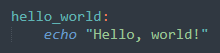
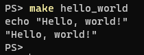
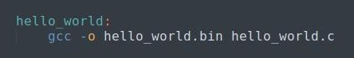
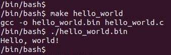
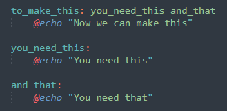
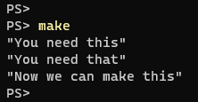

:title: C Programming - Makefiles
:data-transition-duration: 1500
:css: keri.css

CCD Basic JQR v1.0
6.17 Demonstrate the ability to build a binary from multiple C source files and headers by writing a Makefile using explicit rules

----

6.17 Makefiles
========================================

----

Objectives
========================================

* Demonstrate the ability to build a binary from multiple C source files and headers by writing a Makefile using explicit rules

----

Overview
========================================

* make what?
* make why?
* make how?
* make details!
* Common Pitfalls
* Student Labs
* Resources

----

make what?
========================================

* Description
* Key Terms
* Basic Examples

----

Make Description
========================================

* A tool which controls the generation of executables and other non-source files of a program from the program's source files.
* "Generation" is controlled by one or more Makefiles.
* GNU Make features:
    * Build only what you need
    * Language independent
    * Can do more than just build

Source: https://www.gnu.org/software/make/ 

.. note::

	FULL DEFINITION: GNU Make is a tool which controls the generation of executables and other non-source files of a program from the program's source files. 

	ANALOGY: Liken "make" to a compiler and "Makefiles" to source files.

	GNU: "GNU's Not Unix" is a completely free operating system, upwards compatible with Unix.  See - https://www.gnu.org/

----

Key Terms
========================================

* *rule* - One or more commands needed to generate a target
* *target* - A "thing" to generate
* *dependencies* - A list of zero or more pre-requisites to generate a target
* *recipe* - The commands executed by a rule

Here is what a simple rule looks like:

.. code:: makefile

	target:   dependencies ...
              commands
              ...

.. note::

	<PRESENTER_NOTE>

----

:class: center-image

Basic Examples
========================================

Example 1: Basic Rule

Makefile

Usage

.. note::

	Makefile targets don't *have* to reference files

----

:class: center-image

Basic Examples
========================================

Example 2: Simple Rule

Makefile

Usage

.. note::

	This is a more realistic example since it's actually compiling as "generation"

----

:class: center-image

Basic Examples
========================================

Example 3: Dependencies

Makefile

Usage

.. note::

	This example shows basic dependencies.

	A couple GNU Make features have been snuck in:
	    - The first rule is the default rule
	    - Make commands can be silenced using a @

----

make why?
========================================

.. note::

	Ask the students to brainstorm reasons why GNU Make is useful
	"Why create a Makefile?"

----

make why?
========================================

* Accessible: Build/install without knowing how
* Documentation: It's already written down
* SPOT: Developers, stakeholders, testers, customers, developers
* Automation: Defend against human error
* Shorthand: Compilation commands are cumbersome
* Speed: Compile the minimum necessary

.. note::

	See how many the class brainstormed

	Accessible - Many of the students will join established teams.  Will they need to know how to manually compile on Day 1?

	SPOT - Single Point Of Truth

----

make how?
========================================

Linux: Use your package manager

.. code:: bash

	apt install build-essential

Windows:
    * Download GNU Make for Windows: https://www.gnu.org/software/make/
    * Install to a normalized directory (e.g., C:\\GnuWin32)
    * Add the make.exe path (e.g., C:\\GnuWin32\\bin\\) to the PATH environment variable

.. note::

	"GNU Make seems awesome.  How do I use it?"

----

make details!
=========================

Recipes

.. note::

	<PRESENTER_NOTE>

----

make details!
========================================

Dependencies

.. note::

	<PRESENTER_NOTE>

----

make details!
========================================

Variables

.. note::

	<PRESENTER_NOTE>

----

make details!
========================================

Wildcards

.. note::

	<PRESENTER_NOTE>

----

make details!
========================================

CONTINUE HERE

.. note::

	<PRESENTER_NOTE>

----

make details!
========================================

Special Built-in Target Names

.. note::

	<PRESENTER_NOTE>

----

make details!
========================================

* <STUDENTS_SEE_THIS>

.. note::

	<PRESENTER_NOTE>

----

make details!
=========================

* <STUDENTS_SEE_THIS>

.. note::

	<PRESENTER_NOTE>

----

make details!
========================================

* <STUDENTS_SEE_THIS>

.. note::

	<PRESENTER_NOTE>

----

make details!
========================================

* <STUDENTS_SEE_THIS>

.. note::

	<PRESENTER_NOTE>

----

COMMON PITFALLS
=========================

* Using spaces instead of tabs
* Trying to mix Make "code" with shell "code"
* Forgetting each recipe command gets its own shell (by default)
* Misleading error output
    * "missing rule" message when it should be "missing dependency"

.. note::

	"Misleading error output" example: If a target is missing dependency and there's no rule to *make* that dependency, the error will be "No rule to make target" instead of something like "target yadda is missing dependency yaddayadda and there's not rule to make yaddayadda".

----

RESOURCES
=========================

* GNU Make homepage: https://www.gnu.org/software/make/

.. note::

	<PRESENTER_NOTE>

----

Summary
========================================

* <SECTION_1>
* <SECTION_2>
* <SECTION_3>

----

Objectives
========================================

* <OBJECTIVE_1>
* <OBJECTIVE_2>
* <OBJECTIVE_3>
