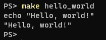
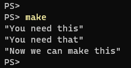

:title: C Programming - Makefiles
:data-transition-duration: 1500
:css: keri.css

CCD Basic JQR v1.0
6.17 Demonstrate the ability to build a binary from multiple C source files and headers by writing a Makefile using explicit rules

----

6.17 Makefiles
========================================

----

Objectives
========================================

* Demonstrate the ability to build a binary from multiple C source files and headers by writing a Makefile using explicit rules

.. note::

	Harkjective: Demonstrate the ability to read and understand Makefiles that use implicit rules

----

Overview
========================================

* make what?
* make why?
* make how?
* make details!
* Common Pitfalls
* Resources
* Student Labs

----

make what?
========================================

* Description
* Key Terms
* Basic Examples

----

Make Description
========================================

* A tool which controls the generation of executables and other non-source files of a program from the program's source files.
* "Generation" is controlled by one or more Makefiles.
* GNU Make features:
    * Build only what you need
    * Language independent
    * Can do more than just build

Source: https://www.gnu.org/software/make/ 

.. note::

	FULL DEFINITION: GNU Make is a tool which controls the generation of executables and other non-source files of a program from the program's source files. 

	ANALOGY: Liken "make" to a compiler and "Makefiles" to source files.

	GNU: "GNU's Not Unix" is a completely free operating system, upwards compatible with Unix.  See - https://www.gnu.org/

	"Generation" is in quotes because it could mean a great number of things: assembly, compilation, linking, shell commands, etc.

----

Key Terms
========================================

* *rule* - One or more commands needed to generate a target
* *target* - A "thing" to generate
* *dependencies* - A list of zero or more pre-requisites to generate a target (AKA *prerequisites*)
* *recipe* - The commands executed by a rule

Here is what a simple rule looks like:

.. code:: makefile

	target:   dependencies ...
              commands
              ...

.. note::

	GNU Make documentation seems to lean heavily on the word "prerequisites" yet their top-level example says "dependencies"?!

----

:class: center-image

Basic Examples
========================================

Example 1: Basic Rule

Makefile

.. image:: images/06-17_001_01-Basic_Makefile-cropped.png

Usage

.. note::

	Makefile targets don't *have* to reference files

----

:class: center-image

Basic Examples
========================================

Example 2: Simple Rule

Makefile

.. image:: images/06-17_002_01-Simple_Makefile-cropped.jpg

Usage

.. image:: images/06-17_002_02-Simple_Makefile_execution-cropped.jpg

.. note::

	This is a more realistic example since it's actually compiling as "generation"

----

:class: center-image

Basic Examples
========================================

Example 3: Dependencies

Makefile

.. image:: images/06-17_003_01-Dependent_Makefile-cropped.png

Usage

.. note::

	This example shows basic dependencies.

	A couple GNU Make features have been snuck in:
	    - The first rule is the default rule
	    - Make commands can be silenced using a @

----

make why?
========================================

.. note::

	Ask the students to brainstorm reasons why GNU Make is useful
	"Why create a Makefile?"

----

make why?
========================================

* Accessible: Build/install without knowing how
* Documentation: It's already written down
* SPOT: Developers, stakeholders, testers, customers, developers
* Automation: Defend against human error
* Shorthand: Compilation commands are cumbersome
* Speed: Compile the minimum necessary

.. note::

	See how many the class brainstormed

	Accessible - Many of the students will join established teams.  Will they need to know how to manually compile on Day 1?

	SPOT - Single Point Of Truth

----

make how?
========================================

Linux: Install using your package manager

.. code:: bash

	# As one example...
	apt install build-essential

Windows:
    * Download GNU Make for Windows: https://www.gnu.org/software/make/
    * Install to a normalized directory (e.g., C:\\GnuWin32)
    * Add the make.exe path (e.g., C:\\GnuWin32\\bin\\) to the PATH environment variable

.. note::

	"GNU Make seems awesome.  How do I use it?"

----

make details!
=========================

* Recipes
* Dependencies
* Variables
* Special Target Names
* Implicit Rules

----

make details!
=========================

Recipes

.. code:: makefile

	# MAKE Comment: Not in a recipe so it's a Make comment
	GLOBAL_VAR := "This variable is globally accessible"
	MAKEFILE_CONDITIONALS := https://www.gnu.org/software/make/manual/html_node/Conditional-Syntax.html

	all:
		# SHELL Comment: This gets passed to the shell as-is
		echo This line \
		is split
		LOCAL_VAR="This variable only exists right now"
		if true; then echo "This is a /bin/sh conditional!"; fi
		# Normally make prints each line of the recipe before it is executed.
		# This is called "echoing".
		@# When a line starts with ‘@’, the echoing of that line is suppressed.
	ifneq ($(GLOBAL_VAR),)
		echo "See: $(MAKEFILE_CONDITIONALS)"
	endif
		cd each && echo "...recipe command gets its own shell..." > so_chain.them
		echo "Recipes stop on a non-zero exit code"
		-echo "A command preceded by a ‘-’ will ignore errors"; exit 1
		echo "make --ignore-errors or .IGNORE will have similar effects"

*NOTE:* Makefiles are tab-delimited.

.. note::

	This may be an eye chart but it's a good introduction into deciphering recipes.
	Go through each line one-by-one with the class.  Sometimes it's better to show them than tell them.

----

make details!
========================================

Dependencies (AKA Prerequisites)

* Normal
	* Order: All prerequisite recipes must be completed before the target is started
	* Dependency: If any prerequisite is newer, the target is out-of-date and must be rebuilt
* Order-Only
	* Order: All prerequisite recipes must be completed before the target is started
	* New/old/out-of-date isn't considered

.. code:: makefile

	targets : normal-prerequisites | order-only-prerequisites

See: https://www.gnu.org/software/make/manual/html_node/Prerequisite-Types.html for more

.. note::

	Order-Only prerequisites are covered in the GNU Make online manual so they're covered here.
	The manual also includes a resonable example.

	However, I'm not sure I've ever seen one in actual use.  Defaulting to Normal prerequisites is safe.

	Also, feel free to reference the "Basic Example 3", which uses some easy-to-follow (and see) "normal" dependencies.

----

make details!
========================================

Variable

* Referencing
* Types

.. note::

	They students have already seen plenty of "variable" examples but now is your chance to cover the topic, in some depth, with some detail.

----

make details!
========================================

Referencing Variables

Write a dollar sign followed by the name of the variable in parentheses or braces:

.. code:: makefile

	all:
		@echo "The default program for compiling C programs is $(CC)"
		@echo "Extra flags to give to the C compiler: ${CFLAGS}"

See: https://www.gnu.org/software/make/manual/html_node/Reference.html for more

.. note::

	FUN FACT: CC and CFLAGS are two examples of "Pre-Defined Variables" used by "implicit rules" but the objective doesn't call for them to know that.

	See: https://www.gnu.org/software/make/manual/html_node/Implicit-Variables.html

----

make details!
========================================

(Some) Variable Types

* User-Defined variables
* Automatic Variables

.. note::

	SPOILER ALERT: There's a lot more to GNU Make variables but these are the basics.

	We will scrape the surface of user-defined variables, barely mention automatic variables, and skip other variable types (e.g., Pre-Defined Variables)

----

make details!
========================================

User-Defined Variables

Two types:
  + recursive '=' - Value is resolved when used.
  + simply expanded ':=' - Value is resolved when it's defined.

.. code:: makefile

	RECURSIVE1 = "R1" $(SIMPLY1) $(SIMPLY2)
	SIMPLY1 := "S1" $(SIMPLY2)
	SIMPLY2 := "S2" $(SIMPLY1)

	all:
		@echo $(RECURSIVE1)
		@echo $(SIMPLY1)
		@echo $(SIMPLY2)

See:
  + https://www.gnu.org/software/make/manual/html_node/Using-Variables.html
  + https://makefiletutorial.com/#variables-pt-2

.. note::

	It helps to think about simply expanded variables as "position dependent" and recursive variables as "(run)time dependent"
	Talk through the output with the students.

	SPOILER ALERT: The output is...

	R1 S1 S2 S1

	S1
	
	S2 S1

----

make details!
========================================

Automatic Variables

* GNU Make documentation lists 8
* There are several variants
* None of them are requried for "explicit rules"
* Two of them are very useful: $@ and $^

.. code:: makefile

	hello_world: hello_world.c
    		@echo "The target is $@"
    		@echo "All of the prerequisites are: $^"

See: https://www.gnu.org/software/make/manual/html_node/Automatic-Variables.html for more

----

make details!
========================================

Special Built-in Target Names

* GNU Make documentation lists 16
* None of them are requried for "explicit rules"
* Some of them are useful: .IGNORE, .PHONY, .PRECIOUS, .ONESHELL

.. code:: makefile

	# Ignore recipe errors for listed targets
	.IGNORE: janky error-prone

	# Run listed recipes unconditionally, ignoring matching filenames
	.PHONY: all clean

	# Preserves intermediate files
	.PRECIOUS: %.o

	# All recipe commands are passed to a single invocation of the shell
	.ONESHELL:

See: https://www.gnu.org/software/make/manual/html_node/Special-Targets.html for more

.. note::

	.PHONY is most important of them all.  It is commonly used for targets *not* associated with files.
	E.g., all, clean, install, uninstall.

	.PRECIOUS is also useful.  I wrote a rule that used a directory as a dependency.  Make tried to
	remove that "intermediate file" but failed because it wasn't a file.  Right or wrong, I added it to
	.PRECIOUS to avoid that behavior.

	That way, GNU Make will ignore any filenames that happen to match.

	The % indicates a pattern rule.  % is to GNU Make as * is to your average shell.

----

make details!
========================================

A peek behind the curtain...

Explicit Rules vs. Implicit Rules

Explicit example...

.. code:: makefile

	foo: foo.o bar.o
		gcc -o foo foo.o bar.o

	foo.o: foo.c
		gcc -c foo.c -o foo.o

	bar.o: bar.c
		gcc -c bar.c -o bar.o

made Implicit...

.. code:: makefile

	foo: foo.o bar.o
		gcc -o $@ $^

	%.o: %.c
		gcc -c $^ -o $@

See: https://www.gnu.org/software/make/manual/html_node/Implicit-Rules.html

.. note::

	The objective specifies "explicit rules" but knowing what's possible shouldn't hurt.

	This is just scratching the surface of "Implicit Rules".  Make already "implicitly" knows how to compile object code, as an example.
	This example of "Implicit Rules" is using user-defined "Pattern Rules".
	see: https://web.mit.edu/gnu/doc/html/make_10.html#SEC91

	Discuss the key advantage of implicit rules with the students: scalability.  Know that variables and $(shell) function calls
	could be used to further future-proof(?) implicit rule sets.

----

make details!
========================================

Implicit Rules FTW

What if *this* were your Makefile for *every* project?

.. code:: makefile

	CC := gcc
	CFLAGS := 
	SOURCE := $(shell ls *.c)
	OBJECTS = $(SOURCE:.c=.o)

	foo: $(OBJECTS)
		$(CC) -o $@ $^

	%.o: %.c
		$(CC) -o $@ -c $^

See: https://www.gnu.org/software/make/manual/html_node/Implicit-Rules.html

.. note::

	Now it doesn't matter what you name the source files.  It doesn't matter
	how many there are.  This Makefile will infinitely scale with your project.

	Realistically, this is just a starting point.  Libraries might be split up.
	Headers might be in a different directory than source files.  You won't
	always be delivering a "foo" binary.  But, this is a fantastic starting point!

----

make details!
=========================

* Recipes
* Dependencies
    * Normal
    * Order-Only
* Variables
    * Recursive
    * Simply-Expanded
* Special Target Names
* Implicit Rules

.. note::

	This was a large section so summarize by having the students recap material.
	"Name some basic facts of recipes"
	"What's the difference between normal and order-only dependencies?"
	"How do you know if a variable assignment is recursive or simply-expanded?"
	"What are some special target names?"
	"What is the key advantage to implicit rules?"

----

COMMON PITFALLS
=========================

* Using spaces instead of tabs
* Trying to mix Make "code" with shell "code"
* Forgetting each recipe command gets its own shell (by default)
* Misleading error output
    * "missing rule" message when it should be "missing dependency"

.. note::

	"Misleading error output" example: If a target is missing dependency and there's no rule to *make* that dependency, the error will be "No rule to make target" instead of something like "target yadda is missing dependency yaddayadda and there's not rule to make yaddayadda".

----

TROUBLESHOOTING
=========================

AKA "So now you hate GNU Make..."

* Enable "echoing" (see: @) so you can see everything
* https://www.gnu.org/software/make/manual/html_node/Error-Messages.html
* https://stackoverflow.com/search?q=gnu+make
* Add DEBUGGING statements to see the value of key variables

.. code:: makefile

	hello_world: hello_world.c
    		echo "DEBUGGING: The target is $@"
    		echo "DEBUGGING: All of the prerequisites are: $^"
    		gcc -o hello_world hello_world.c

.. note::

	It also helps to pull apart recipes and to test individual commands in Proof-of-Concept recipes.

	GNU Make is well documented on the Internet.  The "Let me Google that for you" links may seem
	flippant but they weren't intented to be.

----

RESOURCES
========================================

* GNU Make homepage: https://www.gnu.org/software/make/
* Makefile examples: https://makefiletutorial.com/
* Makefile Cheat Sheet: https://cheatography.com/bavo-van-achte/cheat-sheets/gnumake/
* Walk-->Run-->Sprint Makefile Examples: https://www.cs.colby.edu/maxwell/courses/tutorials/maketutor/

.. note::

	Or just Google something.
	Or just read the Makefile of an open source project.

----

STUDENT LABS
========================================

Ideas:

* Walkthrough *real* Makefiles
* Create a Makefile for a previous project.
* Each student finds an open-source Makefile and explains it to the class.

.. note::

	"Real Makefiles"
	1. KEEN RISK (KERI): https://github.com/hark130/keen-risk/blob/main/Makefile
	Relatively clean and straight-forward OS-agnostic(?) set of Makefiles.

	2. SUNDERING REINDEER (SURE): https://gitlab.com/teamhappyaku/sundering-reindeer/-/blob/development/Makefile
	This is a realistic Makefile, created/updated by a team, that (frankly) could use some refactor and clean-up.

	3. GNU Make: https://github.com/wkusnierczyk/make/blob/master/Makefile.DOS
	Let's look at GNU Make eat their own dog food, as it were.

	4. Radamsa: https://gitlab.com/akihe/radamsa/-/blob/develop/Makefile
	Radamsa is an open-source fuzzer.  This Makefile includes good examples of explicit rules.

	"Previous Projects"
	As of now, the course isn't fleshed-out enough to know what they've already done.
	Also, the "student project" is done so it's hard to know what meaningful work the students could
	create Makefiles for.
	Discuss the matter with the students and brainstorm a good lab.  Don't forget to tailor it to the
	objective.

	"Explains it"
	This may not support the *actual* objective but it supports the secret Harkjective of "read and understand"
	These students won't have to write a Makefile their first day on the team.  If that team is *using* GNU Make,
	they'll need to be able to read and understand what that "legacy" Makefile is doing so they can use it and update it.

----

Summary
========================================

* make what?
* make why?
* make how?
* make details!
* Common Pitfalls
* Resources
* Student Labs

----

Objectives
========================================

* Demonstrate the ability to build a binary from multiple C source files and headers by writing a Makefile using explicit rules
