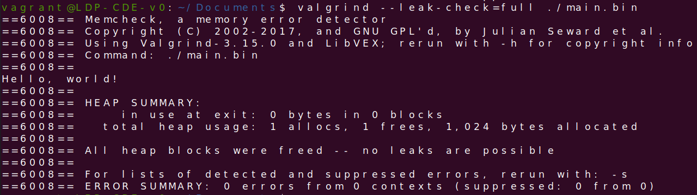

:title: C Programming - Memory Management
:data-transition-duration: 1500
:css: keri.css

CCD Basic JQR v1.0
6.21 Demonstrate skill in controlling memory

----

6.21 Demonstrate skill in controlling memory
============================================

----

Objectives
========================================

* With attention given to implementation defined behavior, compare and contrast standard memory allocation functions (e.g ., malloc () calloc(), realloc ( ), and free ())
* Demonstrate appropriate error checking when managing memory allocations
* Describe programming techniques that reduce the occurrence of memory leaks (e.g ., behaviors that reinforce a clear ownership model)
* Demonstrate effective use of Valgrind with --leak-check=full to identify memory leaks
* Given code samples, identify and remove memory leaks

.. note::

	Odd this objective focuses on "memory leaks" instead of "common dynamic memory mistakes": use-after-free, double-free, buffer overflow, etc.

	Harkjective: Describe programming techniques that reduce the occurrence of common dynamic memory programming flaws.

	Harkjective: Given code samples, identify and remove common dynamic memory programming flaws.

----

Overview
========================================

* Dynamic Memory
* Valgrind
* Demonstration
* Resources
* Student Labs

----

Dynamic Memory
========================================

* C Library Allocation
* Error Checking
* Reduce Memory Leaks

.. note::

	Error Checking == Alwatys Be Checking (ABC)

----

Dynamic Memory - C Library Allocation
========================================

Let's discuss...

.. code:: bash

	man calloc

see: https://linux.die.net/man/3/calloc

.. note::

	void \*malloc(size_t size);
	// malloc() allocates size bytes and returns a pointer
	// to the allocated memory. The memory is not initialized.

	void free(void \*ptr);
	// free() frees the memory space pointed to by ptr, which must
	// have been returned by a previous call to malloc(), calloc() 
	// or realloc().

	void \*calloc(size_t nmemb, size_t size);
	// calloc() allocates memory for an array of nmemb elements of
	// size bytes each and returns a pointer to the allocated memory.
	// The memory is set to zero.

	void \*realloc(void \*ptr, size_t size);
	// realloc() changes the size of the memory block pointed to by
	// ptr to size bytes.

----

Dynamic Memory - Error Checking
========================================

Let's discuss...

.. code:: bash

	man calloc | grep -A 2 "RETURN VALUE"  # Returns NULL on error
	man calloc | grep -A 4 ERRORS          # Sets errno on error
	errno -l | grep ENOMEM                 # ENOMEM 12 Cannot allocate memory

see: https://linux.die.net/man/3/calloc

.. note::

	Key takeaways...

	> On error, these functions return NULL.

	So Always Be Checking (ABC) return values!

	> ENOMEM Out of memory

	Errno is set on error.  The man page only lists ENOMEM but who can be sure.

----

Dynamic Memory - Reduce Memory Leaks
========================================

Memory Leak - Allocated memory, which is not longer needed, that isn't released.*

* Immediately write your free() when you allocate
* Avoid using the heap
* Avoid modifying pointer values
* Take care not to let pointer variables go out of scope
* Good documentation/comments
* Establish a clear ownership model
* Use memory debuggers
* Allocate and free memory in the same module
* Allocate and free memory at the same level of abstraction

\* Dynamic memory management is a common source of programming flaws: memory leaks, heap-buffer overflows, dangling pointers, double-free issues, use-after-free, buffer over-read, etc.

.. note::

	Memory leak definition notes:  This is written in a terse and generic format.  This defintion is agnostic to "memory region", meaning it applies to the stack as well as the heap.
	(Though, if you mismanage stack allocation then you can expect worse problems than a memory leak.)  Commonly, "memory leak" means heap-allocated memory that hasn't been free()d.

	Why are memory leaks a problem?  1. They're considered a BUG and can sometimes be exploited.  2. Memory leaks can cause problems on the host system by hording resources.
	The longer running the program (e.g. server, daemon) the worse it becomes.

	"Avoid modifying pointer values"?!  How?  Easy.  Use temp variables and leave the original value alone instead.

	"Take care not to let pointer variables go out of scope"?  How?  Easy.  Keep pointer variables at function scope instead of block scope.  Also, consider allocation at higher
	in the call stack (e.g., main()) to better avoid memory leaks while handling error conditions.

	"Establish a clear ownership model"?  How?  This becomes easier in higher-level programming languages.  In C, sometimes this is as easy as documenting whose responsibility
	it is to free() dynamically allocated memory: caller, callee.  In more advanced designs, the concept of a "reference count" is used to determine when dynamic memory is no
	longer needed.  C++ smart pointers use this under the hood.  
	We could utilize that concept in the application of struct that helps manage dynamically allocated memory.

	An example of both "Good documentation/comments" (and arguably "Establish a clear ownership model") is the header file for harklemem.h.  The comment blocks for the functions
	defined in that library clearly indicate whose responsibility it is to free a given dynamically allocated memory address.

	"Use memory debuggers"?  What's a memory debugger?  It's a tool to assist with debugging code.  Memory debuggers commonly "hook" memory allocation functions and manage
	dynamically allocated memory.  This topic will discuss Valgrind, one such example.  6-16 will provide examples on how to use Address Sanitizer (ASAN).  ASAN is the best, but
	Valgrind is a close 2nd.

	see: https://github.com/hark130/Mind_Monitor for more on Valgrind vs. ASAN

	"Allocate and free memory in the same module"?  What does that mean?  It means that, when you're using code/libraries you didn't write, you may not know what "allocator" that
	library used.  Some libraries use allocation methods other than malloc()/free().  For instance, maybe it has implemented its own memory management layer: allocate a page, slice
	that page into a linked list, parse out list nodes for use, etc.  This is the reason why harklemem includes both allocation *and* de-allocation functions.

	"Allocate and free memory at the same level of abstraction"?  Huh?  Part of the "clear ownership model" (AKA design) should be "Who free()s dynamic memory?"  The answer should
	generally be, "The same function that allocated it."  E.g., if main() allocates dynamic memory, passes the pointer to a function, and that function errors... Who free()s that
	memory: main() or the erroring function?  The answer should probably be: the erroring function reports the function to the caller (in this case it's main()) and main() decides
	how to handle that error.  Maybe main() free()s everything and exits.  Maybe it soldiers on.  Regardless, the default discussion should be to handle it at the same level of
	abstraction.

----

Dynamic Memory
========================================

* C Library Allocation
* Error Checking
* Reduce Memory Leaks

----

Valgrind
========================================

* What?
* How?
* Why?

----

Valgrind What?
========================================

Valgrind is a flexible program for debugging and profiling Linux executables.

.. code:: bash

	man valgrind

.. note::

	Highlight the fact that Valgrind is not "instrumented".  It operates on binaries, not source code (like ASAN or memwatch)

----

:class: flex-image center-image

Valgrind How?
========================================

valgrind [valgrind-options] [your-program] [your-program-options]

.. code:: bash

	valgrind main.bin                    # Basic usage
	valgrind --leak-check=full main.bin  # Verbatim from the objective

.. note::

	Highlight the fact that Valgrind is not "instrumented".  It operates on binaries, not source code (like ASAN or memwatch)

----

Why Valgrind?
========================================

* FOSS
* Useful for evaluating binaries
* 69% effective

Effectiveness research documented at: https://github.com/hark130/Mind_Monitor

.. note::

	Someimes you won't have access to source code, symbols, etc.  Valgrind can help.

----

Demonstration
========================================

Time to brainstorm some memory management task for the instructor to code, utilize, and check with Valgrind.

.. note::

	Maybe just focus on something simple.

----

Resources
========================================

* Memory leaks in C: https://www.scaler.com/topics/memory-leak-in-c/
* Valgrind: https://valgrind.org/

----

STUDENT LABS
========================================

* 6-21-1: Implement each of the standard memory allocation functions in a library
* 6-21-2: Create a binary that utilizes each of the functions
* 6-21-3: Check that binary with Valgrind

----

STUDENT LABS
========================================

6-21-1 Instructions

If you're looking for implementation ideas:

.. code:: c

	/*
	 *	Dynamically allocates a zeroized buffer to hold a C string of length str_len,
	 *  	regardless of the actual string length of str_lit.
	 *  Copies str_lit into the new array.
	 *  Actual array is str_len + 1, make room for the nul terminator.
	 *  Returns the pointer to the dynamic memory on success.  Prints error message and
	 *  	returns NULL on bad input or error.
	 */
	char *make_a_string(constr char *str_lit, size_t str_len);

	/*
	 *	Reallocate more space for a dynamically allocated buffer, old_str, that is of
	 *		size old_len.
	 *  The old_str buffer needs to be of size new_len.
	 *  Ensure that the new memory is zeroized.
	 *	Returns the pointer to the dynamic memory, of size new_len + 1, on success.
	 *		Prints error message, free()s old_str, and returns NULL on bad input or error.
	 */
	char *more_string_please(char *old_str, size_t old_len, size_t new_len);

Be sure to Always Be Checking your input and respond to errors.

.. note::

	This isn't a great lab but at least it will get the students thinking about what they want to implement.

----

STUDENT LABS
========================================

6-21-2 Instructions

Write a main() which utilizes all features defined in Student Lab 6-21-1.

Compile and run that binary.

.. note::

	Manual testing with "normal" test cases is fine, but ensure the students test their code with
	"error" input as well.  How else could they know they're properly responding to errors?

----

STUDENT LABS
========================================

6-21-3 Instructions

Use Valgrind to check the binary from Student Lab 6-21-2 for BUGs.

If Valgrind approves, verify Valgrind is working by temporarily adding a BUG for Valgrind to find.

Valgrind *should* be able to find any of the following:

* Unitialized memory use
* Heap buffer overflow
* Memory leak
* Invalid memory access
* Double free()

.. note::

	Ensure the Valgrind BUG is temporary.

----

Summary
========================================

* Dynamic Memory
* Valgrind
* Demonstration
* Resources
* Student Labs

----

Objectives
========================================

* With attention given to implementation defined behavior, compare and contrast standard memory allocation functions (e.g ., malloc () calloc(), realloc ( ), and free ())
* Demonstrate appropriate error checking when managing memory allocations
* Describe programming techniques that reduce the occurrence of memory leaks (e.g ., behaviors that reinforce a clear ownership model)
* Demonstrate effective use of Valgrind with --leak-check=full to identify memory leaks
* Given code samples, identify and remove memory leaks

.. note::

	Harkjective: Describe programming techniques that reduce the occurrence of common dynamic memory programming flaws.

	Harkjective: Given code samples, identify and remove common dynamic memory programming flaws.
