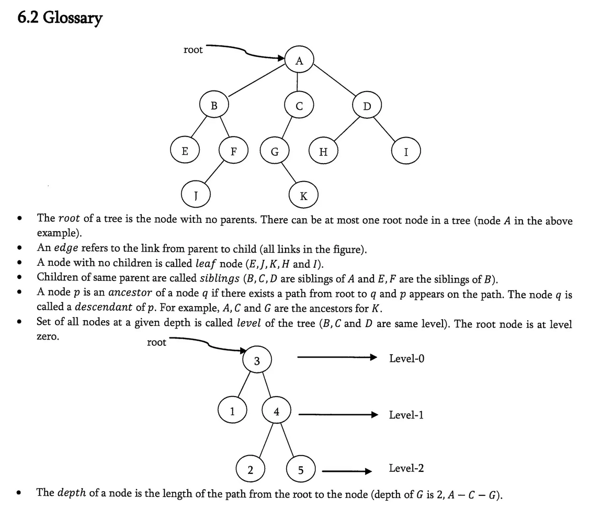

:title: C Programming - Data Structures
:data-transition-duration: 1500
:css: keri.css

CCD Basic JQR v1.0
8.1 Describe the concepts and terms associated with key data structures

----

8.1 Describe the concepts and terms associated with key data structures
=======================================================================

----

Objectives
========================================

[Describe the concepts and terms associated with...]

* Circularly linked list
* Hash table
* Weighted graph
* Common pitfalls when using linked lists, trees, and graphs
* The effect of First In First Out (FIFO) and Last In First Out (LIFO)
* Stack
* Tree vs Binary search tree
* Linked list
* Double linked list
* Queue vs Priority Queue

.. note::

	This may be the order the Job Qualification Standard (JQS) line items are presented in but this is *not* the order I'll be teaching them in.

----

Overview
========================================

* Definitions
* Data Structure Types
* Considerations
* Resources

----

Definitions
========================================

* What is...
    * ...a data structure?
    * ...a producer and consumer?
    * ...FIFO and LIFO?

.. note::

	Take this opportunity to see what they know before proceeding.

----

Definitions - Data Structure
========================================

What is a data structure?
    * A specialized format to store data
    * Organizes, processes, and retrieves data
    * Format implies relationship
    * Includes operations that can be applied to the data

Where can I get one?
    * Lower level languages tend to lack built-in support
    * Most languages permit data structure implementations as libraries
    * Modern languages support modular programming

.. note::

	The relationship implied by a chosen format could represent: order, priority, metadata, etc.

	By this definition alone, a database is a good example of a data structure.  It has a format.
	It organizes and retrieves data.  A database's primary key implies relationship.

	Programmatically, an array is a data structure they (should) have encountered by now.
	C arrays have a format (data type, length).  They organize data.  The format of the array implies relationship (sequential order).
	There are common operations you can apply to an array.

	Do the students know what modular programming is?  Wikipedia defines it as "a software design technique that emphasizes separating the functionality of a program into independent, interchangeable modules, such that each contains everything necessary to execute only one aspect of the desired functionality." (https://en.wikipedia.org/wiki/Modular_programming)
	Shorthand: "a separation between the interface of a library module and its implementation" (https://en.wikipedia.org/wiki/Data_structure)

	Basically, OS implementations are mostly(?) just well(ish) defined data structures under the hood.

	The real answer to "Where can I get one?" is "Make one."

----

Definitions - Producer/Consumer
========================================

Producer: Creates data

Consumer: Reads, processes and/or consumes the data

.. note::

	Much like the terms server and client, these two terms define the relationship of communicating entities.

	Examples include, but are not limited to, error messages to be read, networking packets to be processed.

	In Linux Inter Process Communication (IPC), pipes are commonly used to facilitate producer/consumer communication.

----

Definitions - FIFO/LIFO
========================================

First In First Out (FIFO): The first data produced is the first data consumed

Last In First Out (LIFO): The most recent data is in front

.. note::

	Sometimes, a rigid approach to managing items in storage must be defined.
	Those items in storage could be chunks of memory, data, or stock.

	It might help to liken these concepts to hoses and stacks (of things).
	Setting aside any odd properties of fluid dynamics, the first liquid to enter a hose is the first liquid to leave the hose.
	With a stack of crates, the crate on top is the first to be accessed.

	If this analogy is working, ask the class for a few more examples.

----

Data Structure Types
========================================

* Linked List
* Queue
* Tree
* Stack
* Hash Table
* Graph

----

Data Structure Types - Linked List
========================================

What is it?
    * Comprised of one or more connected nodes
    * Can store a variable number of nodes
    * Nodes contains data and a reference to the next node
    * Memory efficient
    * Linear storage
    * Easy to change the length

.. note::

	SPOILERS: There are four types of Linked Lists and some of those type contain *more* than just data and the next node.
	This definition is more of a "at least" description.

----

Data Structure Types - Linked List
========================================

Common Operations
    * Traverse the list
    * Insert a node
    * Delete a node
    * Search for a node

Real Examples
    * Commonly used to implement other data structures
    * "The linked list is the simplest and most common data structure in the Linux kernel." (1)
    * Windows internals use a linked list data structure to maintain thread scheduler queues

\(1) Linux Kernel Development, Third Edition; Ch 6 Kernel Data Structures P. 86

.. note::

	<PRESENTER_NOTE>

----

Data Structure Types - Linked List
========================================

Types
	* Linked List
	* Doubly Linked List
	* Circular (Singly) Linked List
	* Circular Doubly Linked List

----

:class: flex-image center-image

Data Structure Types - Linked List
========================================

.. code:: c

	/* An element in a linked list */
	struct list_element {
		void *data;                 // Payload
		struct list_element *next;  // Next node
	};

.. image:: images/08-01_001_01-linked_list-cropped.png

.. note::

	The first node in a linked list is called the "Head" node.
	The last node in a linked list is called the "Tail" node.

	Example questions to ask the students:
	* In a well formed linked list, what is special about the tail node?  (next is NULL)
	* In a well formed linked list, what is special about the head node?  (Nothing)
	* Can a well formed linked list contain just one node?  (Arguably yes, unless you define design restrictions)

	Source: Linux Kernel Development, Third Edition; Ch 6 Kernel Data Structures

----

:class: flex-image center-image

Data Structure Types - Linked List
========================================

.. code:: c

	/* An element in a doubly linked list */
	struct list_element {
		void *data;                 // Payload
		struct list_element *next;  // Next node
		struct list_element *prev;  // Previous node
	};

.. image:: images/08-01_001_02-doubly_linked_list-cropped.png

.. note::

	Source: Linux Kernel Development, Third Edition; Ch 6 Kernel Data Structures

----

:class: flex-image center-image

Data Structure Types - Linked List
========================================

.. image:: images/08-01_001_03-circular_singly_linked_list-cropped.png

.. note::

	What's changed between this and a (singly) linked list?  The tail node points at the head node.
	In a circular list, head nodes and tail nodes don't implicitly exist.  You can choose to maintain a head node though.
	It's not required though.  If you have one node, you have access to all the nodes.

	Source: Linux Kernel Development, Third Edition; Ch 6 Kernel Data Structures

----

:class: flex-image center-image

Data Structure Types - Linked List
========================================

.. image:: images/08-01_001_04-circular_doubly_linked_list-cropped.png

.. note::

	What's changed between this and a doubly linked list?  The tail node points at the head node.
	In a circular list, head nodes and tail nodes don't implicitly exist.  You can choose to maintain a head node though.
	It's not required though.  If you have one node, you have access to all the nodes.

	FUN FACT: The Linux kernel's default linked list implementation is fundamentally a circular doubly linked list.  "Using this type of linked list provides the greatest flexibility."

	Source: Linux Kernel Development, Third Edition; Ch 6 Kernel Data Structures

----

Data Structure Types - Queue
========================================

What is it?
    * A linear data channel
    * Stores elements sequentially
    * Typically unidirectional
    * FIFO
    * Producer enqueues data
    * Consumer dequeues data

.. note::

	Real life analogies for queues: People on an escalator, Cashier line in a store, A car wash line, One way exits

	The earlier FIFO-hose-analogy, or a student-provided analogy, could be used to describe a queue.  The faucet is the producer and the garden(?) is the consumer.

----

Data Structure Types - Queue
========================================

Common Operations
    * Create
    * Enqueue
    * Dequeue
    * Peek
    * Size
    * Check Capacity
    * Reset
    * Destroy

Real Examples
    * Linux pipes
    * Scheduling: CPU, disk I/O, etc
    * Handling hardware interrupts
    * Processing website traffic

.. note::

	Create - AKA Allocate/Initialize
	Enqueue - AKA Write
	Dequeue - AKA Read
	Peek - Look at the next element without removing it
	Size - How big is that buffer?
	Check Capacity - Is the queue full?  Is the queue empty?
	Reset - Jettisons all the contents of the queue
	Destroy - AKA Free

	Some people who read "Linux pipes" may first think about the "pipe character" (|), which is fine.  The command on the left is producing data which is in turn being consumed by the command on the right.  From a Linux programming perspective, it's a reference to the `pipe()` system call (which likely underpins, in some form or fashion, the command line interface operator).  `pipe()` "creates a pipe, a unidirectional data channel that can be used for interprocess communication."  (see: `man pipe`)

----

Data Structure Types - Queue
========================================

Types
	* Simple Queue
	* Circular Queue
	* Priority Queue
	* Double Ended Queue (Dequeue)

----

:class: flex-image center-image

Data Structure Types - Queue
========================================

.. image:: images/08-01_002_01-queue-cropped.png

.. note::

	Source: Linux Kernel Development, Third Edition; Ch 6 Kernel Data Structures

----

Data Structure Types - Queue
========================================

Circular Queue
	* Last element is linked to the first
	* Insert in the front
	* Delete in the back

.. note::

	AKA Ring Buffer

	Ask the students if "Last element is linked to the first" sounds familiar
	Q - "If it's circular, how do you know where the front is?"
	A - "Associated operations may store it.  Otherwise, you must."

----

Data Structure Types - Queue
========================================

Priority Queue
	* Each element has a priority
	* Elements with higher priority are removed first
	* Elements with the same priority obey FIFO

.. note::

	You could think of this as a queue of queues, one queue per priority.
	That being said, this type of queue is not necessarily FIFO.

----

Data Structure Types - Queue
========================================

Double Ended Queue (Dequeue)
	* Insertion can take place at the front and rear
	* Deletion can take place at the front and rear

----

Data Structure Types - Queue
========================================

Types
	* Simple Queue
	* Circular Queue
	* Priority Queue
	* Double Ended Queue (Dequeue)

----

Data Structure Types - Tree
========================================

What is it?
    * A hierarchical tree-like structure of data
    * Each vertex (AKA node) has 0 or 1 incoming edges
    * Each vertex has >= 0 outgoing edges

So what's a Binary Tree?
	* Same as a tree except each vertex has at most two outgoing edges
	* Each node has zero, one, or two children

.. note::

	A Binary Tree is a Tree but with more steps.  Those "more steps" provide some logical advantages.

----

Data Structure Types - Tree
========================================

Common Operations
    * PLACEHOLDER

Real Examples
    * PLACEHOLDER

\(1) Linux Kernel Development, Third Edition; Ch 6 Kernel Data Structures P. 86

.. note::

	<PRESENTER_NOTE>

----

Data Structure Types - Tree
========================================

Types
	* Tree
	* Binary Tree
	* Binary Search Trees
	* Self-Balancing Binary Search Trees
	* Red-Black Trees

.. note::

	The objective stops at Binary Search Tree (BST) but it seems amiss to avoid at least mentioning self-balancing BSTs and Red-Black Trees.

----

:class: flex-image center-image

Data Structure Types - Tree
========================================

* A hierarchical tree-like structure of data
* Each vertex (AKA node) has 0 or 1 incoming edges
* Each vertex has >= 0 outgoing edges

.. note::

	Compare this graphic to the "What is [a tree]?" bullets from a few slides back.
	Is this diagram a tree-like structure of data?  Yes.  It branches out.  It contains data.  There's an implicit relationship between the data.
	Does each vertex have 0 or 1 incoming edges?  Yes.
	Does each vertex have >= 0 outgoing edges?  Yes.

----

:class: center-image

Data Structure Types - Tree
========================================

* Each vertex has at most two outgoing edges
* Each node has zero, one, or two children

.. note::

	Implicit transition statement: "A binary tree is just a tree with extra steps..."
	Really, a binary tree is just a stepping stone to a binary search tree because binary trees don't have any implicit ordering.

----

:class: center-image

Data Structure Types - Tree
========================================

* A node's left subtree only contains values less than the node
* A node's right subtree only contains values greater than the node

.. note::

	Implicit transition statement: "A binary search tree is just a binary tree with extra steps..."

----

:class: center-image

Data Structure Types - Tree
========================================

* Self-balancing BSTs attempt, as part of normal operations, to remain (semi)balanced

.. note::

	Implicit transition statement: "A self-balancing BST is just a BST with extra steps..."

	The depth of a node is measured by how many parent nodes it is from the first (AKA root) node.
	Nodes with no children are called leaves.
	The height of a tree is the depth of the deepest node in the tree.

	If anyone asks about the importance of self-balancing BSTs, ask them about worst-case-scenario BST insertion...
	"What would a BST look like if the first value was 100 and each subsequent insertion was one less?"
	A - That BST would look like a linked list, which isn't nearly as efficient as a balanced BST.

----

:class: center-image

Data Structure Types - Tree
========================================

Red-black trees remain semi-balanced BSTs by enforcing the following:

* All nodes are either red or black
* Leaf nodes are black
* Leaf nodes do not contain data
* All non-leaf nodes have two children
* If a node is red, both of its children are black
* The path from a node to one of its leaves contains the same number of black nodes as the shortest path to any of its other leaves

.. note::

	Implicit transition statement: "A red-black tree is just a self-balancing BST with extra steps..."

----

Data Structure Types - Stack
========================================

* <STUDENTS_SEE_THIS>

.. note::

	<PRESENTER_NOTE>

----

Data Structure Types - Queue
========================================

* <STUDENTS_SEE_THIS>

.. note::

	<PRESENTER_NOTE>

----

Data Structure Types - Graph
========================================

* <STUDENTS_SEE_THIS>

.. note::

	<PRESENTER_NOTE>

----

Considerations
========================================

* FIFO vs. LIFO
* I have data.  Which structure type should I use?
* Common Pitfalls

----

Considerations - FIFO vs. LIFO
========================================

* <STUDENTS_SEE_THIS>

.. note::

	<PRESENTER_NOTE>

----

Considerations - Which one?
========================================

Use linked lists if...
    * ...you iterate over *all* of your data
    * ...performance is not important
    * ...you're storing a small number of items

Use queues if...
	* ...your code follows a producer/consumer pattern
	* ...you want to use a fixed-size buffer
	* ...you value simple/efficient add/remove functionality

Use a hash table if...
    * ...you think to yourself, "I wish I had a Python dictionary here"

Use a binary search tree if...
    1. You need to store a large amount of data
    2. You need to traverse that data efficiently
    3. Your instructor didn't teach you how to use a red-black tree

.. note::

	Queues work well for inter-process communication (IPC).  Doubly so if the communication is only one-way.

	All things being equal, the simplest solution is the best.  As such, use a linked-list if you're not performing time-critical searches.

----

Considerations - Common Pitfalls
========================================

* <STUDENTS_SEE_THIS>

.. note::

	<PRESENTER_NOTE>

----

Resources
========================================

* Linux Kernel Development, Third Edition
* Queues - https://www.shiksha.com/online-courses/articles/queue-data-structure-types-implementation-applications/

.. note::

	This is a good chance to ask the students if they have any questions.

----

Summary
========================================

* Definitions
* Data Structure Types
	* Linked List
	* Queue
	* Tree
	* Stack
	* Hash Table
	* Graph
* Considerations
	* FIFO vs. LIFO
	* I have data.  Which structure type should I use?
	* Common Pitfalls
* Resources

.. note::

	Last chance to cover student questions.

----

Objectives
========================================

Describe the concepts and terms associated with...

* Circularly linked list
* Hash table
* Weighted graph
* Common pitfalls when using linked lists, trees, and graphs
* The effect of First In First Out (FIFO) and Last In First Out (LIFO)
* Stack
* Tree vs Binary search tree
* Linked list
* Double linked list
* Queue vs Priority Queue
