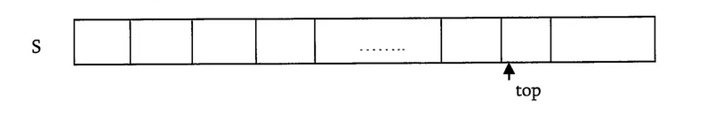

:title: C Programming - Data Structures
:data-transition-duration: 1500
:css: keri.css

CCD Basic JQR v1.0
8.1 Describe the concepts and terms associated with key data structures

----

8.1 Describe the concepts and terms associated with key data structures
=======================================================================

----

Objectives
========================================

[Describe the concepts and terms associated with...]

* Circularly linked list
* Hash table
* Weighted graph
* Common pitfalls when using linked lists, trees, and graphs
* The effect of First In First Out (FIFO) and Last In First Out (LIFO)
* Stack
* Tree vs Binary search tree
* Linked list
* Double linked list
* Queue vs Priority Queue

.. note::

	This may be the order the Job Qualification Standard (JQS) line items are presented in but this is *not* the order I'll be teaching them in.

----

Overview
========================================

* Definitions
* Data Structure Types
* Considerations
* Resources

----

Definitions
========================================

* What is...
    * ...a data structure?
    * ...a producer and consumer?
    * ...FIFO and LIFO?

.. note::

	Take this opportunity to see what they know before proceeding.

----

Definitions - Data Structure
========================================

What is a data structure?
    * A specialized format to store data
    * Organizes, processes, and retrieves data
    * Format implies relationship
    * Includes operations that can be applied to the data

Where can I get one?
    * Lower level languages tend to lack built-in support
    * Most languages permit data structure implementations as libraries
    * Modern languages support modular programming

.. note::

	The relationship implied by a chosen format could represent: order, priority, metadata, etc.

	By this definition alone, a database is a good example of a data structure.  It has a format.
	It organizes and retrieves data.  A database's primary key implies relationship.

	Programmatically, an array is a data structure they (should) have encountered by now.
	C arrays have a format (data type, length).  They organize data.  The format of the array implies relationship (sequential order).
	There are common operations you can apply to an array.

	Do the students know what modular programming is?  Wikipedia defines it as "a software design technique that emphasizes separating the functionality of a program into independent, interchangeable modules, such that each contains everything necessary to execute only one aspect of the desired functionality." (https://en.wikipedia.org/wiki/Modular_programming)
	Shorthand: "a separation between the interface of a library module and its implementation" (https://en.wikipedia.org/wiki/Data_structure)

	Basically, OS implementations are mostly(?) just well(ish) defined data structures under the hood.

	The real answer to "Where can I get one?" is "Make one."

----

Definitions - Producer/Consumer
========================================

Producer: Creates data

Consumer: Reads, processes and/or consumes the data

.. note::

	Much like the terms server and client, these two terms define the relationship of communicating entities.

	Examples include, but are not limited to, error messages to be read, networking packets to be processed.

	In Linux Inter Process Communication (IPC), pipes are commonly used to facilitate producer/consumer communication.

----

Definitions - FIFO/LIFO
========================================

First In First Out (FIFO): The first data produced is the first data consumed

Last In First Out (LIFO): The most recent data is in front

.. note::

	Sometimes, a rigid approach to managing items in storage must be defined.
	Those items in storage could be chunks of memory, data, or stock.

	It might help to liken these concepts to hoses and stacks (of things).
	Setting aside any odd properties of fluid dynamics, the first liquid to enter a hose is the first liquid to leave the hose.
	With a stack of crates, the crate on top is the first to be accessed.

	If this analogy is working, ask the class for a few more examples.

----

Data Structure Types
========================================

* Linked List
* Stack
* Queue
* Tree
* Graph
* Table

----

Data Structure Types - Linked List
========================================

What is it?
    * Comprised of one or more connected nodes
    * Can store a variable number of nodes
    * Nodes contains data and a reference to the next node
    * Memory efficient
    * Linear storage
    * Easy to change the length

.. note::

	SPOILERS: There are four types of Linked Lists and some of those type contain *more* than just data and the next node.
	This definition is more of a "at least" description.

----

Data Structure Types - Linked List
========================================

Common Operations
    * Traverse the list
    * Insert a node
    * Delete a node
    * Search for a node

Real Examples
    * Commonly used to implement other data structures
    * "The linked list is the simplest and most common data structure in the Linux kernel." (1)
    * Windows internals use a linked list data structure to maintain thread scheduler queues

\(1) Linux Kernel Development, Third Edition; Ch 6 Kernel Data Structures

.. note::

	<PRESENTER_NOTE>

----

Data Structure Types - Linked List
========================================

Types
	* Linked List
	* Doubly Linked List
	* Circular (Singly) Linked List
	* Circular Doubly Linked List

----

:class: flex-image center-image

Data Structure Types - Linked List
========================================

.. code:: c

	/* An element in a linked list */
	struct list_element {
		void *data;                 // Payload
		struct list_element *next;  // Next node
	};

.. image:: images/08-01_001_01-linked_list-cropped.png

.. note::

	The first node in a linked list is called the "Head" node.
	The last node in a linked list is called the "Tail" node.

	Example questions to ask the students:
	* In a well formed linked list, what is special about the tail node?  (next is NULL)
	* In a well formed linked list, what is special about the head node?  (Nothing)
	* Can a well formed linked list contain just one node?  (Arguably yes, unless you define design restrictions)

	Source: Linux Kernel Development, Third Edition; Ch 6 Kernel Data Structures

----

:class: flex-image center-image

Data Structure Types - Linked List
========================================

.. code:: c

	/* An element in a doubly linked list */
	struct list_element {
		void *data;                 // Payload
		struct list_element *next;  // Next node
		struct list_element *prev;  // Previous node
	};

.. image:: images/08-01_001_02-doubly_linked_list-cropped.png

.. note::

	Source: Linux Kernel Development, Third Edition; Ch 6 Kernel Data Structures

----

:class: flex-image center-image

Data Structure Types - Linked List
========================================

.. note::

	What's changed between this and a (singly) linked list?  The tail node points at the head node.
	In a circular list, head nodes and tail nodes don't implicitly exist.  You can choose to maintain a head node though.
	It's not required though.  If you have one node, you have access to all the nodes.

	Source: Linux Kernel Development, Third Edition; Ch 6 Kernel Data Structures

----

:class: flex-image center-image

Data Structure Types - Linked List
========================================

.. note::

	What's changed between this and a doubly linked list?  The tail node points at the head node.
	In a circular list, head nodes and tail nodes don't implicitly exist.  You can choose to maintain a head node though.
	It's not required though.  If you have one node, you have access to all the nodes.

	FUN FACT: The Linux kernel's default linked list implementation is fundamentally a circular doubly linked list.  "Using this type of linked list provides the greatest flexibility."

	Source: Linux Kernel Development, Third Edition; Ch 6 Kernel Data Structures

----

Data Structure Types - Linked List
========================================

Types
	* Linked List
	* Doubly Linked List
	* Circular (Singly) Linked List
	* Circular Doubly Linked List

.. note::

	Recap slide.  Take this opportunity to have the students name some basic facts about these types of linked lists.

----

Data Structure Types - Stack
========================================

What is it?
    * An ordered list
    * Operates on "the top"
    * Inserts at the top
    * Deletes from the top
    * LIFO

.. note::

	A good analogy here is a stack of plates.

----

Data Structure Types - Stack
========================================

Common Operations
    * push - insert data onto the stack
    * pop - remove and return data from the stack

Real Examples
    * Web browser back buttons
    * The "Undo" feature
    * Implementing function calls
    * Memory usage

.. note::

	Auxiliary Operations
	* Get the top without removing it
	* Determine the size of the stack
	* Determine whether the stack is empty or not
	* Determine whether the stack is full or not

----

:class: center-image

Data Structure Types - Stack
========================================

Implementations
	* Simple array
	* Dynamic array
	* Linked list

.. note::

	What about types?  There don't appear to be common stack variants.
	The variation comes with how the stack is implemented.

----

:class: flex-image center-image

Data Structure Types - Stack
========================================

* Simple Array
	* Add elements from left to right
	* Bookkeeping stores "the top"
	* Fixed size

.. note::

	PLACEHOLDER

----

Data Structure Types - Stack
========================================

* Dynamic Array
	* Similar concept to a Simple Array but...
	* If the stack is full, increase the size
	* Strategies
		* Go big or go home
		* Double it
		* Right size

.. note::

	Implicit transition statement: "A dynamic array stack is just a static array statck with extra steps..."

	Discuss the strategies with the students:
	"Go big or go home" - Still may need to be increased, but how?  When is "go big" too much?
	"Double it" - Efficient approach but it exponentially increases the size.  Should there be an upper-end limit?
	"Right size" - Stack is full, increases the stack size by one to accomodate one more insertion.  Depends on the method of "right sizing".  Normally, increasing an array infers a "copy" operation and this can get costly.

	Ultimately, the right approach depends on the situation.  I might default to a combination of "start big" and "double it".

----

:class: flex-image center-image

Data Structure Types - Stack
========================================

.. image:: images/08-01_004_04-linked_list_stack-cropped.png

* Linked List
	* Push operations insert a node at the head
	* Pop operations remove the head node
	* Grows and shrinks gracefully

.. note::

	Generally speaking, linked list stacks are preferrable to array implementations.
	That is, until you consider how the linked-list nodes are being allocated.
	For a large (expected) stack, it may be more efficient to implement a dynamic array stack instead.

----

Data Structure Types - Stack
========================================

Implementations
	* Simple array
	* Dynamic array
	* Linked list

.. note::

	Recap slide.  Take this opportunity to have the students name some basic facts about these stack implementations.

----

Data Structure Types - Queue
========================================

What is it?
    * A linear data channel
    * Stores elements sequentially
    * Typically unidirectional
    * FIFO
    * Producer enqueues data
    * Consumer dequeues data

.. note::

	Real life analogies for queues: People on an escalator, Cashier line in a store, A car wash line, One way exits

	The earlier FIFO-hose-analogy, or a student-provided analogy, could be used to describe a queue.  The faucet is the producer and the garden(?) is the consumer.

----

Data Structure Types - Queue
========================================

Common Operations
    * Enqueue
    * Dequeue

Real Examples
    * Ansynchronous data transfer
    * Scheduling: CPU, disk I/O, etc
    * Handling hardware interrupts
    * Processing website traffic

.. note::

	Auxiliary Operations
	* Peek
	* Size
	* Check Capacity
	* Reset

	Enqueue - AKA Write
	Dequeue - AKA Read
	Peek - Look at the next element without removing it
	Size - How big is that buffer?
	Check Capacity - Is the queue full?  Is the queue empty?
	Reset - Jettisons all the contents of the queue

	Examples of Asynchronous data transfer: file IO, pipes, sockets.

	Some people who read "Linux pipes" may first think about the "pipe character" (|), which is fine.  The command on the left is producing data which is in turn being consumed by the command on the right.  From a Linux programming perspective, it's a reference to the `pipe()` system call (which likely underpins, in some form or fashion, the command line interface operator).  `pipe()` "creates a pipe, a unidirectional data channel that can be used for interprocess communication."  (see: `man pipe`)

----

Data Structure Types - Queue
========================================

Types
	* Simple Queue
	* Circular Queue
	* Priority Queue
	* Double Ended Queue (Dequeue)

----

:class: flex-image center-image

Data Structure Types - Queue
========================================

.. note::

	Source: Linux Kernel Development, Third Edition; Ch 6 Kernel Data Structures

----

Data Structure Types - Queue
========================================

Circular Queue
	* Last element is linked to the first
	* Insert in the front
	* Delete in the back

.. note::

	AKA Ring Buffer

	Ask the students if "Last element is linked to the first" sounds familiar
	Q - "If it's circular, how do you know where the front is?"
	A - "Associated operations may store it.  Otherwise, you must."

----

Data Structure Types - Queue
========================================

Priority Queue
	* Each element has a priority
	* Elements with higher priority are removed first
	* Elements with the same priority obey FIFO

.. note::

	You could think of this as a queue of queues, one queue per priority.
	That being said, this type of queue is not necessarily FIFO.

----

Data Structure Types - Queue
========================================

Double Ended Queue (Dequeue)
	* Insertion can take place at the front and rear
	* Deletion can take place at the front and rear

----

Data Structure Types - Queue
========================================

Types
	* Simple Queue
	* Circular Queue
	* Priority Queue
	* Double Ended Queue (Dequeue)

.. note::

	Recap slide.  Take this opportunity to have the students name some basic facts about these types of queues.

----

Data Structure Types - Tree
========================================

What is it?
    * A hierarchical tree-like structure of data
    * Each vertex (AKA node) has 0 or 1 incoming edges
    * Each vertex has >= 0 outgoing edges

So what's a Binary Tree?
	* Same as a tree except each vertex has at most two outgoing edges
	* Each node has zero, one, or two children

.. note::

	A Binary Tree is a Tree but with more steps.  Those "more steps" provide some logical advantages.

----

Data Structure Types - Tree
========================================

Common Operations
    * Inserting an element
    * Deleting an element
    * Searching for an element
    * Traversing the tree

Real Examples
    * Compilers
    * Data compression algorithms

.. note::

	Auxiliary Operations
	* Finding the size of the tree
	* Finding the height of the tree
	* Finding the least common ancestor for a pair of nodes

----

Data Structure Types - Tree
========================================

Tree-Specific Definitions
    * root - a node with no parents
    * edge - the link between a parent and child node
    * leaf - a node with no children
    * siblings - children of the same parent
    * ancestor - p is an ancester of q if p appears on a path from root to q
    * descendant - any node that appears on a path between root and a given node
    * depth - the length of the path from root to a node
    * height - the length of the path from a node to the deepest node

.. note::

	The definitions for ancestor and descendant are a bit robotic, but factual.
	It may be easier to avoid reading that definition (which should be the case anyway) and, instead, liken the definitions to the implicitly understood human-based defintions.  They are, after all, similes(?).

	Talking through these definitions without the benefit of a graphic may be a stretch.  Be ready to draw something to aid student understanding.

----

Data Structure Types - Tree
========================================

Types
	* Tree
	* Binary Tree
	* Binary Search Trees
	* Self-Balancing Binary Search Trees

.. note::

	The objective stops at Binary Search Tree (BST) but it seems amiss to avoid at least mentioning self-balancing BSTs and Red-Black Trees.

----

:class: flex-image center-image

Data Structure Types - Tree
========================================

* A hierarchical tree-like structure of data
* Each vertex (AKA node) has 0 or 1 incoming edges
* Each vertex has >= 0 outgoing edges

.. note::

	Compare this graphic to the "What is [a tree]?" bullets from a few slides back.
	Is this diagram a tree-like structure of data?  Yes.  It branches out.  It contains data.  There's an implicit relationship between the data.
	Does each vertex have 0 or 1 incoming edges?  Yes.
	Does each vertex have >= 0 outgoing edges?  Yes.

	Use this graphic to reference the Tree-Specific Definitions
	Q: Which nodes are fit the "leaf" definition?  A: E, J, H, K, I
	Q: Which node is a sibling to node "E"?  A: F
	Q: Is node "C" an ancestor to node "H"?  A: No
	Q: Is node "H" a descendant of node "C"?  A: No
	Q: What is the depth of node "G"?  A: 2
	Q: What is the heigh of node "B"?  A: 2

----

:class: center-image

Data Structure Types - Tree
========================================

.. image:: images/08-01_003_01-binary_tree-cropped.png

* Each vertex has at most two outgoing edges
* Each node has zero, one, or two children

.. note::

	Implicit transition statement: "A binary tree is just a tree with extra steps..."
	Really, a binary tree is just a stepping stone to a binary search tree because binary trees don't have any implicit ordering.

----

:class: center-image

Data Structure Types - Tree
========================================

.. image:: images/08-01_003_02-binary_search_tree-cropped.png

* A node's left subtree only contains values less than the node
* A node's right subtree only contains values greater than the node

.. note::

	Implicit transition statement: "A binary search tree is just a binary tree with extra steps..."

----

:class: center-image

Data Structure Types - Tree
========================================

.. image:: images/08-01_003_03-balanced_binary_search_tree-cropped.png

* Self-balancing BSTs attempt, as part of normal operations, to remain (semi)balanced

.. note::

	Implicit transition statement: "A self-balancing BST is just a BST with extra steps..."

	The depth of a node is measured by how many parent nodes it is from the first (AKA root) node.
	Nodes with no children are called leaves.
	The height of a tree is the depth of the deepest node in the tree.

	If anyone asks about the importance of self-balancing BSTs, ask them about worst-case-scenario BST insertion...
	"What would a BST look like if the first value was 100 and each subsequent insertion was one less?"
	A - That BST would look like a linked list, which isn't nearly as efficient as a balanced BST.

----

Data Structure Types - Tree
========================================

Types
	* Tree
	* Binary Tree
	* Binary Search Trees
	* Self-Balancing Binary Search Trees

.. note::

	Recap slide.  Take this opportunity to have the students name some basic facts about these types of trees.

----

Data Structure Types - Graph
========================================

What is it?
    * Encodes pairwise relationships
    * Consists of:
    	* nodes (AKA vertices)
    	* edges

So what's a Weighted Graph?
	* Same as a graph except each edge has a value
	* That value is known as a weight

.. note::

	Nodes - The elements of the data structure
	Edges - Connections between the nodes
	Weights - The values could represent distances, cost, etc.

----

Data Structure Types - Graph
========================================

Common Operations
    * Add a node
    * Add an edge
    * Graph traversal

Real Examples: Represent...
    * Electronic circuits
    * Computer networks
    * Databases
    * Ticket dependencies
    * Spanning Tree Protocol (STP)

.. note::

	Auxiliary Operations
	* Weighted graphs allow for "shortest path" algorithmic computations

----

Data Structure Types - Graph
========================================

Graph-Specific Definitions
    * Directed edge: includes direction
    * Undirected edge: directionless
    * Directed graph: all edges are directed
    * Undirected graph: all edges are undirected

.. note::

	Directed edge - includes direction
	Undirected edge - directionless
	Directed graph - all edges are directed
	Undirected graph - all edges are undirected

----

:class: flex-image center-image

Data Structure Types - Graph
========================================

.. note::

	Directed edge: includes direction

----

:class: flex-image center-image

Data Structure Types - Graph
========================================

.. note::

	Undirected edge: directionless

----

:class: flex-image center-image

Data Structure Types - Graph
========================================

.. note::

	Directed graph: all edges are directed

----

:class: flex-image center-image

Data Structure Types - Graph
========================================

.. note::

	Undirected graph: all edges are undirected

----

:class: flex-image center-image

Data Structure Types - Graph
========================================

* Weighted Graph
	* All edges have weights

.. note::

	PLACEHOLDER

----

Data Structure Types - Table
========================================

What is it?
    * Associate a value to a unique key
    * Use the key to find the value

.. note::

	Good analogies are: table of contents, glossaries, dictionaries, etc.

	At some point, the students should realize this is all just fance talk for a Python dictionary.

----

Data Structure Types - Table
========================================

Common Operations
    * Add (key, value)
    * Remove (key)
    * Lookup (key)

Real Examples:
    * DNS lookup table
    * UID table

.. note::

	The Linux kernel implements a map data structure that is purpose-built to map Unique Identification Numbers (UID) to pointers.

	Auxiliary Operations: Not necessarily applicable here, though Hash Tables require a bit more than Symbol Tables.

----

Data Structure Types - Table
========================================

Types(?)
	* Symbol Table (1)
	* Hash Table (2)
	* Map (3)

\(1) Data Structures and Algorithms Made Easy Ch 13

\(2) Data Structures and Algorithms Made Easy Ch 14

\(3) Linux Kernel Development, Third Edition; Ch 6 Kernel Data Structures

.. note::

	Why is there a question mark after Types?  Because these aren't different *types*, per se.
	Instead, they're different "names".  All of them have key/value pairs.  Some academic sources separate them but they are all very *very* similar.
	For instance...
	"Although a hash table is a type of map, not all maps are implemented via hashes." (3)
	That being said, all three are still very similar.

----

Data Structure Types - Table
========================================

Table-Specific Considerations
    * Is the table ordered by key or not?
    * How is the table implemented?

.. note::

	Since this is the last data structure covered, the students should be able to brainstorm some valid ways to implement a table.
	Q: What are some data structures we could use to implement a table?  A: array, linked list, BST.
	Let the record show that, all things being equal, a hash table is the preferred "type" of table and a BST is the preferred implementation.

----

Data Structure Types - Table
========================================

* Symbol Table:
	* A mapping of keys to values

.. code:: python

	input = 'Sometimes when I have problems I Google ' \
	        'solutions to those problems so I can ' \
	        'easily solve them'

	symbol_table = {}
	for word in input.upper().split():
	    if word in symbol_table:
	        symbol_table[word] += 1
	    else:
	        symbol_table[word] = 1

.. note::

	Python is used here almost as psuedocode to help drive this point home.

----

:class: flex-image center-image

Data Structure Types - Table
========================================

Hash Table Components
	* Hash Table
	* Hash Function
	* Collision Resolution

.. note::

	Implicit transition statement: "A hash table is just a symbol table(ish) with extra steps..."

	SPOILERS: Hashing is a technique used for storing and retrieving information as quickly as possible.

----

:class: flex-image center-image

Data Structure Types - Table
========================================

Hash Table
	* Each hash table position holds an item and is named by an integer starting at 0
	* Keys are hashed into the reference integer

.. note::

	A Hast Table is a collection of items which are stored in a way to make it easy to find them later

	The term "position" is also called a "slot" or "bucket"

	A data structure that maps keys to values using a hash function for efficient retrieval and storage.

	Explicit transition statement: "How do keys become that reference integer number?  The hash function."

----

Data Structure Types - Table
========================================

Hash Function - Transforms a key into a slot index.

Good hash functions...:
    * Minimize collisions
    * Easy/quick to compute
    * Distribute key values evenly
    * Use every part of the key

.. code:: mathematica

	hash(key) = key % table_size

.. note::

	Explicit transition statement: "How do keys become that reference integer number?  The hash function."

	A "hash collision" is when a hash function computes the same result for two different inputs.

	Good hash functions also have a high load factor but I decided to skip that in the interest of complexity.  This JQS line item appears to be an entire undergraduate course condensed into 1 day.
	What is a load factor?
	Load factor = (Number of hash table elements) / (Hash table size)

	The % is a reference to mod

----

Data Structure Types - Table
========================================

Collision Resolution
	* Chain Results
		* Slots hold a linked list
		* Each linked list node holds the original hash and value
	* Open Addressing
	    * Keys are stored in the table
	    * The table is probed for collisions
	* Reduce Collision Probability - use two different hash functions

.. note::

	PLOT TWIST: Using two hash functions to reduce collision probability still doesn't help avoid array-implemented collisions.  You still have to choose a hash(key) to mod by table_size.

	If hash1(key) != hash2(key), which is very likely, you still have to mod one of those hash values to store the key's value in the hash table (unless you store the 2nd hash with the value).

----

Considerations
========================================

* FIFO vs. LIFO
* I have data.  Which structure type should I use?
* Common Pitfalls

----

Considerations - FIFO vs. LIFO
========================================

* Order - Is order important?
* Freshness - Is the relevancy of data important?
* Memory Management - Is memory consumption a concern?

.. note::

	Order - Is the original order of data important?  Maybe not.  Maybe the data contains internal sequencing.  If order is important, choose FIFO.

	Freshness - Is the "freshness" of data more important than completeness or order?
	Consider of graph of points.  What if points were being added to the graph faster than you could read them?  At a 2/1 ratio, you'd be falling ever behind.
	If you always read the most recent data you may miss some detail/fidelity but at least you'd be seeing current information at the maximum rate.

	Memory Management - FIFO features "fixed memory consumption".  That is to say memory utilization stays constant regardless of the number of operations.
	Conversely, LIFO memory consumption changes with each operation and does not maintain a fixed size.  Efficient resource allocation for LIFO can be challenging.

----

Considerations - Which one?
========================================

Use linked lists if...
    * ...you iterate over *all* of your data
    * ...performance is not important
    * ...you're adding/removing a small number of items

Use queues if...
	* ...your code follows a producer/consumer pattern
	* ...you want to use a fixed-size buffer
	* ...you value simple/efficient add/remove functionality

Use a hash table if...
    * ...you think to yourself, "I wish I had a Python dictionary here"

Don't use a hash table if...
    * ...the order of data is important
    * ...you have multi-dimensional data
    * ...you have dynamic data
    * ...you know that keys will not be unique

Use a binary search tree if...
    1. You need to store a large amount of data
    2. You need to traverse that data efficiently
    3. Your data doesn't need to be ordered

.. note::

	If you need ordered information, use a linear data structure: linked list, stack, queue, etc.

	Queues work well for inter-process communication (IPC).  Doubly so if the communication is only one-way.

	All things being equal, the simplest solution is the best.  As such, use a linked-list if you're not performing time-critical searches.

----

Considerations - Common Pitfalls
========================================

* Linked Lists
	* Traversal
	* Inefficient (for certain operations)
* Trees
	* Becoming unbalanced
	* Complex
	* Inefficient (for certain operations)
* Graphs
	* Limited representation
	* Scalability

.. note::

	Traversal - Probably the most time-consuming to traverse of all the data structures.
	Reverse-traversing a singly-linked list is also not possible.

	Unabalanced - Uneven search times create problems in speed-critical applications.
	The most unbalanced tree is arguably worse than a linked list.

	Complex - BSTs become even more complex to implement when advancing the data structures (e.g., red-black trees).

	Inefficient - Linked lists are not good at searching.  Trees are not good at sorting or grouping operations.

	Limited representation - Graphs may need to be supplemented because graphs don't inherently include properties or attributes of nodes.	

	Scalability - Graphs don't scale well.  Large graphs become difficult to interpret and analyze.

----

Resources
========================================

* Linux Kernel Development, Third Edition
* Data Structures and Algorithms Made Easy
* FIFO vs. LIFO - https://www.spiceworks.com/tech/devops/articles/fifo-vs-lifo/
* Queues - https://www.shiksha.com/online-courses/articles/queue-data-structure-types-implementation-applications/
* Hash Table
    * https://en.wikipedia.org/wiki/Hash_table
    * https://www.hackerearth.com/practice/data-structures/hash-tables/basics-of-hash-tables/tutorial/
* String Hashing - https://cp-algorithms.com/string/string-hashing.html

.. note::

	This is a good chance to ask the students if they have any questions.

----

Summary
========================================

* Definitions
* Data Structure Types
	* Linked List
	* Stack
	* Queue
	* Tree
	* Graph
	* Table
* Considerations
	* FIFO vs. LIFO
	* I have data.  Which structure type should I use?
	* Common Pitfalls
* Resources

.. note::

	Last chance to cover student questions.

----

Objectives
========================================

Describe the concepts and terms associated with...

* Circularly linked list
* Hash table
* Weighted graph
* Common pitfalls when using linked lists, trees, and graphs
* The effect of First In First Out (FIFO) and Last In First Out (LIFO)
* Stack
* Tree vs Binary search tree
* Linked list
* Double linked list
* Queue vs Priority Queue
