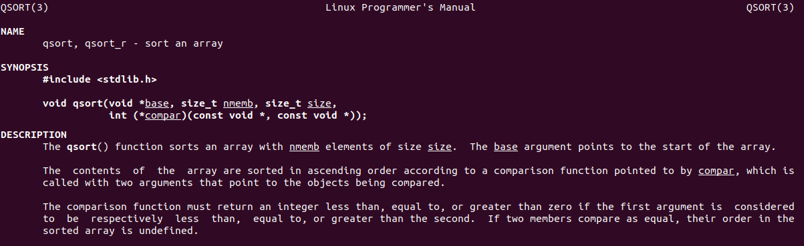

:title: C Programming - Data Structures - Linked List
:data-transition-duration: 1500
:css: keri.css

CCD Basic JQR v1.0
8.2 Demonstrate skill in creating and using a circularly linked list that accepts any data type

----

8.2 Demonstrate skill in creating and using a circularly linked list that accepts any data type
===============================================================================================

----

Objectives
========================================

* Removing selected items from the circularly linked list
* Creating a circularly linked list with n number of items
* Navigating through a circularly linked list
* Finding the first occurrence of an item in a circularly linked list
* Sorting the circularly linked list alphanumerically using a function pointer
* Destroying a circularly linked list
* Inserting an item into a specific location in a circularly linked list
* Removing all items from the circularly linked list

.. note::

	I intend to accomplish these objectives in incremental stages.

----

Overview
========================================

* "Any data type"
* Data Structure Bookkeeping
* Sorting
* Resources
* Student Labs

----

"Any data type"
========================================

How can you store "any data type"?

.. code:: c

	typedef enum _data_type
	{
	    NULL_DT = 0, CHAR_DT,
	    DOUBLE_DT, FLOAT_DT,
	    INT_DT, STRING_DT, VOID_DT
	} data_type, *data_type_ptr;

	typedef struct _any_data
	{
	    // Pointer to data
	    void *d_ptr;
	    // Data type
	    data_type d_type;
	    // Total data size
	    unsigned int d_size;
	} any_data, *any_data_ptr;

.. note::

	Whomever wrote the "any data type" objective hates students or they meant "discrete data type".
	You store "any data type" by saving the raw data, the original data type, and the size of that data in memory.
	Another solution would be to use a Union but you'd still have to store the original data type.
	Walk them through a couple examples.

----

Data Structure Bookkeeping
========================================

At a minimum, someone must hold the head node.

.. code:: c

	typedef struct _list_node
	{
	    // Data
	    any_data_ptr data_ptr;
	    // Next node
	    struct _list_node *next_ptr;
	} list_node, *list_node_ptr;	

.. note::

	You could just operate on a list_node_ptr without doing any data structure bookkeeping.
	Bookkeeping can save you some time though.

----

Data Structure Bookkeeping
========================================

A layer of abstraction allows for bookkeeping

Bookkeeping can help improve performance

.. code:: c

	typedef struct _linked_list
	{
	    // Head node
	    list_node_ptr head_ptr;
	    // Tail node
	    list_node_ptr tail_ptr;
	    // Number of entries
	    unsigned int entries;
	} linked_list, *linked_list_ptr;

.. note::

	You could just operate on a list_node_ptr without doing any data structure bookkeeping.
	Bookkeeping can save you some time though.
	For instance, keeping track of the number of linked list entries will make validating insertion/seeking easier.
	Also, keeping track of the tail node will make appending new nodes O(1) instead of O(n).

----

Sorting
========================================

* Generic Process
* Sorting Algorithms
* Modular Sorting

.. note::

	This "sorting" section is purposely short.  This isn't 8-02: Sorting.  This is 8-02: Linked Lists.
	It's only here because there's one objective that requires sorting.

----

Sorting - Process
========================================

* Generic Process
	1. Gather the input
	2. Sort it
	3. Put it back

.. note::

	1. Sometimes the input is already gathered.  Sometimes it's best to put the input into an array.  That way, the sorting implementation works regardless of the original data structure format.
	2. There are numerous sorting algorithms, each with their own strengths and weaknesses.
	3. Sometimes the data can be sorted in-place but if you gathered the input into an array then you'll need to put it back into its original format.

----

:class: split-table

Sorting - Algorithms
========================================

Common Sorting Algorithms

+---------------+---------------+-------------+
| **Algorithm** |    **PRO**    | **Time**    |
+---------------+---------------+-------------+
| Bubble        | Simplest      | Slowest     |
+---------------+---------------+-------------+
| Insertion     | Almost sorted | Slow        |
+---------------+---------------+-------------+
| Quick         | Most common   | Fast        |
+---------------+---------------+-------------+
| Merge         | Worst == Best | Fastest     |
+---------------+---------------+-------------+

.. note::

	Bubble sort touches all permutations of all elements while sorting.  "Worst case" == "Best case" time complexity: O(n^2).

	Insertion sort is a good choice when the array is nearly sorted

	Quick sort (AKA partition sort) is a divide-and-conquer algorithm

	Merge sort's "worst case" time complexity is the same as its "best case": O(nlogn).

	SOURCE: https://www.geeksforgeeks.org/sorting-algorithms/#
	        https://builtin.com/machine-learning/fastest-sorting-algorithm

----

:class: center-image

Sorting - Algorithms
========================================

.. note::

	The Linux API implements a quick sort alogrithm.

	man qsort

----

Sorting - Modular
========================================

Modular Sorting

.. code:: c

	/* Should they be swapped? */
	int compare(char *left, char *right);

	/* Swaps two array v indices */
	void swap(char *v[], int i, int j);

	/* Implements quick sort */
	void quick_sort(char *v[], int left, int right);

.. note::

	The trick here is that the quick sort function utilizes both compare and swap under-the-hood.
	This modular programming technique is a best practice.  It makes updates/changes/support/testing easier.
	This modular technique can be extended by adding a "compare" function pointer to the sorting algorithm function declaration.

	SIDE NOTE: Why does the qsort() function take left/right indices as parameters?  To facilitate recursive function calls.
	Quick sort (AKA partition sort) is a divide-and-conquer algorithm.

	SOURCE: The C Programming Language 5.6

----

Resources
========================================

* Linked Lists:
	* Data Structures and Algorithms Made Easy Ch. 3
* Sorting:
	* https://www.geeksforgeeks.org/sorting-algorithms/#
	* https://builtin.com/machine-learning/fastest-sorting-algorithm
	* The C Programming Language 5.6

----

STUDENT LABS
========================================

All labs will utilize the 8-02-sort_functions "library".
Some labs have unit tests available to validate the work.
Be sure to use ASAN and Valgrind.

* 8-02-1: Linked list implementation
* 8-02-2: Circular linked list implementation

General Files:
	* 8-02-sort_functions.h - Declares sorting functions
	* 8-02-sort_functions.c - Implements sorting functions

.. note::

	Lab 1 is intended to be a demonstration-performance lab.
	Lab 2 is intended to be a stand-alone student lab.

----

STUDENT LABS
========================================

8-02-1: Linked List

Key Files:
	* 8-02-1-linked_list.h - Declares library API and data structures
	* 8-02-1-linked_list-lab.c - Implements library functionality
	* 8-02-1-linked_list-main.c - Unit tests for basic functionality

Suggested implementation order:
	1. append_data()
	2. delete_list()
	3. count_nodes()
	4. find_node_pos()
	5. insert_data()
	6. remove_node_pos()
	7. find_node_val()
	8. sort_list()

.. note::

	The file comment block includes a description, build instructions, and notes on testing.
	You might want to have 8-02-1-linked_list.h open in a code editor when discussing these.
	Essentially, the function comment blocks serve as instructions.
	The library function prototypes are presented in order of "recommended implementation"
	It's important to note that 8-02-1-linked_list-lab.c is the single most important file in the list.  It's where the work is done.

	Suggested implementation order:
		1. append_data() - Essentially, creates a linked list.
		2. delete_list() - Write the free() anytime you alloc() something.
		3. count_nodes() - Will be used to help validate adds and removes.
		4. find_node_pos() - Mid-tier functionality
		5. insert_data() - Mid-tier functionality
		6. remove_node_pos() - Mid-tier functionality
		7. find_node_val() - Mid-tier functionality
		8. sort_list() - This will likely become a "stretch goal" for fast students

	After 1 & 2 - Unit tests will be failing but you shouldn't have any memory leaks.
	After 3-->7 - This is probably "good enough"
	Regarding 8 - Sorting is non-trivial work.  Sure, the 8-02-sort_functions library defines *some* functionality but the actual sorting algorithm (e.g., quick sort, bubble sort) is for the students to implement.

	Be sure to make frequent use of the unit test build and execution.  A similar format is used for later objectives/labs.

	SPOILERS: An example implementation of the 8-02-1-linked_list "library" exists as 8-02-1-linked_list-solution.c.  That solution file passes all the unit tests, ASAN, and Valgrind.

	QUESTIONS TO THE AUTHOR OF 8-02-1-linked_list-main.c...
	Q: Why didn't you use a framework?
	A: Testing frameworks for C are a pain.  I didn't want anyone to have to download/compile/link anything special just to test the lab.
	Q: Why didn't you implement the local main.c functionality in a library?
	A: I didn't want any "not me" instructors (or the students) to have to fuss with multiple files just to test the lab.
	Q: Why did I manually implement quick sort instead of using a library implmementation?
	A: I could have used qsort() (Linux API) but is that implemented on all distros?  Are there packages to install?  Plus, now the example code won't work on non-Linux systems.  TL;DR - I just wanted it to "work" with little-to-no fuss.

----

STUDENT LABS
========================================

8-02-2: Circular Linked List

This lab DOES NOT have unit tests to validate your work.
Write your own main() to test your work.
Be sure to use ASAN and Valgrind.

* Minimum functionality: append data, delete list
* Basic functionality: count nodes, find node (pos), insert data (pos), remove node (pos)
* More functionality: find node (value), sort list

Key Files:
	* 8-02-circular_list.h - Defines the circularly linked list interface
	* 8-02-circular_list-lab.c - Implements the circularly linked list

.. note::

	Minimum, basic, and "more" represent crawl-walk-run milestones while implementing a circularly linked list

	Key Files
	The interface is already designed in 8-02-circular_list.h (wait for applause/thanks)
	It's important to note that 8-02-circular_list-lab.c is the single most important file in the list.  It's where the students do all their work.
	Don't forget that the 8-02-sort_functions library already defines sorting algorithms to use in the labs (wait for applause/thanks)

----

Summary
========================================

* "Any data type"
* Data Structure Bookkeeping
* Sorting
* Resources
* Student Labs

.. note::

	Last chance to cover student questions.

----

Objectives
========================================

* 8-04-2:   Creating a hash table with n number of items
* 8-04-2:   Navigating through a hash table to find the nth item
* 8-04-2:   Finding an item in a hash table
* 8-04-2:   Removing selected items from a hash table
* 8-04-2:   Inserting an item into a hash table
* 8-04-2: Implement functionality to mitigate hash collisions within the hash table
* 8-04-2:   Removing all items from the hash table

.. note::

	This slide is presented as a lookup table of lab-to-objective
