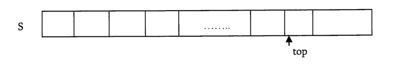
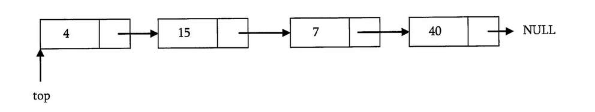

:title: C Programming - Data Structures - Stack
:data-transition-duration: 1500
:css: keri.css

CCD Basic JQR v1.0
8.5 Demonstrate skill in creating and using a stack that accepts any data type

----

8.5 Demonstrate skill in creating and using a stack that accepts any data type
==============================================================================

----

Objectives
========================================

* Removing all items from the stack
* Create a stack (cannot be fixed sized)
* Adding an item in a stack (enforce FILO)
* Removing n items from a stack
* Destroying a stack
* Preventing a stack overrun

.. note::

	I intend to accomplish these objectives in incremental stages.

----

Overview
========================================

* "Any data type"
* Implementations
* Data Structure Bookkeeping
* Resources
* Student Labs

----

"Any data type"
========================================

How can you store "any data type"?

.. code:: c

	typedef enum _data_type
	{
	    NULL_DT = 0, CHAR_DT,
	    DOUBLE_DT, FLOAT_DT,
	    INT_DT, STRING_DT, VOID_DT
	} data_type, *data_type_ptr;

	typedef struct _any_data
	{
	    // Pointer to data
	    void *d_ptr;
	    // Data type
	    data_type d_type;
	    // Total data size
	    unsigned int d_size;
	} any_data, *any_data_ptr;

.. note::

	Whomever wrote the "any data type" objective hates students or they meant "discrete data type".
	You store "any data type" by saving the raw data, the original data type, and the size of that data in memory.
	Another solution would be to use a Union but you'd still have to store the original data type.
	Walk them through a couple examples.

----

:class: flex-image center-image

Implementations
========================================

* Array

* Linked List

.. note::

	You could just operate on a list_node_ptr without doing any data structure bookkeeping.
	Bookkeeping can save you some time though.

----

Data Structure Bookkeeping - Array
========================================

.. code:: c

	typedef struct _array_stack
	{
	    // Top of the stack
	    int top;
	    // Number of entries
	    int entries;
	    // Available space
	    int capacity;
	    // Array implementation
	    any_data_ptr *stack;
	} array_stack, *array_stack_ptr;	

.. note::

	This bookkeeping abstraction could also be used to "grow" the stack if it ever becomes full.
	Unsigned ints could work for top and capacity but storing top as -1 is a good way to indicate the stack is empty.

----

Data Structure Bookkeeping - Linked List
========================================

.. code:: c

	typedef struct _list_stack
	{
	    // Number of entries
	    int entries;
	    // List implementation
	    list_node_ptr *top;
	} list_stack, *list_stack_ptr;	

.. note::

	This implementation is easier to grow capacity.
	The head node of the linked list *becomes* the "top" entry in the stack.

----

Resources
========================================

* Data Structures and Algorithms Made Easy Ch. 4

----

STUDENT LABS
========================================

This lab has unit tests available to validate the work.
Be sure to use ASAN and Valgrind.

* 8-05-1: Linked list implementation
* 8-05-2: Dynamic Array implementation

General Files:
	* 8-00-definitions.h - Defines common-use data types
	* 8-05-stack.h - Defines a generic library API
	* 8-05-stack-main.c - Implements generic API unit tests

.. note::

	Lab 1 is intended to be a demonstration-performance lab.
	Lab 2 is intended to be a stand-alone student lab.

	"Generic library API" means the same header can be used for both of the lab implementations.
	SPOILERS: The unit tests can be used for the same.

----

STUDENT LABS
========================================

8-05-1: Linked List Implementated Stack

Key Files:
	* 8-05-1-list_stack-lab.c - Implements 8-05-stack as a linked list

Suggested implementation order:
	1. allocate_stack()
	2. destroy_stack()
	3. push_data()
	4. destroy_any_data()
	5. pop_data()
	6. get_top()
	7. get_size()
	8. is_empty()
	9. empty_stack()

.. note::

	The file comment block includes a description, build instructions, and notes on testing.
	You might want to have 8-05-stack.h open in a code editor when discussing these.
	Essentially, the function comment blocks serve as instructions.
	The library function prototypes are presented in order of "recommended implementation"

	Be sure to make frequent use of the unit test build and execution.  A similar format is used for later objectives/labs.

	SPOILERS: An example implementation of the 8-05-list_stack "library" exists as 8-05-1-list_stack-solution.c.  That solution file passes all the unit tests, ASAN, and Valgrind.

----

STUDENT LABS
========================================

8-05-2: Array Implementated Stack

This lab has unit tests to validate your work.
Be sure to use ASAN and Valgrind.

Key Files:
	* 8-05-2-array_stack-lab.c - Implements 8-05-stack as a dynamic array

Suggested implementation order:
	1. allocate_stack()
	2. destroy_stack()
	3. push_data()
	4. destroy_any_data()
	5. pop_data()
	6. get_top()
	7. get_size()
	8. is_empty()
	9. empty_stack()

.. note::

	Key Files
	The interface is already designed in 8-05-stack.h (wait for applause/thanks)
	The interface and unit tests may be the same but this implementation should be different than 8-05-1.
	Either write a dedicated Makefile or a dedicated 8-05-2 rule in the Makefile from Lab 1.

----

STUDENT LABS
========================================

8-05-2: Array Implementated Stack

The header defines an abstract data type of `stack_adt`.

That stack_adt is defined as `struct _stack_adt`.

What members will you need to "bookkeep" this data structure?

.. code:: c

	/* An Array-based Stack Struct */
	struct _stack_adt
	{
	    /* DEFINE YOUR ARRAY BOOKKEEPING HERE */
	};

.. note::

	Take this opportunity to discuss the necessary bookkeeping for an array-implemented stack.
	This code snippet is an excerpt from 8-05-2-array_stack-lab.c
	Previous slides in this section discussed some suggested members to this struct.
	At a minimum, this struct requires: a pointer to the array, the capacity, and the index to the "top" entry.
	Everything else is unnecessary.

----

Summary
========================================

* "Any data type"
* Data Structure Bookkeeping
* Sorting
* Resources
* Student Labs

.. note::

	Last chance to cover student questions.

----

Objectives
========================================

* 8-05-1/2: Removing all items from the stack
* 8-05-1/2: Create a stack (cannot be fixed sized)
* 8-05-1/2: Adding an item in a stack (enforce FILO)
* 8-05-1/2: Removing n items from a stack
* 8-05-1/2: Destroying a stack
* 8-05-2:   Preventing a stack overrun

.. note::

	This slide is presented as a lookup table of lab-to-objective
