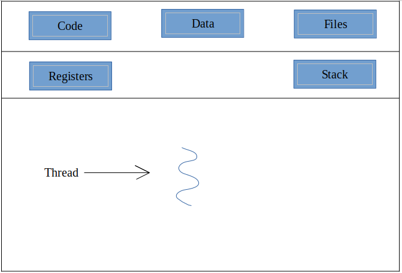
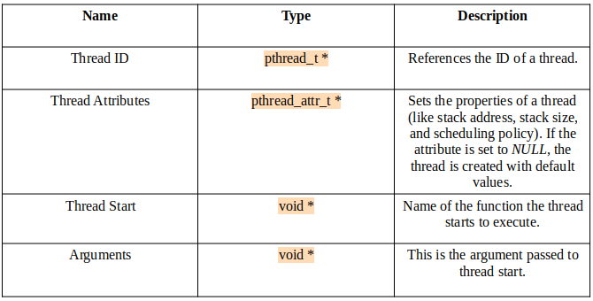
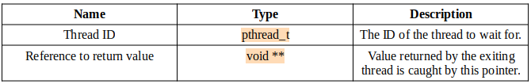
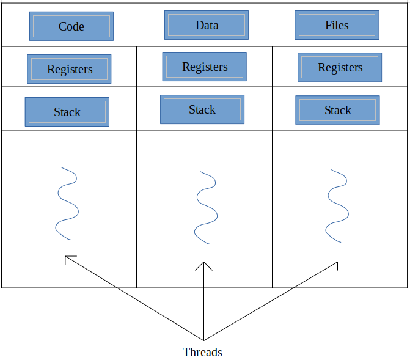
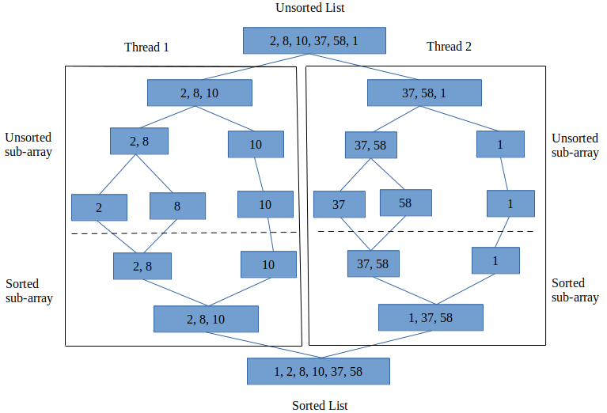

:title: C Programming - Threads and Multi-Threading
:data-transition-duration: 1500
:css: c-prog.css

CCD Basic JQR v1.0
10.5 Demonstrate the ability to use the following constructs associated with concurrency

----

10.5 Demonstrate the ability to use the following constructs associated with concurrency
=========================================================================================

----

Objectives
========================================

* [Demonstrate] Threads
* [Demonstrate] Locks
* [Demonstrate] Condition variables
* [Demonstrate] Atomics
* [Demonstrate] Thread Pool (with graceful shutdown without memory leaks)

----

Overview
========================================

* Concept of Threads
* What are locks?
* Conditional Variables in Threads
* Utilizing a Thread Pool
* Running Multiple Threads (Multi-Threading)

----

Concept of Threads 
========================================

* Simple definition:

  + A sub-process within a process (aka lightweight process)
* Threads share the same resources (memory) with each other 

  + These shared resources include the same global variables, same heap memory, same set of file descriptors, etc
* Goal is to be able to run multiple tasks concurrently
* Example applications: tabs in a web browser, typing in text/data in MS word, video games, and many more...  

----

Processess vs Threads
========================================

* Processes execute in a difference address space

  + Threads executing under the same process share the same address space
* Context switching is faster in threads compared to processes
* Processes execute independent of each other

  + Threads executing under the same process are dependent on the process running them

----

Thread Diagram
========================================

:class: center-image

----

Thread Syntax
========================================

* For UNIX based systems, threads are implemented via Pthreads in the header file <pthread.h>
* Each thread has an object of type pthread_t which tells its ID

  + The ID of threads CANNOT be shared since the thread ID uniquely identifies each thread
  + For multiple threads, an array data structure can be created that contains an ID for each thread (in multi-threading section)

.. code:: c

  #include <pthread.h>
  pthread_t id[1];

----

Thread Creation
========================================

* A thread is created and uses the function pthread_create(), which takes in four parameters:

:class: center-image

----

Exiting and Waiting for a Thread
========================================

* To exit a thread, the function pthread_exit() is utilized.
* If a value is returned by a thread upon exiting, its reference is passed as an argument

  + Only references to global or dynamic variables are returned from a thread, not it's local variables
* A parent thread is made to wait for a child thread via the pthread_join() function, which contains two parameters:

:class: center-image

.. code:: c

  int* ptr;
  pthread_join(id, &ptr);

----

Thread Implementation in Code: Pthreads
========================================

pthreads in C code:

.. code:: c

  #include <stdio.h>
  #include <stdlib.h>
  #include <pthread.h>

  void *runThread(void *arg)
  {
      int i;
      printf("Running Thread \n");
      for(i=1;i<=5;i++){
        printf("%d\n",i);
      } 
      return NULL;
  }

  int main()
  {
      pthread_t tid;
      printf("In main function\n");
      pthread_create(&tid, NULL, runThread, NULL);
      pthread_join(tid, NULL);
      printf("Thread over\n");
      return 0;
  }

----

Threads - Demo/Lab
========================================

----

What are locks?
========================================

* Restricts access to resources when multiple threads are running
* Why use locks?

  + Allows control back to programmer
  + Prevents threads from unintentionally accessing the same resource
* Mutexes

----

Sample Code of Locks
========================================

.. code:: c

  #include<stdio.h>
  #include<string.h>
  #include<pthread.h>
  #include<stdlib.h>
  #include<unistd.h>

  pthread_t tid[3];
  int counter;
  pthread_mutex_t lock;

  void* doSomeFunction(void *arg)
  {
      pthread_mutex_lock(&lock);

      unsigned long i = 0;
      counter += 1;
      printf("\n Thread %d started\n", counter);
      sleep (5);
      printf("\n Thread %d finished\n", counter);
      sleep (2);
      pthread_mutex_unlock(&lock);
      return NULL;
  }

  int main(void)
  {
      int i = 0;
      int err;

      if (pthread_mutex_init(&lock, NULL) != 0){
          printf("\n mutex init failed\n");
          return 1;
      }

      while(i < 3){
          err = pthread_create(&(tid[i]), NULL, &doSomeFunction, NULL);
          if (err != 0)
              printf("\ncan't create thread :[%s]", strerror(err));
          i++;
      }

      pthread_join(tid[0], NULL);
      pthread_join(tid[1], NULL);
      pthread_mutex_destroy(&lock);

      return 0;
  }

----

Locks - Demo/Lab
========================================

----

Conditional Variables in threads
========================================

* Filler

----

Utilizing a Thread Pool
========================================

* Contains a collection of threads that are waiting for tasks to be allocated to them for concurrent execution.
* 

----

Running Multiple Threads (Multi-Threading)
===============================================

* Running multiple threads allow faster applications via parallelism

----

Multi-Thread Diagram
===============================================

:class: center-image

----

Multi-Thread: Sample C code
===============================================

.. code:: c

  #include <stdio.h>
  #include <stdlib.h>
  #include <pthread.h>

  #define NUM_THREADS 5

  void *PrintHello(void *threadid) {
    long tid;
    tid = (long)threadid;
    printf("Hello World! Thread ID, %ld\n", tid);
    pthread_exit(NULL);
  }

  int main () {
    pthread_t threads[NUM_THREADS];
    int rc;
    long i;
    for( i = 0; i < NUM_THREADS; i++ ) {
        printf("main() : creating thread, %ld\n", i);
        rc = pthread_create(&threads[i], NULL, PrintHello, (void *)i);
        if (rc) {
          printf("Error:unable to create thread, %d\n", rc);
          exit(-1);
        }
    }
    pthread_exit(NULL);
  }

----

Multi-Threading Application: Sorting Routine
=============================================

* Sorting routines are one of many applications of multi-threading

----

Mlti-Threading - Demo/Lab
========================================
