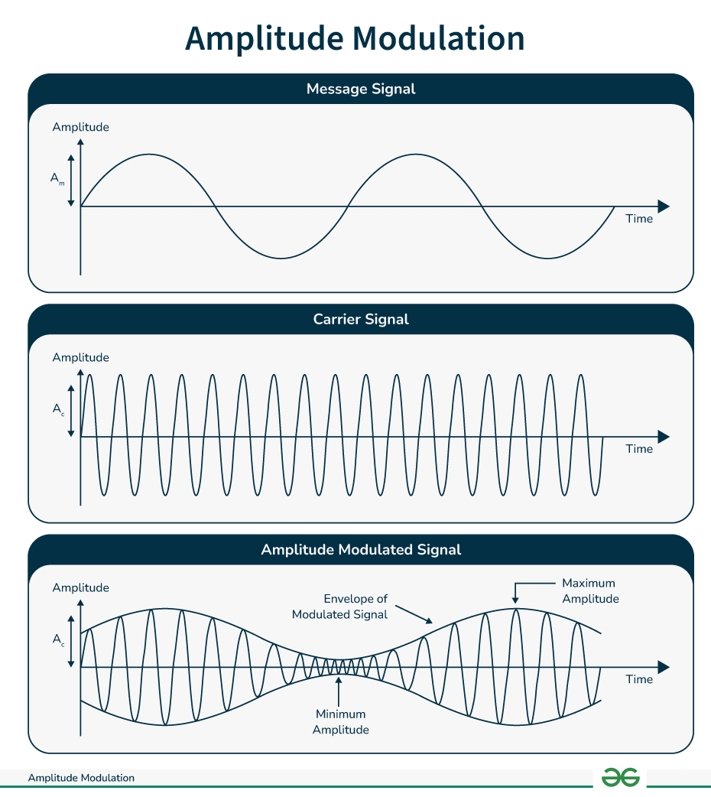
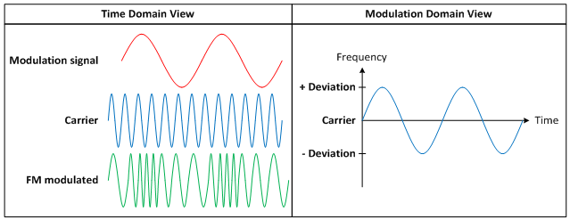
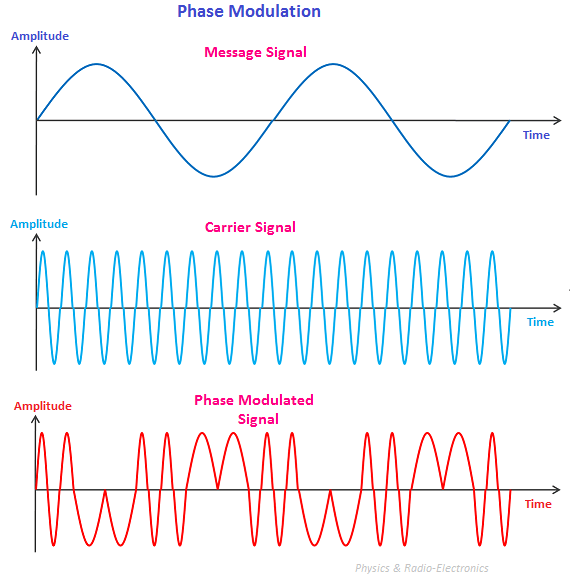
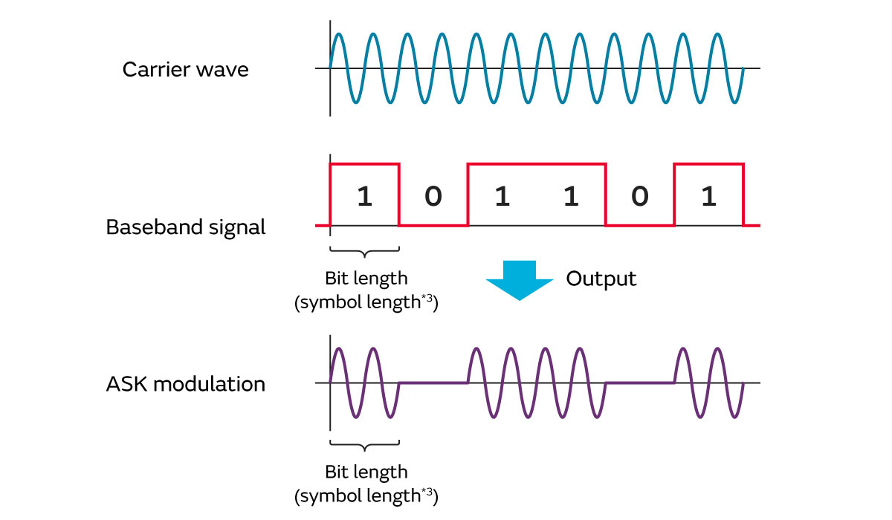
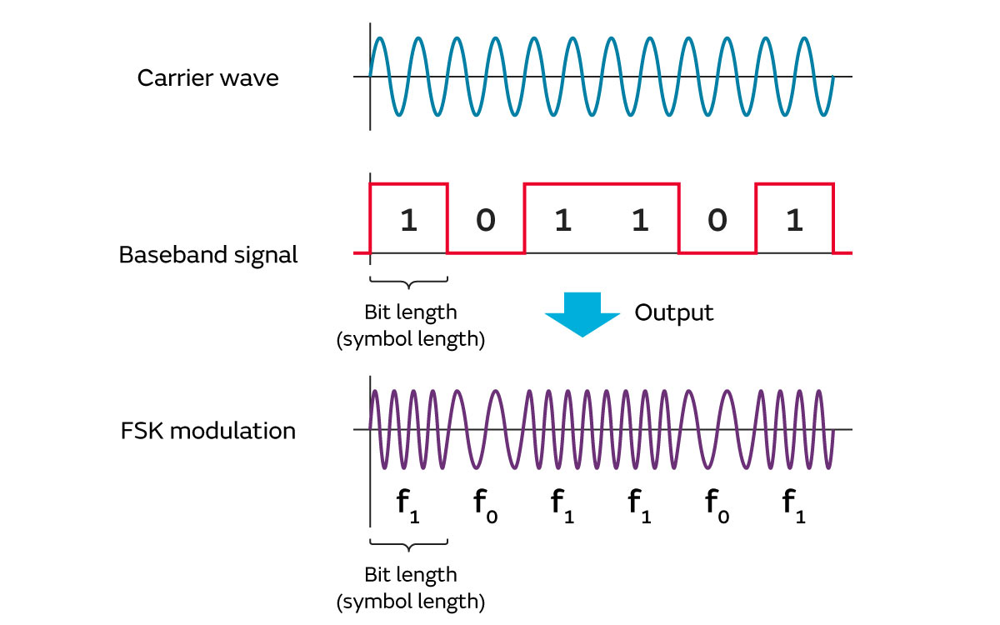
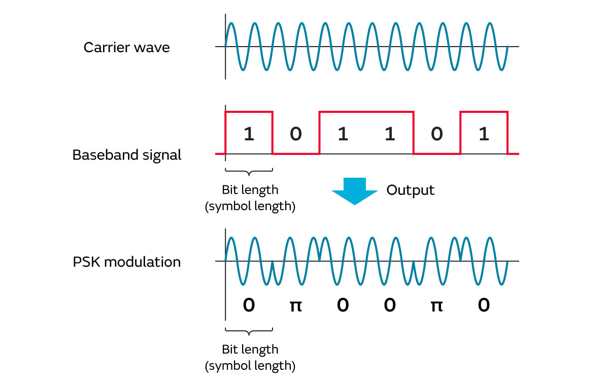
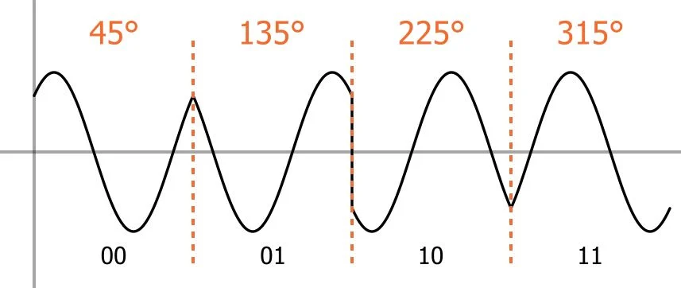
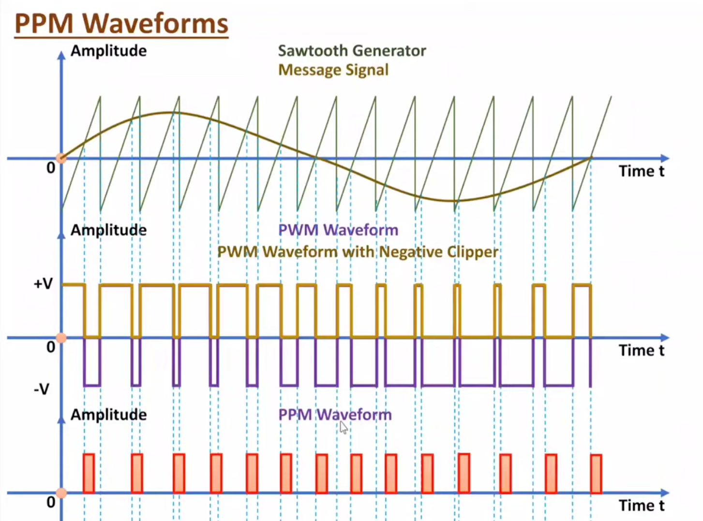

:title: RF - Digital Modulation
:data-transition-duration: 1500
:css: keri.css

Identifying Digital Modulation Schemes

----

5.03 Identify Digital Modulation
========================================

----

Objectives
========================================

 Using the analysis tools of your choice, correctly identify the following modulation schemes in an IQ capture from a SDR:

* FSK
* Narrow and wideband FM
* BPSK and QPSK
* PPM and OOK

.. note::

	This may be a copy/paste of the JQR Line Item but it's not how we're going to go after the topic.

----

Overview
========================================

* Definitions
* Modulation 101
* Tools
* Modulation Schemes
* Tricks

.. note::

	After giving them the road map, give them an academic disclaimer before continuing.

----

Definitions
========================================

.. note::

	We may breeze past some of the definitions but we'll double back to discuss all of them.

----

Definitions - Foundational
========================================

* signal - a function representing information over time
* sample - discrete measurements of a signal taken at regular intervals
* sample rate (fs) - number of samples per second
* bandwidth - range of frequencies occupied by a signal
* frequency (Hz) - how fast a signal oscillates
* amplitude - signal strength (magnitude)
* phase - position within a cycle of a waveform

.. note::

	<PRESENTER_NOTE>

----

Definitions - Modulation
========================================

* carrier - a sinusoidal signal used to transmit information
* modulation - the process of encoding information onto a carrier
* symbol - a unit of transmission representing one or more bits
* symbol rate (baud rate) - number of symbols transmitted per second
* constellation - a representation of symbols in a complex plane
* IQ - representation of a signal as complex samples:
    * In-phase - real
    * Quadrature - imaginary

.. note::

	<PRESENTER_NOTE>

----

Definitions - Niche
========================================

* envelope - the magnitude of the signal over time
* phase transitions - changes in signal phase between symbols
* pulse shaping - filtering applied to symbols to control bandwidth

.. note::

	This slide is titled "Niche" because, while I may not use these terms someone else might. ;-)

----

:class: barely-shrink-image center-image block-image

Modulation 101
========================================

.. note::

	The objective specifically calls out "Digital Modulation" but the modulation characterization places FM under analog --> analog.
	Don't let anyone look at it too hard.  I've observed that different entities use subtly different terms to describe RF-related terms.

	CREDIT: By Michel Bakni - Own work, CC BY-SA 4.0, https://commons.wikimedia.org/w/index.php?curid=109678259

----

Modulation 101
========================================

* Amplitude Modulation (AM) - Information encoded in amplitude changes
* Frequency Modulation (FM) - Information encoded in frequency changes
* Phase Modulation (PM) - Information encoded in discrete phase shifts

.. note::

	Seemingly, not part of the objective: AM, FM, and PM are the major families.
	Some derivative forms of modulation include more than one.  E.g., QAM.
	Quadrature Amplitude Modulation (QAM) - Information encoded in both amplitude and phase
	However, there are forms of modulation that don't necessarily fall into AM, FM, or PM.
	E.g., the pulse modulation family: PAM (Pulse Amplitude Modulation), PWM (Pulse Width Modulation), PPM (Pulse Position Modulation).

----

:class: shrink-image center-image

Modulation 101 - AM
========================================

.. note::

	CREDIT: https://www.geeksforgeeks.org/physics/amplitude-modulation-definition-types-expression/

----

:class: shrink-image center-image

Modulation 101 - FM
========================================

.. note::

	Information is encoded by varying the instantaneous frequency of a carrier while amplitude remains constant.

	CREDIT: https://www.ti.com/document-viewer/lit/html/SSZT995

----

:class: shrink-image center-image

Modulation 101 - PM
========================================

.. note::

	It might help to whiteboard an example for PM.
	1. Draw a sine wave (1)
	2. Draw a cosine wave (0)
	3. Draw a message (e.g., another sinusoid that ranges from -1 to 1, a digital signal that ranges from 0 to 1)

	CREDIT: https://www.physics-and-radio-electronics.com/blog/phase-modulation/

----

Modulation 101
========================================

* AM
* FM
* PM

.. note::

	Many other modulation scheme falls into one, or more, of these bins.
	However, there are exceptions (e.g., PPM which is part of the pulse modulation family)

----

Tools
========================================

* GNURadio
* Inspectrum
* Universal Radio Hacker (URH)
* Google
* SigMF Metadata

.. note::

	The first three are legitimate programs to use but the other two are merely techniques.
	Regardless, now's the time to bring it up.

----

Tools - GNURadio
========================================

* What is it?
    * FOSS development toolkit for dynamic signal processing
* Why would I use it?
    * Modular, free, versatile, powerful, rapid, well-documented
* How do I use it?
	* See: https://wiki.gnuradio.org/index.php/InstallingGR
	* Then: https://wiki.gnuradio.org/index.php/Tutorials

.. note::

	The "Why?" is honestly too long to list.  Now's the time to show a flowgraph.
	Best flowgraph?  The general "inspection" flowgraph.
	Be sure to assert that Amp/Freq/Phase plots must be considered in conjunction.

----

Tools - Inspectrum
========================================

* What is it?
    * A tool for the static analysis of captured signals
* Why would I use it?
    * Plot samples: amp, freq, phase
    * Measure symbol rate
    * Export symbols
* How do I use it?
	* See: https://github.com/miek/inspectrum#install
	* Then: https://youtu.be/tGff31uGXQU?si=iH9hwLoumiC2z5JU

.. note::

	Time to showcase Inspectrum's niche usage.
	1. Open an IQ
	2. Plot amp/freq/phase
	3. Guess the modulation scheme
	4. Measure symbol rate
	5. Export symbols

----

Tools - URH
========================================

* What is it?
    * A complete suite for wireless protocol investigation
* Why would I use it?
    * Automatic detection of modulation parameters
    * Customizable decoding algorithms
    * Protocol reverse engineering
    * Simulation of signals
* How do I use it?
    * See: https://github.com/jopohl/urh?tab=readme-ov-file#installation
    * Read: https://github.com/jopohl/urh/releases/download/v2.0.0/userguide.pdf
    * Then: https://youtu.be/kuubkTDAxwA?si=UcrfJj2mLtigw1Bq

.. note::

	I don't have great examples on how to use URH.  Top of the list.
	1. Open an OOK signal and let URH auto-detect
	2. Open the Demod 101 FoI2 project and show the custom decode algorithm

----

Tools - Google
========================================

* What is it?
    * A search engine
* Why would I use it?
    * Many signals can be identified by key characteristics
* How do I use it?
	* "What RF protocol uses PSK over 99.5MHz center frequency"
	* https://letmegooglethat.com/?q=What+RF+protocol+uses+PSK+over+99.5MHz+center+frequency

.. note::

	This "How?" example works perfectly but, other times, the first search is just the beginning.

----

Tools - SigMF
========================================

* What is it?
    * A metadata format for recorded digital signal samples
* Why would I use it?
    * Center frequency
    * Sample rate
    * Description
* How do I use it?
    * See: https://sigmf.org/
    * Parse it
    * Read it (e.g., "captured this on my way home")
    * Some tools are SigMF-aware

.. note::

	Required fields will ensure the SigMF metadata contains key details like the center frequency and sample rate.
	It's easier to programmatically parse JSON than it is to attempt do divine key details from a filename ("...26Msps...").
	Some of the SigMF capture sets contain clues to decode the signal.

	From: https://sigmf.org/

----

Modulation Schemes
========================================

* On–Off Keying (OOK)
* Frequency Shift Key (FSK)
* Narrow/Wideband FM
* Binary PSK (BPSK)
* Quadrature PSK (QPSK)
* Pulse-Position Modulation (PPM)

.. note::

	This is the actual order we'll discuss them in: Amp, Freq, then Phase.

----

:class: barely-shrink-image center-image block-image

Modulation Schemes - OOK
========================================

.. note::

	The raw image shows: OOK generated using a 10 MHz carrier and a 1 MHz digital clock signal
	CREDIT: https://www.allaboutcircuits.com/textbook/radio-frequency-analysis-design/radio-frequency-modulation/digital-modulation-amplitude-and-frequency/

----

:class: barely-shrink-image center-image block-image

Modulation Schemes - FSK
========================================

.. note::

	CREDIT: https://www.allaboutcircuits.com/textbook/radio-frequency-analysis-design/radio-frequency-modulation/digital-modulation-amplitude-and-frequency/

----

:class: split-table

Modulation Schemes - Narrow/Wideband FM
========================================

+---------+--------------+----------------+
| FM Type | Bandwidth    | Uses           |
+---------+--------------+----------------+
| Narrow  | ~10–25 kHz   | Reliable Audio |
+---------+--------------+----------------+
| Wide    | ~150–200 kHz | Quality Audio  |
+---------+--------------+----------------+

.. note::

	The Wideband FM bandwidth is indicative of FM radio.  It could be wider.

	Narrowband FM examples: Walkie-talkies / two-way radios, Public safety / emergency services, Aviation communications.
	Wideband FM examples: FM Radio.

----

:class: barely-shrink-image center-image block-image

Modulation Schemes - BPSK
========================================

.. note::

	Two phases are used to transmit one-bit-per-symbol: on, off.
	CREDIT: https://www.allaboutcircuits.com/textbook/radio-frequency-analysis-design/radio-frequency-modulation/digital-modulation-amplitude-and-frequency/

----

:class: barely-shrink-image center-image block-image

Modulation Schemes - QPSK
========================================

.. note::

	Very similar to BPSK except two-bits-per-symbol are transmitted because four phases (QPSK) are used instead of just two (BPSK).
	CREDIT: https://www.allaboutcircuits.com/technical-articles/quadrature-phase-shift-keying-qpsk-modulation/

----

:class: shrink-image center-image block-image

Modulation Schemes - PPM
========================================

* Information is encoded in the timing (position) of pulses relative to a timing reference
* Amplitude and width (duration) are fixed
* Each symbol is one pulse shifted in time
* Converting Pulse Width Modulation (PWM) is one method to generate PPM

.. note::

	Given the fact that PPM relies on a reference clock, "the receiver must be properly synchronized to align the local clock with the beginning of each symbol. Therefore, it is often implemented differentially as differential pulse-position modulation."

	PPM only requires a reference timing (clock or frame) and a way to shift pulse timing within that frame

	There are different methods to generate PPM:
	- clock tick --> apply variable delay --> emit pulse
	- PWM --> edge detection --> convert width --> position

	Source: https://en.wikipedia.org/wiki/Pulse-position_modulation
	CREDIT: https://youtu.be/b3sSlE6tdmM?si=0PFk0hjZroIyZpdw

----

Modulation Schemes
========================================

* OOK
* FSK
* Narrow/Wideband FM
* BPSK
* QPSK
* PPM

.. note::

	Do a quick recap here.

----

Tricks
========================================

* Sharp changes in the frequency-vs-time plot?  Consider PM.
* Watch out for Non-Return-to-Zero (NRZ) when measuring symbol time
* No long strings of bits?  Consider Manchester encoding.
* Universal Radio Hacker is magic
* Search signal details: center freq, bandwidth, modulation, etc.

.. note::

	Freq-->PM: https://en.wikipedia.org/wiki/Instantaneous_phase_and_frequency
	NRZ: https://en.wikipedia.org/wiki/Non-return-to-zero
	You should have already covered some tips and tricks prior to this slide.
	Make this the tips-and-tricks recap.

----

Summary
========================================

* Definitions
* Modulation 101
* Tools
* Modulation Schemes
* Tricks

----

Objectives
========================================

 Using the analysis tools of your choice, correctly identify the following modulation schemes in an IQ capture from a SDR:

* FSK
* Narrow and wideband FM
* BPSK and QPSK
* PPM and OOK
